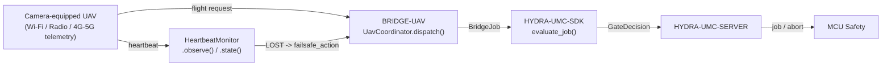

<!-- =============================================================================
HYDRA-UMC-BRIDGE-UAV - Camera-equipped drone bidirectional coordination bridge
Copyright (C) 2026 JuanenRac (Electro Hobby 3D) <electrohobby3d@gmail.com>
GPL-3.0-or-later - see LICENSE
============================================================================= -->

<p align="center">
  
</p>

# 🛩️ HYDRA-UMC-BRIDGE-UAV

<p align="center">🇺🇸 <b>English</b> | <a href="README_spa.md">🇪🇸 Español</a> | <a href="README_fra.md">🇫🇷 Français</a> | <a href="README_ita.md">🇮🇹 Italiano</a> | <a href="README_deu.md">🇩🇪 Deutsch</a> | <a href="README_zho.md">🇨🇳 简体中文</a> | <a href="README_jpn.md">🇯🇵 日本語</a></p>

### 🔗 Dependency-Free Coordination Boundary Between HYDRA-UMC and Camera-Equipped UAVs

<p align="left">
  
  
  
</p>

---

## 1. 🛠️ TECHNICAL OVERVIEW

**HYDRA-UMC-BRIDGE-UAV** is the bidirectional, high-level coordination boundary between HYDRA-UMC and a camera-equipped drone (UAV), reachable over Wi-Fi, a radio link or a cellular (4G/5G) telemetry connection. It validates and forwards a small, named vocabulary of high-level flight requests (`PRE_FLIGHT_CHECK`, `TAKEOFF`, `GOTO_WAYPOINT`, `HOVER_AND_CAPTURE`, `RETURN_TO_LAUNCH`, `LAND`), and separately runs a real, required link-loss heartbeat watchdog. It never computes flight control or stabilization, and it cannot bypass HYDRA-UMC-SERVER, MCU limits, watchdogs or E-STOP.

It belongs to the **Mobile & Autonomous Bridges** family alongside `HYDRA-UMC-BRIDGE-DROIDS` and `HYDRA-UMC-BRIDGE-AMR`, and shares the same `HYDRA-UMC-SDK` job-and-safety contract as the stationary **External Automation Bridges** (CNC, LASER, OPENPNP, PRINTER3D, ROS2).

### Key Features:
* ✅ **Real, dependency-free flight-request core:** `coordinator.py`'s `UavCoordinator` has zero MAVLink/vendor-SDK import - it is deliberately plain Python, testable on any host without a real UAV connected. *(implemented, tested in `tests/test_coordinator.py`)*
* ✅ **Real named flight-request vocabulary:** `PRE_FLIGHT_CHECK`, `TAKEOFF`, `GOTO_WAYPOINT`, `HOVER_AND_CAPTURE`, `RETURN_TO_LAUNCH`, `LAND` - never a raw attitude/throttle command. A normal mission `COMPLETE` and an emergency `ABORT` both resolve to the same real `RETURN_TO_LAUNCH` request. `LAND` is real and genuinely distinct - MAVLink's own `MAV_CMD_NAV_LAND` vs `MAV_CMD_NAV_RETURN_TO_LAUNCH` (checked against the [official MAVLink common message set](https://mavlink.io/en/messages/common.html)) - for the real case RTL alone can't cover: descend now, not fly home first (e.g. battery too low, or the path home isn't safe). `emergency_land_request()` exposes it as a standalone request, deliberately outside the `JobPhase`-driven `dispatch()` flow - same reasoning as `HeartbeatMonitor`'s own separate signal. *(implemented)*
* ✅ **A real, required link-loss heartbeat watchdog:** `HeartbeatMonitor` is a deterministic, explicit-`now`-driven failsafe state machine - never reads a real clock, reports `LOST` from the very first check if never observed, and treats exactly-at-the-timeout as still `OK` (only genuinely exceeding it trips the configured `RETURN_TO_LAUNCH`/hover failsafe). *(implemented, tested with a full deterministic boundary suite in `tests/test_heartbeat.py`)*
* ✅ **Real shared safety gate:** every job dispatched through `UavCoordinator.dispatch()` is evaluated by `evaluate_job()` from `HYDRA-UMC-SDK`'s `bridge_contract`, the same gate every sibling bridge and HYDRA-UMC-SERVER use; a productive phase requires an `IDLE` external machine and a `READY` HYDRA-UMC cell, while `ABORT` remains requestable during a fault. *(implemented)*
* ✅ **Fail-closed phase routing and static evidence:** an unknown future SDK phase is denied. `inspect_request_plan.py` emits the static schema `1.1` flight-request plan (now including the standalone `LAND` request) without opening any transport. *(implemented, tested)*
* ✅ **Real MAVLink command transport:** `mavlink_transport.py`'s `MavlinkFlightControl` sends an already-gated dispatch as a real `COMMAND_LONG`, mapped to a real, numbered `MAV_CMD` (`MAV_CMD_NAV_TAKEOFF`/`MAV_CMD_DO_REPOSITION`/`MAV_CMD_NAV_LOITER_UNLIM`/`MAV_CMD_IMAGE_START_CAPTURE`/`MAV_CMD_NAV_RETURN_TO_LAUNCH`/`MAV_CMD_NAV_LAND`/`MAV_CMD_COMPONENT_ARM_DISARM`) - a rejected dispatch never reaches the network. *(implemented, tested in `tests/test_mavlink_transport.py`)*
* ✅ **Non-mutating build/test:** `build-test.bat`/`.sh` compile the source and run deterministic unit tests without changing version or CHANGELOG. *(implemented, see BUILD & RUN below)*
* 🔜 **A DJI OSDK transport adapter** (for a non-MAVLink platform) - introduced only after that SDK is selected and tested. *(planned)*

---

## 2. 🔄 UAV COORDINATION FLOW



---

## 3. 🧱 ARCHITECTURE & DESIGN DECISIONS

* **Why the heartbeat watchdog is its own module, not folded into the coordinator.** Link loss is a real, distinct failure mode from "is this job allowed right now" - `HeartbeatMonitor` answers "can I still trust what I last heard from this UAV" independently of any particular job, so it can be checked continuously (e.g. every telemetry tick) rather than only when a job happens to be dispatched.
* **Why `HeartbeatMonitor` takes an explicit `now` instead of reading a real clock.** The pasted architecture note this project started from is explicit that a UAV bridge REQUIRES this watchdog - the only way to prove its exact timeout-boundary behavior (not just "it eventually times out") without a flaky, slow, real-sleep-based test suite is to make time an explicit, testable input.
* **Why `COMPLETE` and `ABORT` both resolve to `RETURN_TO_LAUNCH`.** A finished mission and an emergency abort have the same real correct outcome for a UAV: come home. Collapsing them onto the same request name in the static plan (deduplicated, not repeated) reflects that honestly instead of inventing two different "go home" verbs.
* **Why this bridge's own heartbeat is explicitly NOT a replacement for the flight controller's own failsafe.** Pixhawk/PX4 and DJI's own firmware already implement a real, certified-adjacent link-loss failsafe at the radio/telemetry level - this bridge's `HeartbeatMonitor` is a coordination-layer signal for HYDRA-UMC's own state, and both must exist independently; see `docs/BRIDGE_GUIDE.md`'s own hardware acceptance gate.
* **Why the MAVLink/OSDK transport adapter is not in this repo yet.** Committing to one flight controller's real command/telemetry protocol before it is selected and tested would risk baking in assumptions this local, dependency-free core cannot verify.
* **How this fits the rest of the ecosystem.** BRIDGE-UAV sits between a real UAV and `HYDRA-UMC-SDK` → `HYDRA-UMC-SERVER` → MCU safety - it is a coordination boundary, never a flight-control node, and it cannot bypass HYDRA-UMC-SERVER, MCU limits, watchdogs or E-STOP.

---

## 📂 DIRECTORY STRUCTURE

```text
HYDRA-UMC-BRIDGE-UAV/
├── src/
│   └── hydra_umc_bridge_uav/
│       ├── __init__.py
│       ├── coordinator.py       # UavCoordinator: dependency-free flight-request gate
│       ├── heartbeat.py         # HeartbeatMonitor: real, deterministic link-loss failsafe
│       └── mavlink_transport.py # Sends an already-gated UavDispatch as a real MAVLink COMMAND_LONG
├── tests/
│   ├── test_coordinator.py      # Deterministic unit tests for the coordination core
│   ├── test_heartbeat.py        # Deterministic boundary tests for the heartbeat watchdog
│   └── test_mavlink_transport.py # Real MAV_CMD shape tests against a fake MAVLink connection
├── tools/
│   ├── build_test.py            # Non-mutating compile + test runner (build-test.bat/.sh)
│   ├── bump_version.py          # Synchronizes pyproject.toml, manifest and CHANGELOG.md
│   └── inspect_request_plan.py  # Prints the static flight-request plan (no transport opened)
├── docs/
│   └── BRIDGE_GUIDE.md          # Scope, compatible platforms, scripts, hardware acceptance gate
├── images/
│   └── HYDRA_UMC_BANNER.svg     # README banner
├── build-test.bat / build-test.sh  # Validate only, never modifies the repository
├── build.bat / build.sh            # Validate, then bump version + CHANGELOG on success
├── pyproject.toml               # Package metadata; depends on HYDRA-UMC-SDK (git)
├── hydra-umc.project.json       # Ecosystem manifest (version, maturity, family)
├── CHANGELOG.md
├── CODE_OF_CONDUCT.md / CONTRIBUTING.md / SECURITY.md / SUPPORT.md
├── LICENSE / LICENSE.md
└── README.md / README_*.md      # This file and its 6 translations
```

---

## 4. ⚙️ BUILD & RUN

Requires Python 3.11+. `tools/build_test.py` expects `HYDRA-UMC-SDK` checked out as a sibling directory (`../HYDRA-UMC-SDK`) or pointed at via the `HYDRA_UMC_SDK_ROOT` environment variable.

```bash
# Windows
build-test.bat      # validate only — no version/CHANGELOG change
build.bat            # validate, then bump version + CHANGELOG on success

# Linux/macOS
bash build-test.sh
bash build.sh
```

`build-test` compiles every module under `src/` with `py_compile` and runs the full `unittest` suite (`tests/test_coordinator.py`, `tests/test_heartbeat.py`) - deterministically, with no real UAV connection, no network and no version/CHANGELOG change. `build` runs that same validation first and, only on success, calls `tools/bump_version.py` to synchronize the version across `pyproject.toml`, `hydra-umc.project.json` and `CHANGELOG.md`. There is no live hardware `run` command yet - that requires a validated MAVLink/OSDK transport adapter and a real UAV.

---

## ✅ Current Status & Next Steps

**Real today:** version `0.0.4`, functional as a dependency-free coordination core (`UavCoordinator`) plus a real, fully boundary-tested link-loss heartbeat watchdog (`HeartbeatMonitor`), fail-closed phase routing, a static `plan-only` flight-request schema, a real MAVLink command sender (`MavlinkFlightControl`) mapping every request to its real, numbered `MAV_CMD`, and non-mutating build-test scripts wired into CI with an SDK checkout.

**Integration boundary:** this bridge is a coordination boundary only - it is not a flight-control node, and it cannot bypass HYDRA-UMC-SERVER, MCU limits, watchdogs or E-STOP; every dispatched job still passes through the same shared gate every sibling bridge uses. `HeartbeatMonitor`'s own failsafe signal is a coordination-layer concern, never a replacement for the flight controller's own independent link-loss failsafe.

**Still ahead:** no real MAVLink (Pixhawk/PX4) or DJI OSDK transport, and no physical UAV, has been validated yet - a real adapter will be introduced only after a specific flight controller/SDK is selected and tested.

---

## 🔗 Related Projects

This project is part of a larger robotics ecosystem by the same author (JuanenRac / Electro Hobby 3D), spanning firmware, control software, AI nodes and fleet tooling. Worth knowing about, since a request might actually be about one of these rather than this repository.

### Directly Related

- **[HYDRA-UMC-SDK](https://github.com/JuanenRac/HYDRA-UMC-SDK)** — the shared job-and-safety contract every bridge (including this one) evaluates jobs through.
- **[HYDRA-UMC-SERVER](https://github.com/JuanenRac/HYDRA-UMC-SERVER)** — the authenticated ecosystem boundary this bridge reports to.
- **[HYDRA-UMC-BRIDGE-DROIDS](https://github.com/JuanenRac/HYDRA-UMC-BRIDGE-DROIDS)** — sibling mobile bridge for legged/humanoid droids.
- **[HYDRA-UMC-BRIDGE-AMR](https://github.com/JuanenRac/HYDRA-UMC-BRIDGE-AMR)** — sibling mobile bridge for AGV/AMR fleets.

### Rest of the Ecosystem

**HYDRA-UMC platform** — the multi-robot micro-factory cell this bridge coordinates auxiliaries for
- **[HYDRA-UMC](https://github.com/JuanenRac/HYDRA-UMC)** — the CM5 + STM32H745 motherboard orchestrating up to 8 robot arms.
- **[HYDRA-UMC-SERVER](https://github.com/JuanenRac/HYDRA-UMC-SERVER)** — the Express/WebSocket backend every control client and bridge talks to.
- **[HYDRA-UMC-STUDIO](https://github.com/JuanenRac/HYDRA-UMC-STUDIO)** — web-based control dashboard, multi-robot 3D visualization.

**External Automation Bridges** — sibling repos sharing this same `HYDRA-UMC-SDK` job gate
- **[HYDRA-UMC-BRIDGE-CNC](https://github.com/JuanenRac/HYDRA-UMC-BRIDGE-CNC)** — CNC cell coordination bridge.
- **[HYDRA-UMC-BRIDGE-LASER](https://github.com/JuanenRac/HYDRA-UMC-BRIDGE-LASER)** — laser-cell coordination bridge.
- **[HYDRA-UMC-BRIDGE-OPENPNP](https://github.com/JuanenRac/HYDRA-UMC-BRIDGE-OPENPNP)** — board-flow bridge for OpenPnP.
- **[HYDRA-UMC-BRIDGE-PRINTER3D](https://github.com/JuanenRac/HYDRA-UMC-BRIDGE-PRINTER3D)** — coordination bridge for open 3D-printing software.
- **[HYDRA-UMC-BRIDGE-ROS2](https://github.com/JuanenRac/HYDRA-UMC-BRIDGE-ROS2)** — generic coordination bridge for any ROS 2 platform.

**Safety & Integration Evidence**
- **[HYDRA-UMC-SAFETY-ZONES](https://github.com/JuanenRac/HYDRA-UMC-SAFETY-ZONES)** — cell-zone safety evidence used across the bridge family.
- **[HYDRA-UMC-HIL-BRIDGE](https://github.com/JuanenRac/HYDRA-UMC-HIL-BRIDGE)** — hardware-in-the-loop test evidence.

## 👤 AUTHOR
**JuanenRac** (Electro Hobby 3D)
📧 electrohobby3d@gmail.com
📺 [youtube.com/@electrohobby3d](https://youtube.com/@electrohobby3d)

## 📜 LICENSE
GPL-3.0 - See LICENSE for details.
