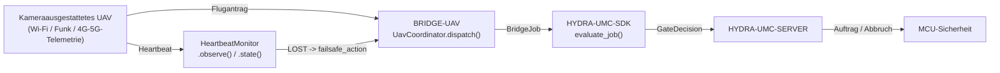

<!-- =============================================================================
HYDRA-UMC-BRIDGE-UAV - Bidirektionale Koordinationsbrücke für kameraausgestattete Drohnen
Copyright (C) 2026 JuanenRac (Electro Hobby 3D) <electrohobby3d@gmail.com>
GPL-3.0-or-later - see LICENSE
============================================================================= -->

<p align="center">
  
</p>

# 🛩️ HYDRA-UMC-BRIDGE-UAV

<p align="center"><a href="README.md">🇺🇸 English</a> | <a href="README_spa.md">🇪🇸 Español</a> | <a href="README_fra.md">🇫🇷 Français</a> | <a href="README_ita.md">🇮🇹 Italiano</a> | 🇩🇪 <b>Deutsch</b> | <a href="README_zho.md">🇨🇳 简体中文</a> | <a href="README_jpn.md">🇯🇵 日本語</a></p>

### 🔗 Abhängigkeitsfreie Koordinationsgrenze zwischen HYDRA-UMC und kameraausgestatteten UAVs

<p align="left">
  
  
  
</p>

---

## 1. 🛠️ TECHNISCHER ÜBERBLICK

**HYDRA-UMC-BRIDGE-UAV** ist die bidirektionale, High-Level-Koordinationsgrenze zwischen HYDRA-UMC und einer kameraausgestatteten Drohne (UAV), erreichbar über Wi-Fi, eine Funkverbindung oder eine Mobilfunk-Telemetrieverbindung (4G/5G). Sie validiert und leitet ein kleines, benanntes Vokabular von High-Level-Fluganfragen weiter (`PRE_FLIGHT_CHECK`, `TAKEOFF`, `GOTO_WAYPOINT`, `HOVER_AND_CAPTURE`, `RETURN_TO_LAUNCH`) und betreibt separat einen echten, verpflichtenden Heartbeat-Watchdog für Verbindungsverlust. Sie berechnet niemals Flugsteuerung oder Stabilisierung und kann HYDRA-UMC-SERVER, MCU-Grenzen, Watchdogs oder den E-STOP nicht umgehen.

Sie gehört zur Familie **Mobile & Autonomous Bridges** neben `HYDRA-UMC-BRIDGE-DROIDS` und `HYDRA-UMC-BRIDGE-AMR` und teilt denselben `HYDRA-UMC-SDK`-Auftrags- und Sicherheitsvertrag wie die stationären **External Automation Bridges** (CNC, LASER, OPENPNP, PRINTER3D, ROS2).

### Kernfunktionen:
* ✅ **Echter, abhängigkeitsfreier Flugantragskern:** `coordinator.py`s `UavCoordinator` hat keinerlei MAVLink-/Hersteller-SDK-Import — es ist bewusst reines Python, testbar auf jedem Host ohne angeschlossenes echtes UAV. *(implementiert, getestet in `tests/test_coordinator.py`)*
* ✅ **Echtes benanntes Flugantrags-Vokabular:** `PRE_FLIGHT_CHECK`, `TAKEOFF`, `GOTO_WAYPOINT`, `HOVER_AND_CAPTURE`, `RETURN_TO_LAUNCH` — niemals ein roher Lage-/Schubbefehl. Ein normal abgeschlossener Auftrag (`COMPLETE`) und ein Notfall-`ABORT` lösen beide dieselbe echte `RETURN_TO_LAUNCH`-Anfrage aus. *(implementiert)*
* ✅ **Ein echter, verpflichtender Heartbeat-Watchdog für Verbindungsverlust:** `HeartbeatMonitor` ist eine deterministische, durch ein explizites `now` gesteuerte Failsafe-Zustandsmaschine — sie liest niemals eine echte Uhr, meldet `LOST` bereits bei der allerersten Prüfung, wenn nie ein Signal beobachtet wurde, und behandelt den exakten Timeout-Zeitpunkt noch als `OK` (erst ein echtes Überschreiten löst den konfigurierten `RETURN_TO_LAUNCH`-/Hover-Failsafe aus). *(implementiert, getestet mit einer vollständigen deterministischen Grenzfall-Suite in `tests/test_heartbeat.py`)*
* ✅ **Echtes gemeinsames Sicherheitsgatter:** jeder über `UavCoordinator.dispatch()` versendete Auftrag wird durch `evaluate_job()` aus dem `bridge_contract` von `HYDRA-UMC-SDK` bewertet, demselben Gatter, das jede Schwesterbrücke und HYDRA-UMC-SERVER verwenden; eine produktive Phase erfordert eine externe Maschine im Zustand `IDLE` und eine `READY`-HYDRA-UMC-Zelle, während `ABORT` auch während eines Fehlers anforderbar bleibt. *(implementiert)*
* ✅ **Ausfallsicheres Phasenrouting und statische Evidenz:** eine unbekannte zukünftige SDK-Phase wird abgelehnt. `inspect_request_plan.py` gibt den statischen Flugantrags-Plan des Schemas `1.0` aus, ohne einen Transport zu öffnen. *(implementiert, getestet)*
* ✅ **Nicht-mutierender Build/Test:** `build-test.bat`/`.sh` kompilieren den Quellcode und führen deterministische Unit-Tests aus, ohne Version oder CHANGELOG zu ändern. *(implementiert, siehe BUILD & AUSFÜHRUNG unten)*
* 🔜 **Echter MAVLink- (Pixhawk/PX4) oder DJI-OSDK-Transportadapter** — wird erst eingeführt, nachdem ein echter Flugcontroller/SDK ausgewählt und getestet wurde. *(geplant)*

---

## 2. 🔄 UAV-KOORDINATIONSABLAUF



---

## 3. 🧱 ARCHITEKTUR UND DESIGN-ENTSCHEIDUNGEN

* **Warum der Heartbeat-Watchdog ein eigenes Modul ist und nicht in den Koordinator eingefaltet wurde.** Verbindungsverlust ist ein echter, eigenständiger Fehlermodus, getrennt von "ist dieser Auftrag gerade erlaubt" — `HeartbeatMonitor` beantwortet "kann ich noch dem vertrauen, was ich zuletzt von diesem UAV gehört habe" unabhängig von einem bestimmten Auftrag, sodass es kontinuierlich geprüft werden kann (z. B. bei jedem Telemetrie-Takt) statt nur, wenn zufällig ein Auftrag versendet wird.
* **Warum `HeartbeatMonitor` ein explizites `now` entgegennimmt, statt eine echte Uhr zu lesen.** Die eingefügte Architektur-Notiz, von der dieses Projekt ausging, ist ausdrücklich, dass eine UAV-Brücke diesen Watchdog VERLANGT — der einzige Weg, sein exaktes Verhalten an der Timeout-Grenze zu beweisen (nicht nur "es läuft irgendwann ab") ohne eine instabile, langsame, auf echten Sleeps basierende Testsuite, ist, die Zeit zu einer expliziten, testbaren Eingabe zu machen.
* **Warum `COMPLETE` und `ABORT` beide zu `RETURN_TO_LAUNCH` aufgelöst werden.** Eine abgeschlossene Mission und ein Notfallabbruch haben für ein UAV dasselbe echte, korrekte Ergebnis: nach Hause kommen. Sie im statischen Plan auf denselben Anfragenamen zusammenzufassen (dedupliziert, nicht wiederholt) spiegelt das ehrlich wider, statt zwei verschiedene "Nachhause"-Verben zu erfinden.
* **Warum der eigene Heartbeat dieser Brücke ausdrücklich KEIN Ersatz für den eigenen Failsafe des Flugcontrollers ist.** Die Firmware von Pixhawk/PX4 und DJI implementiert bereits einen echten, nahezu zertifizierten Failsafe für Verbindungsverlust auf Funk-/Telemetrie-Ebene — der `HeartbeatMonitor` dieser Brücke ist ein Signal der Koordinationsschicht für den eigenen Zustand von HYDRA-UMC, und beide müssen unabhängig voneinander existieren; siehe das eigene Hardware-Abnahmegatter in `docs/BRIDGE_GUIDE.md`.
* **Warum der MAVLink-/OSDK-Transportadapter noch nicht in diesem Repository ist.** Sich vor der Auswahl und dem Test auf das echte Befehls-/Telemetrieprotokoll eines bestimmten Flugcontrollers festzulegen, würde riskieren, Annahmen einzubauen, die dieser lokale, abhängigkeitsfreie Kern nicht verifizieren kann.
* **Wie das in den Rest des Ökosystems passt.** BRIDGE-UAV sitzt zwischen einem echten UAV und `HYDRA-UMC-SDK` → `HYDRA-UMC-SERVER` → MCU-Sicherheit — es ist eine Koordinationsgrenze, niemals ein Flugsteuerungsknoten, und es kann HYDRA-UMC-SERVER, MCU-Grenzen, Watchdogs oder den E-STOP nicht umgehen.

---

## 📂 VERZEICHNISSTRUKTUR

```text
HYDRA-UMC-BRIDGE-UAV/
├── src/
│   └── hydra_umc_bridge_uav/
│       ├── __init__.py
│       ├── coordinator.py       # UavCoordinator: abhängigkeitsfreies Flugantrags-Gatter
│       └── heartbeat.py         # HeartbeatMonitor: echter, deterministischer Failsafe für Verbindungsverlust
├── tests/
│   ├── test_coordinator.py      # Deterministische Unit-Tests für den Koordinationskern
│   └── test_heartbeat.py        # Deterministische Grenzfalltests für den Heartbeat-Watchdog
├── tools/
│   ├── build_test.py            # Nicht-mutierender Compiler + Testläufer (build-test.bat/.sh)
│   ├── bump_version.py          # Synchronisiert pyproject.toml, Manifest und CHANGELOG.md
│   └── inspect_request_plan.py  # Gibt den statischen Flugantrags-Plan aus (kein Transport geöffnet)
├── docs/
│   └── BRIDGE_GUIDE.md          # Umfang, kompatible Plattformen, Skripte, Hardware-Abnahmegatter
├── build-test.bat / build-test.sh  # Validiert nur, ändert das Repository nie
├── build.bat / build.sh            # Validiert und erhöht bei Erfolg Version + CHANGELOG
├── pyproject.toml               # Paket-Metadaten; hängt von HYDRA-UMC-SDK ab (git)
├── hydra-umc.project.json       # Ökosystem-Manifest (Version, Reifegrad, Familie)
├── CHANGELOG.md
├── CODE_OF_CONDUCT.md / CONTRIBUTING.md / SECURITY.md / SUPPORT.md
├── LICENSE / LICENSE.md
└── README.md / README_*.md      # Diese Datei und ihre 6 Übersetzungen
```

---

## 4. ⚙️ BUILD & AUSFÜHRUNG

Erfordert Python 3.11+. `tools/build_test.py` erwartet, dass `HYDRA-UMC-SDK` als Schwesterverzeichnis (`../HYDRA-UMC-SDK`) ausgecheckt oder über die Umgebungsvariable `HYDRA_UMC_SDK_ROOT` angegeben ist.

```bash
# Windows
build-test.bat      # nur Validierung — keine Versions-/CHANGELOG-Änderung
build.bat            # validiert und erhöht bei Erfolg Version + CHANGELOG

# Linux/macOS
bash build-test.sh
bash build.sh
```

`build-test` kompiliert jedes Modul unter `src/` mit `py_compile` und führt die vollständige `unittest`-Suite aus (`tests/test_coordinator.py`, `tests/test_heartbeat.py`) — deterministisch, ohne echte UAV-Verbindung, ohne Netzwerk und ohne Versions-/CHANGELOG-Änderung. `build` führt zuerst dieselbe Validierung aus und ruft nur bei Erfolg `tools/bump_version.py` auf, um die Version in `pyproject.toml`, `hydra-umc.project.json` und `CHANGELOG.md` zu synchronisieren. Es gibt noch keinen echten Hardware-`run`-Befehl — dafür sind ein validierter MAVLink-/OSDK-Transportadapter und ein echtes UAV erforderlich.

---

## ✅ Aktueller Status & Nächste Schritte

**Heute real:** Version `0.0.1`, funktionsfähig als abhängigkeitsfreier Koordinationskern (`UavCoordinator`) plus ein echter, vollständig grenzwertgetesteter Heartbeat-Watchdog für Verbindungsverlust (`HeartbeatMonitor`), ausfallsicherem Phasenrouting, einem statischen `plan-only`-Flugantragsschema sowie nicht-mutierenden Build-Test-Skripten, die in CI mit SDK-Checkout eingebunden sind.

**Integrationsgrenze:** diese Brücke ist ausschließlich eine Koordinationsgrenze — sie ist kein Flugsteuerungsknoten und kann HYDRA-UMC-SERVER, MCU-Grenzen, Watchdogs oder den E-STOP nicht umgehen; jeder versendete Auftrag durchläuft weiterhin dasselbe gemeinsame Gatter, das jede Schwesterbrücke verwendet. Das eigene Failsafe-Signal von `HeartbeatMonitor` ist eine Angelegenheit der Koordinationsschicht, niemals ein Ersatz für den eigenen, unabhängigen Failsafe des Flugcontrollers bei Verbindungsverlust.

**Noch offen:** es wurde noch kein echter MAVLink- (Pixhawk/PX4) oder DJI-OSDK-Transport und kein physisches UAV validiert — ein echter Adapter wird erst eingeführt, nachdem ein bestimmter Flugcontroller/SDK ausgewählt und getestet wurde.

---

## 🔗 Verwandte Projekte

Dieses Projekt ist Teil eines größeren Robotik-Ökosystems desselben Autors (JuanenRac / Electro Hobby 3D), das Firmware, Steuerungssoftware, KI-Knoten und Flotten-Tooling umfasst. Es lohnt sich, das zu wissen, da eine Anfrage tatsächlich eines dieser Projekte betreffen könnte statt dieses Repositorys.

### Direkt verwandt

- **[HYDRA-UMC-SDK](https://github.com/JuanenRac/HYDRA-UMC-SDK)** — der gemeinsame Auftrags- und Sicherheitsvertrag, durch den jede Brücke (einschließlich dieser) ihre Aufträge bewertet.
- **[HYDRA-UMC-SERVER](https://github.com/JuanenRac/HYDRA-UMC-SERVER)** — die authentifizierte Ökosystemgrenze, an die diese Brücke berichtet.
- **[HYDRA-UMC-BRIDGE-DROIDS](https://github.com/JuanenRac/HYDRA-UMC-BRIDGE-DROIDS)** — Schwester-Mobilbrücke für laufende/humanoide Droiden.
- **[HYDRA-UMC-BRIDGE-AMR](https://github.com/JuanenRac/HYDRA-UMC-BRIDGE-AMR)** — Schwester-Mobilbrücke für AGV-/AMR-Flotten.

### Rest des Ökosystems

**HYDRA-UMC-Plattform** — die Multi-Roboter-Mikrofabrikzelle, für die diese Brücke Hilfsfunktionen koordiniert
- **[HYDRA-UMC](https://github.com/JuanenRac/HYDRA-UMC)** — die CM5- + STM32H745-Hauptplatine, die bis zu 8 Roboterarme orchestriert.
- **[HYDRA-UMC-SERVER](https://github.com/JuanenRac/HYDRA-UMC-SERVER)** — das Express/WebSocket-Backend, mit dem jeder Steuerungsclient und jede Brücke spricht.
- **[HYDRA-UMC-STUDIO](https://github.com/JuanenRac/HYDRA-UMC-STUDIO)** — webbasiertes Steuerungs-Dashboard, Multi-Roboter-3D-Visualisierung.

**External Automation Bridges** — Schwester-Repositories, die dasselbe `HYDRA-UMC-SDK`-Auftragsgatter teilen
- **[HYDRA-UMC-BRIDGE-CNC](https://github.com/JuanenRac/HYDRA-UMC-BRIDGE-CNC)** — CNC-Zellkoordinationsbrücke.
- **[HYDRA-UMC-BRIDGE-LASER](https://github.com/JuanenRac/HYDRA-UMC-BRIDGE-LASER)** — Koordinationsbrücke für Laserzellen.
- **[HYDRA-UMC-BRIDGE-OPENPNP](https://github.com/JuanenRac/HYDRA-UMC-BRIDGE-OPENPNP)** — Board-Flow-Brücke für OpenPnP.
- **[HYDRA-UMC-BRIDGE-PRINTER3D](https://github.com/JuanenRac/HYDRA-UMC-BRIDGE-PRINTER3D)** — Koordinationsbrücke für offene 3D-Drucksoftware.
- **[HYDRA-UMC-BRIDGE-ROS2](https://github.com/JuanenRac/HYDRA-UMC-BRIDGE-ROS2)** — generische Koordinationsbrücke für jede ROS-2-Plattform.

**Sicherheits- und Integrationsnachweise**
- **[HYDRA-UMC-SAFETY-ZONES](https://github.com/JuanenRac/HYDRA-UMC-SAFETY-ZONES)** — Sicherheitsnachweise für Zellzonen, die in der gesamten Brückenfamilie verwendet werden.
- **[HYDRA-UMC-HIL-BRIDGE](https://github.com/JuanenRac/HYDRA-UMC-HIL-BRIDGE)** — Hardware-in-the-Loop-Testnachweise.

## 👤 AUTOR
**JuanenRac** (Electro Hobby 3D)
📧 electrohobby3d@gmail.com

## 📜 LIZENZ
GPL-3.0 - Siehe LICENSE für Details.
