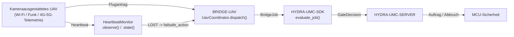

<!-- =============================================================================
HYDRA-UMC-BRIDGE-UAV - Bidirektionale Koordinationsbrücke für kameraausgestattete Drohnen
Copyright (C) 2026 JuanenRac (Electro Hobby 3D) <electrohobby3d@gmail.com>
GPL-3.0-or-later - see LICENSE
============================================================================= -->

<p align="center">
  
</p>

# 🛩️ HYDRA-UMC-BRIDGE-UAV

<p align="center"><a href="README.md">🇺🇸 English</a> | <a href="README_spa.md">🇪🇸 Español</a> | <a href="README_fra.md">🇫🇷 Français</a> | <a href="README_ita.md">🇮🇹 Italiano</a> | 🇩🇪 <b>Deutsch</b> | <a href="README_zho.md">🇨🇳 简体中文</a> | <a href="README_jpn.md">🇯🇵 日本語</a></p>

### 🔗 Abhängigkeitsfreie Koordinationsgrenze zwischen HYDRA-UMC und kameraausgestatteten UAVs

<p align="left">
  
  
  
</p>

---

## 1. 🛠️ TECHNISCHER ÜBERBLICK

**HYDRA-UMC-BRIDGE-UAV** ist die bidirektionale, High-Level-Koordinationsgrenze zwischen HYDRA-UMC und einer kameraausgestatteten Drohne (UAV), erreichbar über Wi-Fi, eine Funkverbindung oder eine Mobilfunk-Telemetrieverbindung (4G/5G). Sie validiert und leitet ein kleines, benanntes Vokabular von High-Level-Fluganfragen weiter (`PRE_FLIGHT_CHECK`, `TAKEOFF`, `GOTO_WAYPOINT`, `HOVER_AND_CAPTURE`, `RETURN_TO_LAUNCH`) und betreibt separat einen echten, verpflichtenden Heartbeat-Watchdog für Verbindungsverlust. Sie berechnet niemals Flugsteuerung oder Stabilisierung und kann HYDRA-UMC-SERVER, MCU-Grenzen, Watchdogs oder den E-STOP nicht umgehen.

Sie gehört zur Familie **Mobile & Autonomous Bridges** neben `HYDRA-UMC-BRIDGE-DROIDS` und `HYDRA-UMC-BRIDGE-AMR` und teilt denselben `HYDRA-UMC-SDK`-Auftrags- und Sicherheitsvertrag wie die stationären **External Automation Bridges** (CNC, LASER, OPENPNP, PRINTER3D, ROS2).

### Kernfunktionen:
* ✅ **Echter, abhängigkeitsfreier Flugantragskern:** `coordinator.py`s `UavCoordinator` hat keinerlei MAVLink-/Hersteller-SDK-Import — es ist bewusst reines Python, testbar auf jedem Host ohne angeschlossenes echtes UAV. *(implementiert, getestet in `tests/test_coordinator.py`)*
* ✅ **Echtes benanntes Flugantrags-Vokabular:** `PRE_FLIGHT_CHECK`, `TAKEOFF`, `GOTO_WAYPOINT`, `HOVER_AND_CAPTURE`, `RETURN_TO_LAUNCH` — niemals ein roher Lage-/Schubbefehl. Ein normal abgeschlossener Auftrag (`COMPLETE`) und ein Notfall-`ABORT` lösen beide dieselbe echte `RETURN_TO_LAUNCH`-Anfrage aus. *(implementiert)*
* ✅ **Ein echter, verpflichtender Heartbeat-Watchdog für Verbindungsverlust:** `HeartbeatMonitor` ist eine deterministische, durch ein explizites `now` gesteuerte Failsafe-Zustandsmaschine — sie liest niemals eine echte Uhr, meldet `LOST` bereits bei der allerersten Prüfung, wenn nie ein Signal beobachtet wurde, und behandelt den exakten Timeout-Zeitpunkt noch als `OK` (erst ein echtes Überschreiten löst den konfigurierten `RETURN_TO_LAUNCH`-/Hover-Failsafe aus). *(implementiert, getestet mit einer vollständigen deterministischen Grenzfall-Suite in `tests/test_heartbeat.py`)*
* ✅ **Echtes gemeinsames Sicherheitsgatter:** jeder über `UavCoordinator.dispatch()` versendete Auftrag wird durch `evaluate_job()` aus dem `bridge_contract` von `HYDRA-UMC-SDK` bewertet, demselben Gatter, das jede Schwesterbrücke und HYDRA-UMC-SERVER verwenden; eine produktive Phase erfordert eine externe Maschine im Zustand `IDLE` und eine `READY`-HYDRA-UMC-Zelle, während `ABORT` auch während eines Fehlers anforderbar bleibt. *(implementiert)*
* ✅ **Ausfallsicheres Phasenrouting und statische Evidenz:** eine unbekannte zukünftige SDK-Phase wird abgelehnt. `inspect_request_plan.py` gibt den statischen Flugantrags-Plan des Schemas `1.1` aus (jetzt einschließlich der eigenständigen `LAND`-Anfrage), ohne einen Transport zu öffnen. *(implementiert, getestet)*
* ✅ **Echter MAVLink-Befehlstransport:** `mavlink_transport.py`s `MavlinkFlightControl` sendet einen bereits geprüften Dispatch als echtes `COMMAND_LONG`, abgebildet auf ein echtes, nummeriertes `MAV_CMD` (`MAV_CMD_NAV_TAKEOFF`/`MAV_CMD_DO_REPOSITION`/`MAV_CMD_NAV_LOITER_UNLIM`/`MAV_CMD_IMAGE_START_CAPTURE`/`MAV_CMD_NAV_RETURN_TO_LAUNCH`/`MAV_CMD_NAV_LAND`/`MAV_CMD_COMPONENT_ARM_DISARM`) - ein abgelehnter Dispatch erreicht das Netzwerk nie. *(implementiert, getestet in `tests/test_mavlink_transport.py`)*
* ✅ **Nicht-mutierender Build/Test:** `build-test.bat`/`.sh` kompilieren den Quellcode und führen deterministische Unit-Tests aus, ohne Version oder CHANGELOG zu ändern. *(implementiert, siehe BUILD & AUSFÜHRUNG unten)*
* 🔜 **Ein DJI-OSDK-Transportadapter** (für eine Nicht-MAVLink-Plattform) — wird erst eingeführt, nachdem dieses SDK ausgewählt und getestet wurde. *(geplant)*

---

## 2. 🔄 UAV-KOORDINATIONSABLAUF



---

## 3. 🧱 ARCHITEKTUR UND DESIGN-ENTSCHEIDUNGEN

* **Warum der Heartbeat-Watchdog ein eigenes Modul ist und nicht in den Koordinator eingefaltet wurde.** Verbindungsverlust ist ein echter, eigenständiger Fehlermodus, getrennt von "ist dieser Auftrag gerade erlaubt" — `HeartbeatMonitor` beantwortet "kann ich noch dem vertrauen, was ich zuletzt von diesem UAV gehört habe" unabhängig von einem bestimmten Auftrag, sodass es kontinuierlich geprüft werden kann (z. B. bei jedem Telemetrie-Takt) statt nur, wenn zufällig ein Auftrag versendet wird.
* **Warum `HeartbeatMonitor` ein explizites `now` entgegennimmt, statt eine echte Uhr zu lesen.** Die eingefügte Architektur-Notiz, von der dieses Projekt ausging, ist ausdrücklich, dass eine UAV-Brücke diesen Watchdog VERLANGT — der einzige Weg, sein exaktes Verhalten an der Timeout-Grenze zu beweisen (nicht nur "es läuft irgendwann ab") ohne eine instabile, langsame, auf echten Sleeps basierende Testsuite, ist, die Zeit zu einer expliziten, testbaren Eingabe zu machen.
* **Warum `COMPLETE` und `ABORT` beide zu `RETURN_TO_LAUNCH` aufgelöst werden.** Eine abgeschlossene Mission und ein Notfallabbruch haben für ein UAV dasselbe echte, korrekte Ergebnis: nach Hause kommen. Sie im statischen Plan auf denselben Anfragenamen zusammenzufassen (dedupliziert, nicht wiederholt) spiegelt das ehrlich wider, statt zwei verschiedene "Nachhause"-Verben zu erfinden.
* **Warum der eigene Heartbeat dieser Brücke ausdrücklich KEIN Ersatz für den eigenen Failsafe des Flugcontrollers ist.** Die Firmware von Pixhawk/PX4 und DJI implementiert bereits einen echten, nahezu zertifizierten Failsafe für Verbindungsverlust auf Funk-/Telemetrie-Ebene — der `HeartbeatMonitor` dieser Brücke ist ein Signal der Koordinationsschicht für den eigenen Zustand von HYDRA-UMC, und beide müssen unabhängig voneinander existieren; siehe das eigene Hardware-Abnahmegatter in `docs/BRIDGE_GUIDE.md`.
* **Warum der MAVLink-/OSDK-Transportadapter noch nicht in diesem Repository ist.** Sich vor der Auswahl und dem Test auf das echte Befehls-/Telemetrieprotokoll eines bestimmten Flugcontrollers festzulegen, würde riskieren, Annahmen einzubauen, die dieser lokale, abhängigkeitsfreie Kern nicht verifizieren kann.
* **Wie das in den Rest des Ökosystems passt.** BRIDGE-UAV sitzt zwischen einem echten UAV und `HYDRA-UMC-SDK` → `HYDRA-UMC-SERVER` → MCU-Sicherheit — es ist eine Koordinationsgrenze, niemals ein Flugsteuerungsknoten, und es kann HYDRA-UMC-SERVER, MCU-Grenzen, Watchdogs oder den E-STOP nicht umgehen.

---

## 📂 VERZEICHNISSTRUKTUR

```text
HYDRA-UMC-BRIDGE-UAV/
├── src/
│   └── hydra_umc_bridge_uav/
│       ├── __init__.py
│       ├── coordinator.py       # UavCoordinator: abhängigkeitsfreies Flugantrags-Gatter
│       ├── heartbeat.py         # HeartbeatMonitor: echter, deterministischer Failsafe für Verbindungsverlust
│       └── mavlink_transport.py # Sendet einen bereits validierten UavDispatch als echten MAVLink-COMMAND_LONG
├── tests/
│   ├── test_coordinator.py      # Deterministische Unit-Tests für den Koordinationskern
│   ├── test_heartbeat.py        # Deterministische Grenzfalltests für den Heartbeat-Watchdog
│   └── test_mavlink_transport.py # Echte MAV_CMD-Form-Tests gegen eine simulierte MAVLink-Verbindung
├── tools/
│   ├── build_test.py            # Nicht-mutierender Compiler + Testläufer (build-test.bat/.sh)
│   ├── bump_version.py          # Synchronisiert pyproject.toml, Manifest und CHANGELOG.md
│   └── inspect_request_plan.py  # Gibt den statischen Flugantrags-Plan aus (kein Transport geöffnet)
├── docs/
│   └── BRIDGE_GUIDE.md          # Umfang, kompatible Plattformen, Skripte, Hardware-Abnahmegatter
├── images/
│   └── HYDRA_UMC_BANNER.svg     # README-Banner
├── build-test.bat / build-test.sh  # Validiert nur, ändert das Repository nie
├── build.bat / build.sh            # Validiert und erhöht bei Erfolg Version + CHANGELOG
├── pyproject.toml               # Paket-Metadaten; hängt von HYDRA-UMC-SDK ab (git)
├── hydra-umc.project.json       # Ökosystem-Manifest (Version, Reifegrad, Familie)
├── CHANGELOG.md
├── CODE_OF_CONDUCT.md / CONTRIBUTING.md / SECURITY.md / SUPPORT.md
├── LICENSE / LICENSE.md
└── README.md / README_*.md      # Diese Datei und ihre 6 Übersetzungen
```

---

## 4. ⚙️ BUILD & AUSFÜHRUNG

Erfordert Python 3.11+. `tools/build_test.py` erwartet, dass `HYDRA-UMC-SDK` als Schwesterverzeichnis (`../HYDRA-UMC-SDK`) ausgecheckt oder über die Umgebungsvariable `HYDRA_UMC_SDK_ROOT` angegeben ist.

```bash
# Windows
build-test.bat      # nur Validierung — keine Versions-/CHANGELOG-Änderung
build.bat            # validiert und erhöht bei Erfolg Version + CHANGELOG

# Linux/macOS
bash build-test.sh
bash build.sh
```

`build-test` kompiliert jedes Modul unter `src/` mit `py_compile` und führt die vollständige `unittest`-Suite aus (`tests/test_coordinator.py`, `tests/test_heartbeat.py`) — deterministisch, ohne echte UAV-Verbindung, ohne Netzwerk und ohne Versions-/CHANGELOG-Änderung. `build` führt zuerst dieselbe Validierung aus und ruft nur bei Erfolg `tools/bump_version.py` auf, um die Version in `pyproject.toml`, `hydra-umc.project.json` und `CHANGELOG.md` zu synchronisieren. Es gibt noch keinen echten Hardware-`run`-Befehl — dafür sind ein validierter MAVLink-/OSDK-Transportadapter und ein echtes UAV erforderlich.

---

## ✅ Aktueller Status & Nächste Schritte

**Heute real:** Version `0.0.4`, funktionsfähig als abhängigkeitsfreier Koordinationskern (`UavCoordinator`) plus ein echter, vollständig grenzwertgetesteter Heartbeat-Watchdog für Verbindungsverlust (`HeartbeatMonitor`), ausfallsicherem Phasenrouting, einem statischen `plan-only`-Flugantragsschema, einem echten MAVLink-Befehlstransport (`MavlinkFlightControl`), der jede Anfrage auf ihr echtes, nummeriertes `MAV_CMD` abbildet, sowie nicht-mutierenden Build-Test-Skripten, die in CI mit SDK-Checkout eingebunden sind.

**Integrationsgrenze:** diese Brücke ist ausschließlich eine Koordinationsgrenze — sie ist kein Flugsteuerungsknoten und kann HYDRA-UMC-SERVER, MCU-Grenzen, Watchdogs oder den E-STOP nicht umgehen; jeder versendete Auftrag durchläuft weiterhin dasselbe gemeinsame Gatter, das jede Schwesterbrücke verwendet. Das eigene Failsafe-Signal von `HeartbeatMonitor` ist eine Angelegenheit der Koordinationsschicht, niemals ein Ersatz für den eigenen, unabhängigen Failsafe des Flugcontrollers bei Verbindungsverlust.

**Noch offen:** es wurde noch kein echter MAVLink- (Pixhawk/PX4) oder DJI-OSDK-Transport und kein physisches UAV validiert — ein echter Adapter wird erst eingeführt, nachdem ein bestimmter Flugcontroller/SDK ausgewählt und getestet wurde.

---

## 🔗 Verwandte Projekte

Dieses Projekt ist Teil des HYDRA-UMC-Robotik-Ökosystems desselben Autors (JuanenRac / Electro Hobby 3D). Gut zu wissen, da eine Anfrage eigentlich eines dieser Projekte betreffen könnte statt dieses Repositorys.

**Übergeordnetes Projekt**
- **[HYDRA-UMC-SERVER](https://github.com/JuanenRac/HYDRA-UMC-SERVER)** — das reale Headless-Backend (REST/WebSocket), mit dem jeder Steuerungsclient tatsächlich spricht; die authentifizierte Ökosystemgrenze, an die diese Bridge berichtet, sobald jeder Befehl die eigene lokale Sicherheitsschranke dieser Bridge durchlaufen hat.

**Geschwisterprojekte** — sprechen ebenfalls mit der eigenen API von HYDRA-UMC-SERVER, jeweils als eigener Client
- **[HYDRA-UMC-STUDIO](https://github.com/JuanenRac/HYDRA-UMC-STUDIO)** — Web-Steuerungs-Dashboard mit Echtzeit-3D-Visualisierung mehrerer Roboter.
- **[HYDRA-UMC-SUITE](https://github.com/JuanenRac/HYDRA-UMC-SUITE)** — Desktop-Schwarmleitstand (PySide6) für mehrere Server gleichzeitig, verpackt als eigenständige ausführbare Datei.
- **[HYDRA-UMC-ANDROID-CONTROL](https://github.com/JuanenRac/HYDRA-UMC-ANDROID-CONTROL)** — native Android-Steuerungs-App mit biometrischem Login und einer gekoppelten Wear-OS-Begleit-App.
- **[HYDRA-UMC-IOS-CONTROL](https://github.com/JuanenRac/HYDRA-UMC-IOS-CONTROL)** — iOS/iPadOS-Steuerungs-App (Flutter) mit Echtzeit-WebSocket-Synchronisierung.
- **[HYDRA-UMC-DSI](https://github.com/JuanenRac/HYDRA-UMC-DSI)** — native Touch-UI für das eingebaute 7"-DSI-Touchscreen, direkt auf dem CM5 eingebettet.
- **[HYDRA-UMC-BRIDGE-AMR](https://github.com/JuanenRac/HYDRA-UMC-BRIDGE-AMR)** — Koordinationsschranke für AGV-/AMR-Flotten über einen echten VDA-5050-MQTT-Publisher — eine von 3 mobilen Flotten-Bridges des Ökosystems.
- **[HYDRA-UMC-BRIDGE-CNC](https://github.com/JuanenRac/HYDRA-UMC-BRIDGE-CNC)** — High-Level-Koordinator für CNC-Zellen mit echtem GRBL-Status-/Steuerbyte-Zugriff.
- **[HYDRA-UMC-BRIDGE-DROIDS](https://github.com/JuanenRac/HYDRA-UMC-BRIDGE-DROIDS)** — Koordinationsschranke für laufende/humanoide Droiden, mit einem echten Boston-Dynamics-Spot-Befehlssender — eine von 3 mobilen Flotten-Bridges des Ökosystems.
- **[HYDRA-UMC-BRIDGE-LASER](https://github.com/JuanenRac/HYDRA-UMC-BRIDGE-LASER)** — Sicherheitskoordinator für Laserzellen, liest 3 echte Schlüssel-/Gehäuse-/Verriegelungs-GPIO-Sicherungen.
- **[HYDRA-UMC-BRIDGE-OPENPNP](https://github.com/JuanenRac/HYDRA-UMC-BRIDGE-OPENPNP)** — sicherer High-Level-Koordinator für den Leiterplattenfluss von OpenPnP Pick-and-Place.
- **[HYDRA-UMC-BRIDGE-PRINTER3D](https://github.com/JuanenRac/HYDRA-UMC-BRIDGE-PRINTER3D)** — sichere Koordinationsschranke für Moonraker/Klipper-3D-Drucker, mit echten gesicherten Job-Befehlen.
- **[HYDRA-UMC-BRIDGE-ROS2](https://github.com/JuanenRac/HYDRA-UMC-BRIDGE-ROS2)** — Sicherheitskoordinator mit einem echten, träge importierten rclpy-ROS-2-Transport.

**Direkt verwandt**
- **[HYDRA-UMC-SDK](https://github.com/JuanenRac/HYDRA-UMC-SDK)** — der gemeinsame JSON-Schema-Vertrag und die Sicherheitsschranke, gegen die jede Bridge ihre Befehle validiert.

**Ebenfalls Teil des Ökosystems**

*Kern-Hardware & Plattform*
- **[HYDRA-UMC](https://github.com/JuanenRac/HYDRA-UMC)** — das physische Motherboard des Roboterarms: CM5-Host + Dual-Core-STM32H745, koordiniert bis zu 8 Werkzeugarme über CAN-OTA/SPI-OTA.
- **[HYDRA-UMC-OS](https://github.com/JuanenRac/HYDRA-UMC-OS)** — reproduzierbare Raspberry-Pi-OS-Produktschicht für den CM5: schreibgeschützter Agent, validierte Konfiguration/Profile, WiFi-Ersteinrichtung.

*Kern-Backend & Clients*
- **[HYDRA-UMC-EDITOR-URDF](https://github.com/JuanenRac/HYDRA-UMC-EDITOR-URDF)** — grafischer Desktop-URDF-Ersteller/-Editor, der fertige Modelle in STUDIOs eigenen Katalog überträgt.

*URTC-Werkzeugplattform*
- **[URTC](https://github.com/JuanenRac/URTC)** — Firmware für die physische Universal-Robot-Tool-Controller-Platine, 25+ Werkzeugprofile über CAN-Bus.
- **[URTC-FLASHER](https://github.com/JuanenRac/URTC-FLASHER)** — Desktop-GUI-Flash-Tool für URTC-Platinen, CAN-OTA plus Full-Chip-SWD/JTAG.
- **[URTC-TESTER](https://github.com/JuanenRac/URTC-TESTER)** — Desktop-Live-CAN-Bus-Diagnosetool für URTC-Platinen, ein Panel pro Werkzeugprofil.
- **[URTC-WEB-STUDIO](https://github.com/JuanenRac/URTC-WEB-STUDIO)** — browserbasierte Alternative zu URTC-TESTER über die Web-Serial-API, ohne lokale Installation.

*Vision-KI-Knoten (Hailo-8)*
- **[HYDRA-UMC-VISION-NODE](https://github.com/JuanenRac/HYDRA-UMC-VISION-NODE)** — Integrationsknoten für die Hailo-8-Vision-Pipeline, mit einer echten stufenweisen Hardware-Bereitschaftsprüfung.
- **[HYDRA-UMC-DETECTION-HEF](https://github.com/JuanenRac/HYDRA-UMC-DETECTION-HEF)** — echte Registry für kompilierte Modelle mit Hailo-Architektur-/Prüfsummen-Safe-Load-Verifizierung.
- **[HYDRA-UMC-VISION-STREAMER](https://github.com/JuanenRac/HYDRA-UMC-VISION-STREAMER)** — echter GStreamer-Pipeline- + MediaMTX-Konfigurationsgenerator mit einer echten HailoRT-Integrationsschranke.
- **[HYDRA-UMC-VISUAL-SERVOING-API](https://github.com/JuanenRac/HYDRA-UMC-VISUAL-SERVOING-API)** — echtes Position-Based-Visual-Servoing-Korrekturgesetz, sicherheitsgesteuert nach vorgelagertem Zonenstatus.
- **[HYDRA-UMC-SAFETY-ZONES](https://github.com/JuanenRac/HYDRA-UMC-SAFETY-ZONES)** — echte Zonenverletzungsprüfung und E-STOP-Anforderung, mit erzwungener Kalibrierungsaktualität.

*Kognitiver KI-Knoten (Hailo-10)*
- **[HYDRA-UMC-COGNITIVE-NODE](https://github.com/JuanenRac/HYDRA-UMC-COGNITIVE-NODE)** — Integrationsknoten für die Hailo-10-Cognitive-Pipeline (LLM-/VLA-/Sprach-Orchestrierung).
- **[HYDRA-UMC-VLA-ENGINE](https://github.com/JuanenRac/HYDRA-UMC-VLA-ENGINE)** — echte Aktions-Token-Kodierung/-Dekodierung und Trajektoriengenerierung für ein Vision-Language-Action-Modell.
- **[HYDRA-UMC-VOICE-UI](https://github.com/JuanenRac/HYDRA-UMC-VOICE-UI)** — echtes Sprach-Frontend (VAD + Intent-Parser) mit einem begrenzten, bestätigungsgesicherten Watch-Relay.
- **[HYDRA-UMC-SEMANTIC-PLANNER](https://github.com/JuanenRac/HYDRA-UMC-SEMANTIC-PLANNER)** — echte regelbasierte Aufgabenzerlegung und semantische Fehlerbehebung über MCU-Fehlercodes.
- **[HYDRA-UMC-DOCS-QA](https://github.com/JuanenRac/HYDRA-UMC-DOCS-QA)** — echte, nur auf der Standardbibliothek basierende TF-IDF-Dokumentensuche über die eigenen Markdown-Dokumente dieses Ökosystems.

*Orchestrierung & Schwarm*
- **[HYDRA-UMC-ORCHESTRATOR](https://github.com/JuanenRac/HYDRA-UMC-ORCHESTRATOR)** — Integrationsknoten mit einem echten gRPC/Protobuf-Health-Report-Vertrag und einer Missions-Zustandsmaschine.
- **[HYDRA-UMC-JOB-DISPATCHER](https://github.com/JuanenRac/HYDRA-UMC-JOB-DISPATCHER)** — echte prioritätsbasierte Job-Queue mit Deduplizierung, über eine echte HTTP-API.
- **[HYDRA-UMC-NODE-HEALING](https://github.com/JuanenRac/HYDRA-UMC-NODE-HEALING)** — echter gRPC-basierter Flotten-Health-Watchdog mit Retry/Backoff und Identitäts-Mismatch-Erkennung.
- **[HYDRA-UMC-PATH-PLANNER-3D](https://github.com/JuanenRac/HYDRA-UMC-PATH-PLANNER-3D)** — echter RRT-basierter 3D-Pfadplaner mit echter Hindernis-/Arbeitsraum-Kollisionsvalidierung.
- **[HYDRA-UMC-SWARM-SYNC](https://github.com/JuanenRac/HYDRA-UMC-SWARM-SYNC)** — echte CRDT-LWW-Element-Map-Zustandssynchronisation, eigenschaftsgetestet auf Multi-Zellen-Konvergenz.

*Digitaler Zwilling & Simulation*
- **[HYDRA-UMC-TWIN](https://github.com/JuanenRac/HYDRA-UMC-TWIN)** — Integrationsknoten für die Digital-Twin-Engine, mit einem echten Versionskompatibilitäts-Sync-Vertrag.
- **[HYDRA-UMC-HIL-BRIDGE](https://github.com/JuanenRac/HYDRA-UMC-HIL-BRIDGE)** — echte Hardware-in-the-Loop-Sicherheitsverriegelung, die Befehle zwischen Simulation und echter Hardware routet.
- **[HYDRA-UMC-PHYSICS-REPLICA](https://github.com/JuanenRac/HYDRA-UMC-PHYSICS-REPLICA)** — echte Vorwärtskinematik und Gelenkgrenzenvalidierung über eine echte URDF-Teilmenge.
- **[HYDRA-UMC-SYNTHETIC-DATA-GEN](https://github.com/JuanenRac/HYDRA-UMC-SYNTHETIC-DATA-GEN)** — echter prozeduraler 2D-Szenengenerator mit YOLO/COCO-Annotationsexport.

*Daten & Analytik*
- **[HYDRA-UMC-DATALAKE](https://github.com/JuanenRac/HYDRA-UMC-DATALAKE)** — echter sqlite3-gestützter Zeitreihenspeicher mit einer echten Ingest-/Abfrage-HTTP-API.
- **[HYDRA-UMC-ANOMALY-DETECTOR](https://github.com/JuanenRac/HYDRA-UMC-ANOMALY-DETECTOR)** — echter FFT- + statistischer Basislinien-Anomaliedetektor mit Drift-Überwachung.
- **[HYDRA-UMC-PRODUCTION-REPORTS](https://github.com/JuanenRac/HYDRA-UMC-PRODUCTION-REPORTS)** — echte OEE-/Verfügbarkeitsberechnung über den DATALAKE-Verlauf, mit reproduzierbarem CSV-Export.
- **[HYDRA-UMC-TELEMETRY-COLLECTOR](https://github.com/JuanenRac/HYDRA-UMC-TELEMETRY-COLLECTOR)** — echte CAN/WebSocket-Ingestion-Pipeline in DATALAKE, mit Sequenz-Deduplizierung.

*Industrie-Gateway*
- **[HYDRA-UMC-GATEWAY-INDUSTRIAL](https://github.com/JuanenRac/HYDRA-UMC-GATEWAY-INDUSTRIAL)** — Integrationsknoten, der zu Industrieprotokollen weiterleitet, mit einer echten Befehls-Allowlist-/Backpressure-Schicht.
- **[HYDRA-UMC-OPCUA-SERVER](https://github.com/JuanenRac/HYDRA-UMC-OPCUA-SERVER)** — echter OPC-UA-Adressraum, verifiziert mit einer echten Binärprotokoll-Client-Session.
- **[HYDRA-UMC-MQTT-BROKER](https://github.com/JuanenRac/HYDRA-UMC-MQTT-BROKER)** — echter MQTT-Broker mit optionaler Pro-Client-Authentifizierung und Topic-ACLs.
- **[HYDRA-UMC-MTCONNECT-ADAPTER](https://github.com/JuanenRac/HYDRA-UMC-MTCONNECT-ADAPTER)** — echte MTConnect-`/probe`- und `/current`-XML-Endpunkte mit Degraded-Mode-Ausgabe.

*Ergänzende Tools & Ökosystembetrieb*
- **[HYDRA-UMC-DASHBOARD-AI](https://github.com/JuanenRac/HYDRA-UMC-DASHBOARD-AI)** — Smart-Summaries- und Anomaly-Highlighting-Panels über DATALAKE/ANOMALY-DETECTOR, mit einem ehrlichen statistischen Fallback.
- **[HYDRA-UMC-TOOL-CLI](https://github.com/JuanenRac/HYDRA-UMC-TOOL-CLI)** — Flotten-CLI mit einem echten, stabilen Exit-Code-Vertrag, ein echter Live-Client der eigenen API von HYDRA-UMC-SERVER.
- **[HYDRA-UMC-WATCH](https://github.com/JuanenRac/HYDRA-UMC-WATCH)** — WearOS-Begleit-App mit echten haptischen Alarmen und einem Sprach-Relay zum gekoppelten Telefon.
- **[URTC-SMART-RACK](https://github.com/JuanenRac/URTC-SMART-RACK)** — Firmware für ein Platinenmontagegestell mit echter Werkzeug-ID-Dekodierung und Smart-Idle-Vorheizlogik.
- **[URTC-VISION-TOOL](https://github.com/JuanenRac/URTC-VISION-TOOL)** — Firmware plus ein echter Python-Vision-Begleiter für einen Thermal-/RGB-Inspektionswerkzeugkopf.
- **[HYDRA-UMC-UPDATER](https://github.com/JuanenRac/HYDRA-UMC-UPDATER)** — administratives Desktop-Tool, das jedes Repository in diesem Ökosystem entdeckt, klont und aktualisiert.
- **[HYDRA-UMC-OS-REBUILDER](https://github.com/JuanenRac/HYDRA-UMC-OS-REBUILDER)** — Windows/Linux-Desktop-Tool, das ein flashbereites CM5-Image baut, vorgeladen mit den aktuellsten Versionen des Ökosystems, mit Ersteinrichtungs-Konfiguration für WLAN/Benutzer/SSH im Stil von Raspberry Pi Imager.

---

## 📚 Dokumentation & Community

- **[CONTRIBUTING.md](CONTRIBUTING.md)** — Technologie-Stack und Coding-Richtlinien für einen Pull Request.
- **[CODE_OF_CONDUCT.md](CODE_OF_CONDUCT.md)** — die in dieser Community erwarteten Verhaltensstandards.
- **[SECURITY.md](SECURITY.md)** — wie man eine Schwachstelle meldet, und die echten Sicherheitsschwerpunkte dieses Projekts.
- **[SUPPORT.md](SUPPORT.md)** — wo man Fragen stellt und Fehler meldet.
- **[LICENSE.md](LICENSE.md)** — die eigene Lizenz dieses Projekts.

## 👤 AUTOR
**JuanenRac** (Electro Hobby 3D)
📧 electrohobby3d@gmail.com
📺 [youtube.com/@electrohobby3d](https://youtube.com/@electrohobby3d)

## 📜 LIZENZ
GPL-3.0 - Siehe LICENSE für Details.
