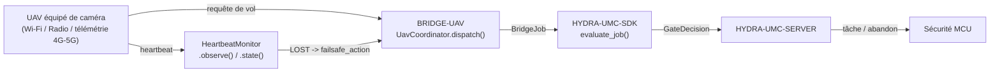

<!-- =============================================================================
HYDRA-UMC-BRIDGE-UAV - Pont de coordination bidirectionnel pour drones équipés de caméra
Copyright (C) 2026 JuanenRac (Electro Hobby 3D) <electrohobby3d@gmail.com>
GPL-3.0-or-later - see LICENSE
============================================================================= -->

<p align="center">
  
</p>

# 🛩️ HYDRA-UMC-BRIDGE-UAV

<p align="center"><a href="README.md">🇺🇸 English</a> | <a href="README_spa.md">🇪🇸 Español</a> | 🇫🇷 <b>Français</b> | <a href="README_ita.md">🇮🇹 Italiano</a> | <a href="README_deu.md">🇩🇪 Deutsch</a> | <a href="README_zho.md">🇨🇳 简体中文</a> | <a href="README_jpn.md">🇯🇵 日本語</a></p>

### 🔗 Frontière de coordination sans dépendance entre HYDRA-UMC et les UAV équipés de caméra

<p align="left">
  
  
  
</p>

---

## 1. 🛠️ APERÇU TECHNIQUE

**HYDRA-UMC-BRIDGE-UAV** est la frontière de coordination bidirectionnelle et haut niveau entre HYDRA-UMC et un drone équipé de caméra (UAV), accessible par Wi-Fi, une liaison radio ou une connexion de télémétrie cellulaire (4G/5G). Elle valide et transmet un vocabulaire réduit et nommé de requêtes de vol haut niveau (`PRE_FLIGHT_CHECK`, `TAKEOFF`, `GOTO_WAYPOINT`, `HOVER_AND_CAPTURE`, `RETURN_TO_LAUNCH`), et exécute séparément un watchdog réel et obligatoire de perte de liaison (heartbeat). Elle ne calcule jamais le contrôle de vol ni la stabilisation, et elle ne peut pas contourner HYDRA-UMC-SERVER, les limites du MCU, les watchdogs ou l'E-STOP.

Il appartient à la famille **Mobile & Autonomous Bridges**, aux côtés de `HYDRA-UMC-BRIDGE-DROIDS` et `HYDRA-UMC-BRIDGE-AMR`, et partage le même contrat de tâches et de sécurité `HYDRA-UMC-SDK` que les **External Automation Bridges** stationnaires (CNC, LASER, OPENPNP, PRINTER3D, ROS2).

### Fonctionnalités clés :
* ✅ **Noyau réel de requêtes de vol, sans dépendance :** `UavCoordinator` de `coordinator.py` n'importe ni MAVLink ni aucun SDK constructeur — c'est délibérément du Python pur, testable sur n'importe quel hôte sans UAV réel connecté. *(implémenté, testé dans `tests/test_coordinator.py`)*
* ✅ **Vocabulaire réel de requêtes de vol nommées :** `PRE_FLIGHT_CHECK`, `TAKEOFF`, `GOTO_WAYPOINT`, `HOVER_AND_CAPTURE`, `RETURN_TO_LAUNCH` — jamais une commande brute d'assiette/accélérateur. Un `COMPLETE` de mission normale et un `ABORT` d'urgence se résolvent tous deux vers la même requête réelle `RETURN_TO_LAUNCH`. *(implémenté)*
* ✅ **Un watchdog réel et obligatoire de perte de liaison :** `HeartbeatMonitor` est une machine à états de sécurité déterministe, pilotée par un `now` explicite — elle ne lit jamais une horloge réelle, signale `LOST` dès la toute première vérification si rien n'a jamais été observé, et traite l'instant exact du délai d'expiration comme encore `OK` (seul un dépassement réel déclenche le failsafe configuré `RETURN_TO_LAUNCH`/vol stationnaire). *(implémenté, testé avec une suite déterministe complète de cas limites dans `tests/test_heartbeat.py`)*
* ✅ **Portail de sécurité partagé, réel :** chaque tâche envoyée via `UavCoordinator.dispatch()` est évaluée par `evaluate_job()` du `bridge_contract` de `HYDRA-UMC-SDK`, le même portail utilisé par tous les ponts frères et HYDRA-UMC-SERVER ; une phase productive nécessite une machine externe `IDLE` et une cellule HYDRA-UMC `READY`, tandis qu'`ABORT` reste demandable pendant un défaut. *(implémenté)*
* ✅ **Routage de phases fermé et évidence statique :** une future phase SDK inconnue est refusée. `inspect_request_plan.py` émet le plan de requêtes de vol statique de schéma `1.0` sans ouvrir aucun transport. *(implémenté, testé)*
* ✅ **Build/test non mutant :** `build-test.bat`/`.sh` compilent le code source et exécutent des tests unitaires déterministes sans changer la version ni le CHANGELOG. *(implémenté, voir COMPILATION ET EXÉCUTION ci-dessous)*
* 🔜 **Adaptateur de transport réel MAVLink (Pixhawk/PX4) ou DJI OSDK** — introduit seulement après la sélection et le test d'un contrôleur de vol/SDK réel. *(prévu)*

---

## 2. 🔄 FLUX DE COORDINATION DE L'UAV



---

## 3. 🧱 ARCHITECTURE ET CHOIX DE CONCEPTION

* **Pourquoi le watchdog de heartbeat est son propre module, et non intégré au coordinateur.** La perte de liaison est un mode de défaillance réel et distinct de « cette tâche est-elle autorisée maintenant » — `HeartbeatMonitor` répond à « puis-je encore faire confiance à la dernière information reçue de cet UAV », indépendamment de toute tâche particulière, si bien qu'il peut être vérifié en continu (par ex. à chaque trame de télémétrie) plutôt que seulement lorsqu'une tâche est justement envoyée.
* **Pourquoi `HeartbeatMonitor` reçoit un `now` explicite plutôt que de lire une horloge réelle.** La note d'architecture collée dont ce projet est parti est explicite : un pont UAV EXIGE ce watchdog — la seule façon de démontrer son comportement exact à la limite du délai d'expiration (pas seulement « il finit par expirer ») sans une suite de tests lente et instable fondée sur de vraies pauses (`sleep`) est de faire du temps une entrée explicite et testable.
* **Pourquoi `COMPLETE` et `ABORT` se résolvent tous deux vers `RETURN_TO_LAUNCH`.** Une mission terminée et un abandon d'urgence ont le même véritable résultat correct pour un UAV : rentrer. Les fusionner sous le même nom de requête dans le plan statique (dédupliqué, non répété) reflète cela honnêtement plutôt que d'inventer deux verbes distincts de « retour ».
* **Pourquoi le heartbeat propre à ce pont n'est explicitement PAS un remplacement du failsafe propre du contrôleur de vol.** Le firmware propre de Pixhawk/PX4 et de DJI implémente déjà un failsafe réel, quasi certifié, de perte de liaison au niveau radio/télémétrie — le `HeartbeatMonitor` de ce pont est un signal de la couche de coordination pour l'état propre de HYDRA-UMC, et les deux doivent exister indépendamment ; voir le portail d'acceptation matérielle propre de `docs/BRIDGE_GUIDE.md`.
* **Pourquoi l'adaptateur de transport MAVLink/OSDK n'est pas encore dans ce dépôt.** S'engager sur le protocole réel de commandes/télémétrie d'un contrôleur de vol donné avant qu'il ne soit sélectionné et testé risquerait d'intégrer des hypothèses que ce noyau local sans dépendance ne peut pas vérifier.
* **Comment cela s'intègre dans le reste de l'écosystème.** BRIDGE-UAV se situe entre un UAV réel et `HYDRA-UMC-SDK` → `HYDRA-UMC-SERVER` → sécurité MCU : c'est une frontière de coordination, jamais un nœud de contrôle de vol, et elle ne peut pas contourner HYDRA-UMC-SERVER, les limites du MCU, les watchdogs ou l'E-STOP.

---

## 📂 STRUCTURE DES RÉPERTOIRES

```text
HYDRA-UMC-BRIDGE-UAV/
├── src/
│   └── hydra_umc_bridge_uav/
│       ├── __init__.py
│       ├── coordinator.py       # UavCoordinator : portail de requêtes de vol sans dépendance
│       └── heartbeat.py         # HeartbeatMonitor : failsafe déterministe réel de perte de liaison
├── tests/
│   ├── test_coordinator.py      # Tests unitaires déterministes du noyau de coordination
│   └── test_heartbeat.py        # Tests déterministes des cas limites du watchdog
├── tools/
│   ├── build_test.py            # Compilateur + lanceur de tests non mutant (build-test.bat/.sh)
│   ├── bump_version.py          # Synchronise pyproject.toml, manifeste et CHANGELOG.md
│   └── inspect_request_plan.py  # Affiche le plan de requêtes de vol statique (aucun transport ouvert)
├── docs/
│   └── BRIDGE_GUIDE.md          # Portée, plateformes compatibles, scripts, portail d'acceptation matérielle
├── build-test.bat / build-test.sh  # Valide uniquement, ne modifie jamais le dépôt
├── build.bat / build.sh            # Valide puis, si succès, incrémente version + CHANGELOG
├── pyproject.toml               # Métadonnées du paquet ; dépend de HYDRA-UMC-SDK (git)
├── hydra-umc.project.json       # Manifeste de l'écosystème (version, maturité, famille)
├── CHANGELOG.md
├── CODE_OF_CONDUCT.md / CONTRIBUTING.md / SECURITY.md / SUPPORT.md
├── LICENSE / LICENSE.md
└── README.md / README_*.md      # Ce fichier et ses 6 traductions
```

---

## 4. ⚙️ COMPILATION ET EXÉCUTION

Nécessite Python 3.11+. `tools/build_test.py` attend que `HYDRA-UMC-SDK` soit cloné en tant que répertoire frère (`../HYDRA-UMC-SDK`) ou indiqué via la variable d'environnement `HYDRA_UMC_SDK_ROOT`.

```bash
# Windows
build-test.bat      # validation uniquement — pas de changement de version/CHANGELOG
build.bat            # valide puis, si succès, incrémente version + CHANGELOG

# Linux/macOS
bash build-test.sh
bash build.sh
```

`build-test` compile chaque module sous `src/` avec `py_compile` et exécute la suite complète `unittest` (`tests/test_coordinator.py`, `tests/test_heartbeat.py`) — de manière déterministe, sans connexion réelle à un UAV, sans réseau et sans changement de version/CHANGELOG. `build` exécute d'abord cette même validation et, seulement en cas de succès, appelle `tools/bump_version.py` pour synchroniser la version dans `pyproject.toml`, `hydra-umc.project.json` et `CHANGELOG.md`. Il n'existe pas encore de commande `run` avec matériel réel — cela nécessite un adaptateur de transport MAVLink/OSDK validé et un UAV réel.

---

## ✅ État actuel et prochaines étapes

**Réel aujourd'hui :** version `0.0.1`, fonctionnel en tant que noyau de coordination sans dépendance (`UavCoordinator`) plus un watchdog réel de perte de liaison entièrement testé sur ses cas limites (`HeartbeatMonitor`), un routage de phases fermé, un schéma de requêtes de vol statique `plan-only`, et des scripts build-test non mutants intégrés en CI avec un checkout du SDK.

**Frontière d'intégration :** ce pont n'est qu'une frontière de coordination — ce n'est pas un nœud de contrôle de vol, et il ne peut pas contourner HYDRA-UMC-SERVER, les limites du MCU, les watchdogs ou l'E-STOP ; chaque tâche envoyée passe toujours par le même portail partagé utilisé par tous les ponts frères. Le signal de failsafe propre de `HeartbeatMonitor` relève de la couche de coordination, et n'est jamais un substitut au failsafe indépendant propre du contrôleur de vol.

**Encore à venir :** aucun transport réel MAVLink (Pixhawk/PX4) ni DJI OSDK, ni aucun UAV physique, n'a encore été validé — un adaptateur réel sera introduit seulement après la sélection et le test d'un contrôleur de vol/SDK spécifique.

---

## 🔗 Projets liés

Ce projet fait partie d'un écosystème robotique plus large du même auteur (JuanenRac / Electro Hobby 3D), couvrant firmware, logiciel de contrôle, nœuds d'IA et outillage de flotte.

### Directement liés

- **[HYDRA-UMC-SDK](https://github.com/JuanenRac/HYDRA-UMC-SDK)** — le contrat partagé de tâches et de sécurité par lequel chaque pont (y compris celui-ci) évalue ses tâches.
- **[HYDRA-UMC-SERVER](https://github.com/JuanenRac/HYDRA-UMC-SERVER)** — la frontière authentifiée de l'écosystème à laquelle ce pont rend compte.
- **[HYDRA-UMC-BRIDGE-DROIDS](https://github.com/JuanenRac/HYDRA-UMC-BRIDGE-DROIDS)** — pont mobile frère pour droïdes à pattes/humanoïdes.
- **[HYDRA-UMC-BRIDGE-AMR](https://github.com/JuanenRac/HYDRA-UMC-BRIDGE-AMR)** — pont mobile frère pour les flottes AGV/AMR.

### Reste de l'écosystème

**Plateforme HYDRA-UMC** — la micro-usine multi-robot pour laquelle ce pont coordonne les auxiliaires
- **[HYDRA-UMC](https://github.com/JuanenRac/HYDRA-UMC)** — la carte mère CM5 + STM32H745 orchestrant jusqu'à 8 bras robotiques.
- **[HYDRA-UMC-SERVER](https://github.com/JuanenRac/HYDRA-UMC-SERVER)** — le backend Express/WebSocket auquel parlent tous les clients de contrôle et ponts.
- **[HYDRA-UMC-STUDIO](https://github.com/JuanenRac/HYDRA-UMC-STUDIO)** — tableau de bord web, visualisation 3D multi-robot.

**External Automation Bridges** — dépôts frères partageant ce même portail de tâches `HYDRA-UMC-SDK`
- **[HYDRA-UMC-BRIDGE-CNC](https://github.com/JuanenRac/HYDRA-UMC-BRIDGE-CNC)** — pont de coordination de cellule CNC.
- **[HYDRA-UMC-BRIDGE-LASER](https://github.com/JuanenRac/HYDRA-UMC-BRIDGE-LASER)** — pont de coordination de cellules laser.
- **[HYDRA-UMC-BRIDGE-OPENPNP](https://github.com/JuanenRac/HYDRA-UMC-BRIDGE-OPENPNP)** — pont de flux de cartes pour OpenPnP.
- **[HYDRA-UMC-BRIDGE-PRINTER3D](https://github.com/JuanenRac/HYDRA-UMC-BRIDGE-PRINTER3D)** — pont de coordination pour logiciels d'impression 3D ouverts.
- **[HYDRA-UMC-BRIDGE-ROS2](https://github.com/JuanenRac/HYDRA-UMC-BRIDGE-ROS2)** — pont de coordination générique pour toute plateforme ROS 2.

**Preuves de sécurité et d'intégration**
- **[HYDRA-UMC-SAFETY-ZONES](https://github.com/JuanenRac/HYDRA-UMC-SAFETY-ZONES)** — preuves de sécurité des zones de cellule utilisées dans toute la famille de ponts.
- **[HYDRA-UMC-HIL-BRIDGE](https://github.com/JuanenRac/HYDRA-UMC-HIL-BRIDGE)** — preuves de tests hardware-in-the-loop.

## 👤 AUTEUR
**JuanenRac** (Electro Hobby 3D)
📧 electrohobby3d@gmail.com

## 📜 LICENCE
GPL-3.0 - Voir LICENSE pour les détails.
