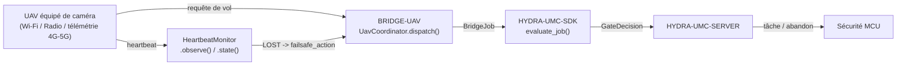

<!-- =============================================================================
HYDRA-UMC-BRIDGE-UAV - Pont de coordination bidirectionnel pour drones équipés de caméra
Copyright (C) 2026 JuanenRac (Electro Hobby 3D) <electrohobby3d@gmail.com>
GPL-3.0-or-later - see LICENSE
============================================================================= -->

<p align="center">
  
</p>

# 🛩️ HYDRA-UMC-BRIDGE-UAV

<p align="center"><a href="README.md">🇺🇸 English</a> | <a href="README_spa.md">🇪🇸 Español</a> | 🇫🇷 <b>Français</b> | <a href="README_ita.md">🇮🇹 Italiano</a> | <a href="README_deu.md">🇩🇪 Deutsch</a> | <a href="README_zho.md">🇨🇳 简体中文</a> | <a href="README_jpn.md">🇯🇵 日本語</a></p>

### 🔗 Frontière de coordination sans dépendance entre HYDRA-UMC et les UAV équipés de caméra

<p align="left">
  
  
  
</p>

---

## 1. 🛠️ APERÇU TECHNIQUE

**HYDRA-UMC-BRIDGE-UAV** est la frontière de coordination bidirectionnelle et haut niveau entre HYDRA-UMC et un drone équipé de caméra (UAV), accessible par Wi-Fi, une liaison radio ou une connexion de télémétrie cellulaire (4G/5G). Elle valide et transmet un vocabulaire réduit et nommé de requêtes de vol haut niveau (`PRE_FLIGHT_CHECK`, `TAKEOFF`, `GOTO_WAYPOINT`, `HOVER_AND_CAPTURE`, `RETURN_TO_LAUNCH`), et exécute séparément un watchdog réel et obligatoire de perte de liaison (heartbeat). Elle ne calcule jamais le contrôle de vol ni la stabilisation, et elle ne peut pas contourner HYDRA-UMC-SERVER, les limites du MCU, les watchdogs ou l'E-STOP.

Il appartient à la famille **Mobile & Autonomous Bridges**, aux côtés de `HYDRA-UMC-BRIDGE-DROIDS` et `HYDRA-UMC-BRIDGE-AMR`, et partage le même contrat de tâches et de sécurité `HYDRA-UMC-SDK` que les **External Automation Bridges** stationnaires (CNC, LASER, OPENPNP, PRINTER3D, ROS2).

### Fonctionnalités clés :
* ✅ **Noyau réel de requêtes de vol, sans dépendance :** `UavCoordinator` de `coordinator.py` n'importe ni MAVLink ni aucun SDK constructeur — c'est délibérément du Python pur, testable sur n'importe quel hôte sans UAV réel connecté. *(implémenté, testé dans `tests/test_coordinator.py`)*
* ✅ **Vocabulaire réel de requêtes de vol nommées :** `PRE_FLIGHT_CHECK`, `TAKEOFF`, `GOTO_WAYPOINT`, `HOVER_AND_CAPTURE`, `RETURN_TO_LAUNCH` — jamais une commande brute d'assiette/accélérateur. Un `COMPLETE` de mission normale et un `ABORT` d'urgence se résolvent tous deux vers la même requête réelle `RETURN_TO_LAUNCH`. *(implémenté)*
* ✅ **Un watchdog réel et obligatoire de perte de liaison :** `HeartbeatMonitor` est une machine à états de sécurité déterministe, pilotée par un `now` explicite — elle ne lit jamais une horloge réelle, signale `LOST` dès la toute première vérification si rien n'a jamais été observé, et traite l'instant exact du délai d'expiration comme encore `OK` (seul un dépassement réel déclenche le failsafe configuré `RETURN_TO_LAUNCH`/vol stationnaire). *(implémenté, testé avec une suite déterministe complète de cas limites dans `tests/test_heartbeat.py`)*
* ✅ **Portail de sécurité partagé, réel :** chaque tâche envoyée via `UavCoordinator.dispatch()` est évaluée par `evaluate_job()` du `bridge_contract` de `HYDRA-UMC-SDK`, le même portail utilisé par tous les ponts frères et HYDRA-UMC-SERVER ; une phase productive nécessite une machine externe `IDLE` et une cellule HYDRA-UMC `READY`, tandis qu'`ABORT` reste demandable pendant un défaut. *(implémenté)*
* ✅ **Routage de phases fermé et évidence statique :** une future phase SDK inconnue est refusée. `inspect_request_plan.py` émet le plan de requêtes de vol statique de schéma `1.1` (incluant désormais la requête autonome `LAND`) sans ouvrir aucun transport. *(implémenté, testé)*
* ✅ **Transport de commandes MAVLink réel :** `mavlink_transport.py`'s `MavlinkFlightControl` envoie un dispatch déjà validé comme un vrai `COMMAND_LONG`, mappé vers un `MAV_CMD` réel et numéroté (`MAV_CMD_NAV_TAKEOFF`/`MAV_CMD_DO_REPOSITION`/`MAV_CMD_NAV_LOITER_UNLIM`/`MAV_CMD_IMAGE_START_CAPTURE`/`MAV_CMD_NAV_RETURN_TO_LAUNCH`/`MAV_CMD_NAV_LAND`/`MAV_CMD_COMPONENT_ARM_DISARM`) - un dispatch rejeté n'atteint jamais le réseau. *(implémenté, testé dans `tests/test_mavlink_transport.py`)*
* ✅ **Build/test non mutant :** `build-test.bat`/`.sh` compilent le code source et exécutent des tests unitaires déterministes sans changer la version ni le CHANGELOG. *(implémenté, voir COMPILATION ET EXÉCUTION ci-dessous)*
* 🔜 **Un adaptateur de transport DJI OSDK** (pour une plateforme non-MAVLink) — introduit seulement après la sélection et le test de ce SDK. *(prévu)*

---

## 2. 🔄 FLUX DE COORDINATION DE L'UAV



---

## 3. 🧱 ARCHITECTURE ET CHOIX DE CONCEPTION

* **Pourquoi le watchdog de heartbeat est son propre module, et non intégré au coordinateur.** La perte de liaison est un mode de défaillance réel et distinct de « cette tâche est-elle autorisée maintenant » — `HeartbeatMonitor` répond à « puis-je encore faire confiance à la dernière information reçue de cet UAV », indépendamment de toute tâche particulière, si bien qu'il peut être vérifié en continu (par ex. à chaque trame de télémétrie) plutôt que seulement lorsqu'une tâche est justement envoyée.
* **Pourquoi `HeartbeatMonitor` reçoit un `now` explicite plutôt que de lire une horloge réelle.** La note d'architecture collée dont ce projet est parti est explicite : un pont UAV EXIGE ce watchdog — la seule façon de démontrer son comportement exact à la limite du délai d'expiration (pas seulement « il finit par expirer ») sans une suite de tests lente et instable fondée sur de vraies pauses (`sleep`) est de faire du temps une entrée explicite et testable.
* **Pourquoi `COMPLETE` et `ABORT` se résolvent tous deux vers `RETURN_TO_LAUNCH`.** Une mission terminée et un abandon d'urgence ont le même véritable résultat correct pour un UAV : rentrer. Les fusionner sous le même nom de requête dans le plan statique (dédupliqué, non répété) reflète cela honnêtement plutôt que d'inventer deux verbes distincts de « retour ».
* **Pourquoi le heartbeat propre à ce pont n'est explicitement PAS un remplacement du failsafe propre du contrôleur de vol.** Le firmware propre de Pixhawk/PX4 et de DJI implémente déjà un failsafe réel, quasi certifié, de perte de liaison au niveau radio/télémétrie — le `HeartbeatMonitor` de ce pont est un signal de la couche de coordination pour l'état propre de HYDRA-UMC, et les deux doivent exister indépendamment ; voir le portail d'acceptation matérielle propre de `docs/BRIDGE_GUIDE.md`.
* **Pourquoi l'adaptateur de transport MAVLink/OSDK n'est pas encore dans ce dépôt.** S'engager sur le protocole réel de commandes/télémétrie d'un contrôleur de vol donné avant qu'il ne soit sélectionné et testé risquerait d'intégrer des hypothèses que ce noyau local sans dépendance ne peut pas vérifier.
* **Comment cela s'intègre dans le reste de l'écosystème.** BRIDGE-UAV se situe entre un UAV réel et `HYDRA-UMC-SDK` → `HYDRA-UMC-SERVER` → sécurité MCU : c'est une frontière de coordination, jamais un nœud de contrôle de vol, et elle ne peut pas contourner HYDRA-UMC-SERVER, les limites du MCU, les watchdogs ou l'E-STOP.

---

## 📂 STRUCTURE DES RÉPERTOIRES

```text
HYDRA-UMC-BRIDGE-UAV/
├── src/
│   └── hydra_umc_bridge_uav/
│       ├── __init__.py
│       ├── coordinator.py       # UavCoordinator : portail de requêtes de vol sans dépendance
│       ├── heartbeat.py         # HeartbeatMonitor : failsafe déterministe réel de perte de liaison
│       └── mavlink_transport.py # Envoie un UavDispatch déjà validé comme un vrai COMMAND_LONG MAVLink
├── tests/
│   ├── test_coordinator.py      # Tests unitaires déterministes du noyau de coordination
│   ├── test_heartbeat.py        # Tests déterministes des cas limites du watchdog
│   └── test_mavlink_transport.py # Tests de forme MAV_CMD réels contre une connexion MAVLink simulée
├── tools/
│   ├── build_test.py            # Compilateur + lanceur de tests non mutant (build-test.bat/.sh)
│   ├── bump_version.py          # Synchronise pyproject.toml, manifeste et CHANGELOG.md
│   └── inspect_request_plan.py  # Affiche le plan de requêtes de vol statique (aucun transport ouvert)
├── docs/
│   └── BRIDGE_GUIDE.md          # Portée, plateformes compatibles, scripts, portail d'acceptation matérielle
├── images/
│   └── HYDRA_UMC_BANNER.svg     # Bannière du README
├── build-test.bat / build-test.sh  # Valide uniquement, ne modifie jamais le dépôt
├── build.bat / build.sh            # Valide puis, si succès, incrémente version + CHANGELOG
├── pyproject.toml               # Métadonnées du paquet ; dépend de HYDRA-UMC-SDK (git)
├── hydra-umc.project.json       # Manifeste de l'écosystème (version, maturité, famille)
├── CHANGELOG.md
├── CODE_OF_CONDUCT.md / CONTRIBUTING.md / SECURITY.md / SUPPORT.md
├── LICENSE / LICENSE.md
└── README.md / README_*.md      # Ce fichier et ses 6 traductions
```

---

## 4. ⚙️ COMPILATION ET EXÉCUTION

Nécessite Python 3.11+. `tools/build_test.py` attend que `HYDRA-UMC-SDK` soit cloné en tant que répertoire frère (`../HYDRA-UMC-SDK`) ou indiqué via la variable d'environnement `HYDRA_UMC_SDK_ROOT`.

```bash
# Windows
build-test.bat      # validation uniquement — pas de changement de version/CHANGELOG
build.bat            # valide puis, si succès, incrémente version + CHANGELOG

# Linux/macOS
bash build-test.sh
bash build.sh
```

`build-test` compile chaque module sous `src/` avec `py_compile` et exécute la suite complète `unittest` (`tests/test_coordinator.py`, `tests/test_heartbeat.py`) — de manière déterministe, sans connexion réelle à un UAV, sans réseau et sans changement de version/CHANGELOG. `build` exécute d'abord cette même validation et, seulement en cas de succès, appelle `tools/bump_version.py` pour synchroniser la version dans `pyproject.toml`, `hydra-umc.project.json` et `CHANGELOG.md`. Il n'existe pas encore de commande `run` avec matériel réel — cela nécessite un adaptateur de transport MAVLink/OSDK validé et un UAV réel.

---

## ✅ État actuel et prochaines étapes

**Réel aujourd'hui :** version `0.0.4`, fonctionnel en tant que noyau de coordination sans dépendance (`UavCoordinator`) plus un watchdog réel de perte de liaison entièrement testé sur ses cas limites (`HeartbeatMonitor`), un routage de phases fermé, un schéma de requêtes de vol statique `plan-only`, un transport de commandes MAVLink réel (`MavlinkFlightControl`) mappant chaque requête vers son `MAV_CMD` réel et numéroté, et des scripts build-test non mutants intégrés en CI avec un checkout du SDK.

**Frontière d'intégration :** ce pont n'est qu'une frontière de coordination — ce n'est pas un nœud de contrôle de vol, et il ne peut pas contourner HYDRA-UMC-SERVER, les limites du MCU, les watchdogs ou l'E-STOP ; chaque tâche envoyée passe toujours par le même portail partagé utilisé par tous les ponts frères. Le signal de failsafe propre de `HeartbeatMonitor` relève de la couche de coordination, et n'est jamais un substitut au failsafe indépendant propre du contrôleur de vol.

**Encore à venir :** aucun transport réel MAVLink (Pixhawk/PX4) ni DJI OSDK, ni aucun UAV physique, n'a encore été validé — un adaptateur réel sera introduit seulement après la sélection et le test d'un contrôleur de vol/SDK spécifique.

---

## 🔗 Projets Liés

Ce projet fait partie de l'écosystème robotique HYDRA-UMC du même auteur (JuanenRac / Electro Hobby 3D). Bon à savoir, car une demande pourrait en réalité concerner l'un de ceux-ci plutôt que ce dépôt.

**Projet Parent**
- **[HYDRA-UMC-SERVER](https://github.com/JuanenRac/HYDRA-UMC-SERVER)** — le vrai backend headless (REST/WebSocket) auquel parle réellement chaque client de contrôle ; la frontière authentifiée de l'écosystème à laquelle ce bridge rend compte une fois chaque commande passée par la propre barrière de sécurité locale de ce bridge.

**Projets Frères** — parlent également à la propre API de HYDRA-UMC-SERVER, chacun en tant que son propre client
- **[HYDRA-UMC-STUDIO](https://github.com/JuanenRac/HYDRA-UMC-STUDIO)** — tableau de bord de contrôle web avec visualisation 3D multi-robot en temps réel.
- **[HYDRA-UMC-SUITE](https://github.com/JuanenRac/HYDRA-UMC-SUITE)** — centre de commande d'essaim de bureau (PySide6) pour plusieurs serveurs à la fois, empaqueté en exécutable autonome.
- **[HYDRA-UMC-ANDROID-CONTROL](https://github.com/JuanenRac/HYDRA-UMC-ANDROID-CONTROL)** — application de contrôle Android native avec connexion biométrique et un compagnon Wear OS jumelé.
- **[HYDRA-UMC-IOS-CONTROL](https://github.com/JuanenRac/HYDRA-UMC-IOS-CONTROL)** — application de contrôle iOS/iPadOS (Flutter) avec synchronisation WebSocket en temps réel.
- **[HYDRA-UMC-DSI](https://github.com/JuanenRac/HYDRA-UMC-DSI)** — interface tactile native pour l'écran tactile DSI 7" embarqué, intégrée directement sur le CM5.
- **[HYDRA-UMC-BRIDGE-AMR](https://github.com/JuanenRac/HYDRA-UMC-BRIDGE-AMR)** — frontière de coordination pour les flottes AGV/AMR via un éditeur MQTT VDA 5050 réel — l'un des 3 bridges de flotte mobile de l'écosystème.
- **[HYDRA-UMC-BRIDGE-CNC](https://github.com/JuanenRac/HYDRA-UMC-BRIDGE-CNC)** — coordinateur haut niveau pour cellules CNC avec accès réel au statut/octets de contrôle GRBL.
- **[HYDRA-UMC-BRIDGE-DROIDS](https://github.com/JuanenRac/HYDRA-UMC-BRIDGE-DROIDS)** — frontière de coordination pour droïdes à pattes/humanoïdes, avec un véritable émetteur de commandes Boston Dynamics Spot — l'un des 3 bridges de flotte mobile de l'écosystème.
- **[HYDRA-UMC-BRIDGE-LASER](https://github.com/JuanenRac/HYDRA-UMC-BRIDGE-LASER)** — coordinateur de sécurité pour cellules laser lisant 3 vraies sécurités GPIO de clé/enceinte/verrouillage.
- **[HYDRA-UMC-BRIDGE-OPENPNP](https://github.com/JuanenRac/HYDRA-UMC-BRIDGE-OPENPNP)** — coordinateur haut niveau sûr pour le flux de cartes du pick-and-place OpenPnP.
- **[HYDRA-UMC-BRIDGE-PRINTER3D](https://github.com/JuanenRac/HYDRA-UMC-BRIDGE-PRINTER3D)** — frontière de coordination sûre pour imprimantes 3D Moonraker/Klipper, avec de vraies commandes de tâche contrôlées.
- **[HYDRA-UMC-BRIDGE-ROS2](https://github.com/JuanenRac/HYDRA-UMC-BRIDGE-ROS2)** — coordinateur de sécurité avec un vrai transport ROS 2 rclpy à importation paresseuse.

**Directement Liés**
- **[HYDRA-UMC-SDK](https://github.com/JuanenRac/HYDRA-UMC-SDK)** — le contrat JSON-Schema partagé et la barrière de sécurité contre laquelle chaque bridge valide ses commandes.

**Fait Également Partie de l'Écosystème**

*Matériel & Plateforme de Base*
- **[HYDRA-UMC](https://github.com/JuanenRac/HYDRA-UMC)** — la carte mère physique du bras robotique : hôte CM5 + coprocesseur STM32H745 double cœur, coordonnant jusqu'à 8 bras-outils via CAN-OTA/SPI-OTA.
- **[HYDRA-UMC-OS](https://github.com/JuanenRac/HYDRA-UMC-OS)** — couche produit reproductible sur Raspberry Pi OS pour le CM5 : agent en lecture seule, config/profils validés, provisionnement WiFi de premier contact.

*Backend Central & Clients*
- **[HYDRA-UMC-EDITOR-URDF](https://github.com/JuanenRac/HYDRA-UMC-EDITOR-URDF)** — créateur/éditeur graphique de bureau pour URDF qui envoie les modèles terminés vers le propre catalogue de STUDIO.

*Plateforme d'Outils URTC*
- **[URTC](https://github.com/JuanenRac/URTC)** — firmware pour la carte physique Universal Robot Tool Controller, plus de 25 profils d'outil sur bus CAN.
- **[URTC-FLASHER](https://github.com/JuanenRac/URTC-FLASHER)** — outil de bureau à interface graphique pour flasher les cartes URTC, CAN-OTA plus SWD/JTAG puce complète.
- **[URTC-TESTER](https://github.com/JuanenRac/URTC-TESTER)** — outil de bureau de diagnostic CAN-bus en direct pour cartes URTC, un panneau par profil d'outil.
- **[URTC-WEB-STUDIO](https://github.com/JuanenRac/URTC-WEB-STUDIO)** — alternative basée navigateur à URTC-TESTER via la Web Serial API, sans installation locale.

*Nœud IA de Vision (Hailo-8)*
- **[HYDRA-UMC-VISION-NODE](https://github.com/JuanenRac/HYDRA-UMC-VISION-NODE)** — hub d'intégration pour le pipeline de vision Hailo-8, avec une vraie vérification de disponibilité matérielle par étape.
- **[HYDRA-UMC-DETECTION-HEF](https://github.com/JuanenRac/HYDRA-UMC-DETECTION-HEF)** — registre réel de modèles compilés avec vérification de chargement sécurisé par architecture Hailo/checksum.
- **[HYDRA-UMC-VISION-STREAMER](https://github.com/JuanenRac/HYDRA-UMC-VISION-STREAMER)** — générateur réel de pipeline GStreamer + config MediaMTX, avec une vraie frontière d'intégration HailoRT.
- **[HYDRA-UMC-VISUAL-SERVOING-API](https://github.com/JuanenRac/HYDRA-UMC-VISUAL-SERVOING-API)** — vraie loi de correction Position-Based Visual Servoing, verrouillée sur l'état de zone en amont.
- **[HYDRA-UMC-SAFETY-ZONES](https://github.com/JuanenRac/HYDRA-UMC-SAFETY-ZONES)** — vraie vérification de violation de zone et demande d'E-STOP, avec application de la fraîcheur de calibration.

*Nœud IA Cognitif (Hailo-10)*
- **[HYDRA-UMC-COGNITIVE-NODE](https://github.com/JuanenRac/HYDRA-UMC-COGNITIVE-NODE)** — hub d'intégration pour le pipeline cognitif Hailo-10 (orchestration LLM/VLA/voix).
- **[HYDRA-UMC-VLA-ENGINE](https://github.com/JuanenRac/HYDRA-UMC-VLA-ENGINE)** — vrai encodage/décodage de jetons d'action et génération de trajectoire pour un modèle Vision-Language-Action.
- **[HYDRA-UMC-VOICE-UI](https://github.com/JuanenRac/HYDRA-UMC-VOICE-UI)** — vrai front-end vocal (VAD + analyseur d'intention) avec un relais Watch borné et soumis à confirmation.
- **[HYDRA-UMC-SEMANTIC-PLANNER](https://github.com/JuanenRac/HYDRA-UMC-SEMANTIC-PLANNER)** — vraie décomposition de tâches basée sur des règles et récupération sémantique d'erreurs sur les codes d'erreur MCU.
- **[HYDRA-UMC-DOCS-QA](https://github.com/JuanenRac/HYDRA-UMC-DOCS-QA)** — vraie recherche documentaire TF-IDF (bibliothèque standard uniquement) sur les propres documents Markdown de cet écosystème.

*Orchestration & Essaim*
- **[HYDRA-UMC-ORCHESTRATOR](https://github.com/JuanenRac/HYDRA-UMC-ORCHESTRATOR)** — hub d'intégration avec un vrai contrat de rapport de santé gRPC/Protobuf et une machine à états de mission.
- **[HYDRA-UMC-JOB-DISPATCHER](https://github.com/JuanenRac/HYDRA-UMC-JOB-DISPATCHER)** — vraie file de tâches basée sur la priorité avec déduplication, via une vraie API HTTP.
- **[HYDRA-UMC-NODE-HEALING](https://github.com/JuanenRac/HYDRA-UMC-NODE-HEALING)** — vrai chien de garde de santé de flotte basé sur gRPC, avec retry/backoff et détection d'incohérence d'identité.
- **[HYDRA-UMC-PATH-PLANNER-3D](https://github.com/JuanenRac/HYDRA-UMC-PATH-PLANNER-3D)** — vrai planificateur de trajectoire 3D basé sur RRT, avec vraie validation des collisions obstacle/espace de travail.
- **[HYDRA-UMC-SWARM-SYNC](https://github.com/JuanenRac/HYDRA-UMC-SWARM-SYNC)** — vraie synchronisation d'état CRDT LWW-Element-Map, testée par propriétés pour la convergence multi-cellule.

*Jumeau Numérique & Simulation*
- **[HYDRA-UMC-TWIN](https://github.com/JuanenRac/HYDRA-UMC-TWIN)** — hub d'intégration pour le moteur de jumeau numérique, avec un vrai contrat de synchronisation par compatibilité de version.
- **[HYDRA-UMC-HIL-BRIDGE](https://github.com/JuanenRac/HYDRA-UMC-HIL-BRIDGE)** — vrai verrouillage de sécurité hardware-in-the-loop routant les commandes entre simulation et matériel réel.
- **[HYDRA-UMC-PHYSICS-REPLICA](https://github.com/JuanenRac/HYDRA-UMC-PHYSICS-REPLICA)** — vraie cinématique directe et validation des limites articulaires sur un vrai sous-ensemble URDF.
- **[HYDRA-UMC-SYNTHETIC-DATA-GEN](https://github.com/JuanenRac/HYDRA-UMC-SYNTHETIC-DATA-GEN)** — vrai générateur procédural de scènes 2D avec export d'annotations YOLO/COCO.

*Données & Analytique*
- **[HYDRA-UMC-DATALAKE](https://github.com/JuanenRac/HYDRA-UMC-DATALAKE)** — vrai magasin de séries temporelles basé sur sqlite3, avec une vraie API HTTP d'ingestion/requête.
- **[HYDRA-UMC-ANOMALY-DETECTOR](https://github.com/JuanenRac/HYDRA-UMC-ANOMALY-DETECTOR)** — vrai détecteur d'anomalies FFT + ligne de base statistique, avec surveillance de dérive.
- **[HYDRA-UMC-PRODUCTION-REPORTS](https://github.com/JuanenRac/HYDRA-UMC-PRODUCTION-REPORTS)** — vrai calcul OEE/disponibilité sur l'historique de DATALAKE, avec export CSV reproductible.
- **[HYDRA-UMC-TELEMETRY-COLLECTOR](https://github.com/JuanenRac/HYDRA-UMC-TELEMETRY-COLLECTOR)** — vrai pipeline d'ingestion CAN/WebSocket vers DATALAKE, avec déduplication par séquence.

*Passerelle Industrielle*
- **[HYDRA-UMC-GATEWAY-INDUSTRIAL](https://github.com/JuanenRac/HYDRA-UMC-GATEWAY-INDUSTRIAL)** — hub d'intégration relayant vers les protocoles industriels, avec une vraie couche de liste blanche de commandes/contre-pression.
- **[HYDRA-UMC-OPCUA-SERVER](https://github.com/JuanenRac/HYDRA-UMC-OPCUA-SERVER)** — vrai espace d'adressage OPC-UA, vérifié avec une vraie session client du protocole binaire.
- **[HYDRA-UMC-MQTT-BROKER](https://github.com/JuanenRac/HYDRA-UMC-MQTT-BROKER)** — vrai broker MQTT avec authentification par client optionnelle et ACL de sujets.
- **[HYDRA-UMC-MTCONNECT-ADAPTER](https://github.com/JuanenRac/HYDRA-UMC-MTCONNECT-ADAPTER)** — vrais points de terminaison XML MTConnect `/probe` et `/current`, avec sortie en mode dégradé.

*Outils Complémentaires & Opérations de l'Écosystème*
- **[HYDRA-UMC-DASHBOARD-AI](https://github.com/JuanenRac/HYDRA-UMC-DASHBOARD-AI)** — panneaux Smart Summaries et Anomaly Highlighting sur DATALAKE/ANOMALY-DETECTOR, avec un repli statistique honnête.
- **[HYDRA-UMC-TOOL-CLI](https://github.com/JuanenRac/HYDRA-UMC-TOOL-CLI)** — CLI de flotte avec un vrai contrat de codes de sortie stable, un vrai client en direct de la propre API de HYDRA-UMC-SERVER.
- **[HYDRA-UMC-WATCH](https://github.com/JuanenRac/HYDRA-UMC-WATCH)** — application compagnon WearOS avec de vraies alertes haptiques et un relais vocal vers le téléphone jumelé.
- **[URTC-SMART-RACK](https://github.com/JuanenRac/URTC-SMART-RACK)** — firmware pour un rack de montage de cartes avec décodage réel d'ID d'outil et logique de préchauffage Smart Idle.
- **[URTC-VISION-TOOL](https://github.com/JuanenRac/URTC-VISION-TOOL)** — firmware plus un vrai compagnon de vision Python pour une tête d'outil d'inspection thermique/RGB.
- **[HYDRA-UMC-UPDATER](https://github.com/JuanenRac/HYDRA-UMC-UPDATER)** — outil administratif de bureau qui découvre, clone et met à jour chaque dépôt de cet écosystème.

## 👤 AUTEUR
**JuanenRac** (Electro Hobby 3D)
📧 electrohobby3d@gmail.com
📺 [youtube.com/@electrohobby3d](https://youtube.com/@electrohobby3d)

## 📜 LICENCE
GPL-3.0 - Voir LICENSE pour les détails.
