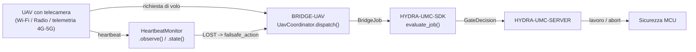

<!-- =============================================================================
HYDRA-UMC-BRIDGE-UAV - Ponte di coordinamento bidirezionale per droni con telecamera
Copyright (C) 2026 JuanenRac (Electro Hobby 3D) <electrohobby3d@gmail.com>
GPL-3.0-or-later - see LICENSE
============================================================================= -->

<p align="center">
  
</p>

# 🛩️ HYDRA-UMC-BRIDGE-UAV

<p align="center"><a href="README.md">🇺🇸 English</a> | <a href="README_spa.md">🇪🇸 Español</a> | <a href="README_fra.md">🇫🇷 Français</a> | 🇮🇹 <b>Italiano</b> | <a href="README_deu.md">🇩🇪 Deutsch</a> | <a href="README_zho.md">🇨🇳 简体中文</a> | <a href="README_jpn.md">🇯🇵 日本語</a></p>

### 🔗 Confine di coordinamento privo di dipendenze tra HYDRA-UMC e gli UAV con telecamera

<p align="left">
  
  
  
</p>

---

## 1. 🛠️ PANORAMICA TECNICA

**HYDRA-UMC-BRIDGE-UAV** è il confine di coordinamento bidirezionale e di alto livello tra HYDRA-UMC e un drone (UAV) dotato di telecamera, raggiungibile via Wi-Fi, un collegamento radio o una connessione di telemetria cellulare (4G/5G). Valida e inoltra un vocabolario ridotto e con nome di richieste di volo di alto livello (`PRE_FLIGHT_CHECK`, `TAKEOFF`, `GOTO_WAYPOINT`, `HOVER_AND_CAPTURE`, `RETURN_TO_LAUNCH`), ed esegue separatamente un watchdog reale e obbligatorio di heartbeat per la perdita di collegamento. Non calcola mai il controllo di volo o la stabilizzazione, e non può aggirare HYDRA-UMC-SERVER, i limiti dell'MCU, i watchdog o l'E-STOP.

Appartiene alla famiglia **Mobile & Autonomous Bridges** insieme a `HYDRA-UMC-BRIDGE-DROIDS` e `HYDRA-UMC-BRIDGE-AMR`, e condivide lo stesso contratto di lavoro e sicurezza `HYDRA-UMC-SDK` degli **External Automation Bridges** stazionari (CNC, LASER, OPENPNP, PRINTER3D, ROS2).

### Caratteristiche principali:
* ✅ **Nucleo reale di richieste di volo, privo di dipendenze:** `UavCoordinator` in `coordinator.py` non ha alcun import MAVLink né di SDK del produttore - è deliberatamente Python semplice, testabile su qualsiasi host senza un UAV reale collegato. *(implementato, testato in `tests/test_coordinator.py`)*
* ✅ **Vocabolario reale di richieste di volo con nome:** `PRE_FLIGHT_CHECK`, `TAKEOFF`, `GOTO_WAYPOINT`, `HOVER_AND_CAPTURE`, `RETURN_TO_LAUNCH` - mai un comando grezzo di assetto/manetta. Un `COMPLETE` di missione normale e un `ABORT` di emergenza si risolvono entrambi nella stessa richiesta reale `RETURN_TO_LAUNCH`. *(implementato)*
* ✅ **Un watchdog reale e obbligatorio di heartbeat per la perdita di collegamento:** `HeartbeatMonitor` è una macchina a stati failsafe deterministica, guidata da un `now` esplicito - non legge mai un orologio reale, riporta `LOST` fin dal primo controllo se non è mai stato osservato nulla, e tratta l'istante esatto del timeout come ancora `OK` (solo superarlo davvero fa scattare il failsafe configurato `RETURN_TO_LAUNCH`/hover). *(implementato, testato con una suite deterministica completa di casi limite in `tests/test_heartbeat.py`)*
* ✅ **Porta di sicurezza condivisa, reale:** ogni lavoro inviato tramite `UavCoordinator.dispatch()` viene valutato da `evaluate_job()` del `bridge_contract` di `HYDRA-UMC-SDK`, la stessa porta usata da tutti i ponti fratelli e da HYDRA-UMC-SERVER; una fase produttiva richiede una macchina esterna `IDLE` e una cella HYDRA-UMC `READY`, mentre `ABORT` resta richiedibile durante un guasto. *(implementato)*
* ✅ **Instradamento delle fasi chiuso ed evidenza statica:** una futura fase SDK sconosciuta viene negata. `inspect_request_plan.py` emette il piano statico di richieste di volo di schema `1.1` (che ora include la richiesta autonoma `LAND`) senza aprire alcun trasporto. *(implementato, testato)*
* ✅ **Trasporto reale dei comandi MAVLink:** `mavlink_transport.py`'s `MavlinkFlightControl` invia un dispatch già validato come un vero `COMMAND_LONG`, mappato su un `MAV_CMD` reale e numerato (`MAV_CMD_NAV_TAKEOFF`/`MAV_CMD_DO_REPOSITION`/`MAV_CMD_NAV_LOITER_UNLIM`/`MAV_CMD_IMAGE_START_CAPTURE`/`MAV_CMD_NAV_RETURN_TO_LAUNCH`/`MAV_CMD_NAV_LAND`/`MAV_CMD_COMPONENT_ARM_DISARM`) - un dispatch rifiutato non raggiunge mai la rete. *(implementato, testato in `tests/test_mavlink_transport.py`)*
* ✅ **Build/test non mutante:** `build-test.bat`/`.sh` compilano il codice sorgente ed eseguono test unitari deterministici senza cambiare versione o CHANGELOG. *(implementato, vedi COMPILAZIONE ED ESECUZIONE più sotto)*
* 🔜 **Un adattatore di trasporto DJI OSDK** (per una piattaforma non-MAVLink) - introdotto solo dopo che quell'SDK sarà selezionato e testato. *(pianificato)*

---

## 2. 🔄 FLUSSO DI COORDINAMENTO DELL'UAV



---

## 3. 🧱 ARCHITETTURA E DECISIONI DI PROGETTAZIONE

* **Perché il watchdog di heartbeat è un modulo a sé, non integrato nel coordinatore.** La perdita di collegamento è una modalità di guasto reale e distinta da "questo lavoro è consentito adesso" - `HeartbeatMonitor` risponde a "posso ancora fidarmi dell'ultima cosa che ho saputo da questo UAV" indipendentemente da qualsiasi lavoro specifico, così può essere verificato in modo continuo (ad es. ad ogni tick di telemetria) e non solo quando un lavoro viene effettivamente inviato.
* **Perché `HeartbeatMonitor` riceve un `now` esplicito invece di leggere un orologio reale.** La nota di architettura incollata da cui è partito questo progetto afferma esplicitamente che un ponte UAV RICHIEDE questo watchdog - l'unico modo per dimostrare il suo comportamento esatto al limite del timeout (non solo "prima o poi scade") senza una suite di test lenta e instabile basata su sleep reali è rendere il tempo un input esplicito e testabile.
* **Perché `COMPLETE` e `ABORT` si risolvono entrambi in `RETURN_TO_LAUNCH`.** Una missione conclusa e un abort di emergenza hanno lo stesso esito reale corretto per un UAV: tornare a casa. Farli confluire nello stesso nome di richiesta nel piano statico (deduplicato, non ripetuto) riflette questo con onestà invece di inventare due verbi diversi per "tornare".
* **Perché l'heartbeat proprio di questo ponte NON è esplicitamente un sostituto del failsafe proprio del controller di volo.** Il firmware di Pixhawk/PX4 e di DJI implementa già un failsafe reale, quasi certificato, di perdita di collegamento a livello di radio/telemetria - l'`HeartbeatMonitor` di questo ponte è un segnale del solo livello di coordinamento per lo stato proprio di HYDRA-UMC, ed entrambi devono esistere in modo indipendente; vedi la porta di accettazione hardware propria di `docs/BRIDGE_GUIDE.md`.
* **Perché l'adattatore di trasporto MAVLink/OSDK non è ancora in questo repository.** Vincolarsi al protocollo reale di comandi/telemetria di uno specifico controller di volo prima che sia selezionato e testato rischierebbe di incorporare ipotesi che questo nucleo locale privo di dipendenze non può verificare.
* **Come si inserisce nel resto dell'ecosistema.** BRIDGE-UAV si trova tra un UAV reale e `HYDRA-UMC-SDK` → `HYDRA-UMC-SERVER` → sicurezza MCU - è un confine di coordinamento, mai un nodo di controllo di volo, e non può aggirare HYDRA-UMC-SERVER, i limiti dell'MCU, i watchdog o l'E-STOP.

---

## 📂 STRUTTURA DELLE DIRECTORY

```text
HYDRA-UMC-BRIDGE-UAV/
├── src/
│   └── hydra_umc_bridge_uav/
│       ├── __init__.py
│       ├── coordinator.py       # UavCoordinator: porta di richieste di volo priva di dipendenze
│       └── heartbeat.py         # HeartbeatMonitor: failsafe reale e deterministico di perdita di collegamento
├── tests/
│   ├── test_coordinator.py      # Test unitari deterministici del nucleo di coordinamento
│   └── test_heartbeat.py        # Test deterministici dei casi limite del watchdog di heartbeat
├── tools/
│   ├── build_test.py            # Compilatore + esecutore di test non mutante (build-test.bat/.sh)
│   ├── bump_version.py          # Sincronizza pyproject.toml, manifesto e CHANGELOG.md
│   └── inspect_request_plan.py  # Stampa il piano statico di richieste di volo (nessun trasporto aperto)
├── docs/
│   └── BRIDGE_GUIDE.md          # Ambito, piattaforme compatibili, script, porta di accettazione hardware
├── build-test.bat / build-test.sh  # Solo valida, non modifica mai il repository
├── build.bat / build.sh            # Valida e, solo in caso di successo, aggiorna versione + CHANGELOG
├── pyproject.toml               # Metadati del pacchetto; dipende da HYDRA-UMC-SDK (git)
├── hydra-umc.project.json       # Manifesto dell'ecosistema (versione, maturità, famiglia)
├── CHANGELOG.md
├── CODE_OF_CONDUCT.md / CONTRIBUTING.md / SECURITY.md / SUPPORT.md
├── LICENSE / LICENSE.md
└── README.md / README_*.md      # Questo file e le sue 6 traduzioni
```

---

## 4. ⚙️ COMPILAZIONE ED ESECUZIONE

Richiede Python 3.11+. `tools/build_test.py` si aspetta che `HYDRA-UMC-SDK` sia clonato come directory fratella (`../HYDRA-UMC-SDK`) o indicato tramite la variabile d'ambiente `HYDRA_UMC_SDK_ROOT`.

```bash
# Windows
build-test.bat      # solo validazione — nessun cambio di versione/CHANGELOG
build.bat            # valida e, se ha successo, aggiorna versione + CHANGELOG

# Linux/macOS
bash build-test.sh
bash build.sh
```

`build-test` compila ogni modulo sotto `src/` con `py_compile` ed esegue l'intera suite `unittest` (`tests/test_coordinator.py`, `tests/test_heartbeat.py`) - in modo deterministico, senza connessione reale a un UAV, senza rete e senza cambio di versione/CHANGELOG. `build` esegue prima quella stessa validazione e, solo in caso di successo, chiama `tools/bump_version.py` per sincronizzare la versione tra `pyproject.toml`, `hydra-umc.project.json` e `CHANGELOG.md`. Non esiste ancora un comando `run` con hardware reale - serve un adattatore di trasporto MAVLink/OSDK validato e un UAV reale.

---

## ✅ Stato attuale e prossimi passi

**Reale oggi:** versione `0.0.4`, funzionale come nucleo di coordinamento privo di dipendenze (`UavCoordinator`) più un watchdog reale di heartbeat per la perdita di collegamento completamente testato sui casi limite (`HeartbeatMonitor`), instradamento delle fasi chiuso, uno schema di richieste di volo statico `plan-only`, un trasporto reale dei comandi MAVLink (`MavlinkFlightControl`) che mappa ogni richiesta sul suo `MAV_CMD` reale e numerato, e script build-test non mutanti collegati alla CI con un checkout dell'SDK.

**Confine di integrazione:** questo ponte è solo un confine di coordinamento - non è un nodo di controllo di volo, e non può aggirare HYDRA-UMC-SERVER, i limiti dell'MCU, i watchdog o l'E-STOP; ogni lavoro inviato passa comunque attraverso la stessa porta condivisa usata da tutti i ponti fratelli. Il segnale di failsafe proprio di `HeartbeatMonitor` è una questione del livello di coordinamento, mai un sostituto del failsafe indipendente proprio del controller di volo.

**Ancora da fare:** nessun trasporto reale MAVLink (Pixhawk/PX4) o DJI OSDK, né un UAV fisico, è ancora stato validato - un adattatore reale sarà introdotto solo dopo che un controller di volo/SDK specifico sarà selezionato e testato.

---

## 🔗 Progetti correlati

Questo progetto fa parte di un ecosistema robotico più ampio dello stesso autore (JuanenRac / Electro Hobby 3D), che copre firmware, software di controllo, nodi IA e strumenti di flotta. Vale la pena saperlo, perché una richiesta potrebbe in realtà riguardare uno di questi progetti anziché questo repository.

### Direttamente correlati

- **[HYDRA-UMC-SDK](https://github.com/JuanenRac/HYDRA-UMC-SDK)** — il contratto condiviso di lavoro e sicurezza attraverso cui ogni ponte (incluso questo) valuta i propri lavori.
- **[HYDRA-UMC-SERVER](https://github.com/JuanenRac/HYDRA-UMC-SERVER)** — il confine autenticato dell'ecosistema a cui questo ponte riporta.
- **[HYDRA-UMC-BRIDGE-DROIDS](https://github.com/JuanenRac/HYDRA-UMC-BRIDGE-DROIDS)** — ponte mobile fratello per droidi con gambe/umanoidi.
- **[HYDRA-UMC-BRIDGE-AMR](https://github.com/JuanenRac/HYDRA-UMC-BRIDGE-AMR)** — ponte mobile fratello per flotte AGV/AMR.

### Resto dell'ecosistema

**Piattaforma HYDRA-UMC** — la micro-fabbrica multi-robot per cui questo ponte coordina gli ausiliari
- **[HYDRA-UMC](https://github.com/JuanenRac/HYDRA-UMC)** — la scheda madre CM5 + STM32H745 che orchestra fino a 8 bracci robotici.
- **[HYDRA-UMC-SERVER](https://github.com/JuanenRac/HYDRA-UMC-SERVER)** — il backend Express/WebSocket con cui parlano tutti i client di controllo e i ponti.
- **[HYDRA-UMC-STUDIO](https://github.com/JuanenRac/HYDRA-UMC-STUDIO)** — dashboard di controllo web, visualizzazione 3D multi-robot.

**External Automation Bridges** — repository fratelli che condividono questa stessa porta di lavoro `HYDRA-UMC-SDK`
- **[HYDRA-UMC-BRIDGE-CNC](https://github.com/JuanenRac/HYDRA-UMC-BRIDGE-CNC)** — ponte di coordinamento cella CNC.
- **[HYDRA-UMC-BRIDGE-LASER](https://github.com/JuanenRac/HYDRA-UMC-BRIDGE-LASER)** — ponte di coordinamento celle laser.
- **[HYDRA-UMC-BRIDGE-OPENPNP](https://github.com/JuanenRac/HYDRA-UMC-BRIDGE-OPENPNP)** — ponte di flusso schede per OpenPnP.
- **[HYDRA-UMC-BRIDGE-PRINTER3D](https://github.com/JuanenRac/HYDRA-UMC-BRIDGE-PRINTER3D)** — ponte di coordinamento per software di stampa 3D open.
- **[HYDRA-UMC-BRIDGE-ROS2](https://github.com/JuanenRac/HYDRA-UMC-BRIDGE-ROS2)** — ponte di coordinamento generico per qualsiasi piattaforma ROS 2.

**Evidenze di sicurezza e integrazione**
- **[HYDRA-UMC-SAFETY-ZONES](https://github.com/JuanenRac/HYDRA-UMC-SAFETY-ZONES)** — evidenze di sicurezza delle zone di cella usate in tutta la famiglia di ponti.
- **[HYDRA-UMC-HIL-BRIDGE](https://github.com/JuanenRac/HYDRA-UMC-HIL-BRIDGE)** — evidenze di test hardware-in-the-loop.

## 👤 AUTORE
**JuanenRac** (Electro Hobby 3D)
📧 electrohobby3d@gmail.com
📺 [youtube.com/@electrohobby3d](https://youtube.com/@electrohobby3d)

## 📜 LICENZA
GPL-3.0 - Vedi LICENSE per i dettagli.
