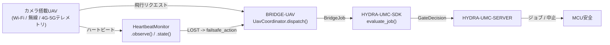

<!-- =============================================================================
HYDRA-UMC-BRIDGE-UAV - カメラ搭載ドローン双方向連携ブリッジ
Copyright (C) 2026 JuanenRac (Electro Hobby 3D) <electrohobby3d@gmail.com>
GPL-3.0-or-later - see LICENSE
============================================================================= -->

<p align="center">
  
</p>

# 🛩️ HYDRA-UMC-BRIDGE-UAV

<p align="center"><a href="README.md">🇺🇸 English</a> | <a href="README_spa.md">🇪🇸 Español</a> | <a href="README_fra.md">🇫🇷 Français</a> | <a href="README_ita.md">🇮🇹 Italiano</a> | <a href="README_deu.md">🇩🇪 Deutsch</a> | <a href="README_zho.md">🇨🇳 简体中文</a> | 🇯🇵 <b>日本語</b></p>

### 🔗 HYDRA-UMCとカメラ搭載UAVとの間の依存関係なし連携境界

<p align="left">
  
  
  
</p>

---

## 1. 🛠️ 技術概要

**HYDRA-UMC-BRIDGE-UAV** は、HYDRA-UMCとカメラ搭載ドローン(UAV)との間の双方向・高レベルの連携境界であり、Wi-Fi、無線リンク、またはセルラー(4G/5G)テレメトリ接続経由で到達可能である。小規模で命名された高レベルの飛行リクエストの語彙(`PRE_FLIGHT_CHECK`、`TAKEOFF`、`GOTO_WAYPOINT`、`HOVER_AND_CAPTURE`、`RETURN_TO_LAUNCH`)を検証・転送し、それとは別に実在する必須のリンク喪失ハートビート・ウォッチドッグを実行する。飛行制御や姿勢安定化を計算することは一切なく、HYDRA-UMC-SERVER、MCUの限界、ウォッチドッグ、E-STOPを迂回することはできない。

`HYDRA-UMC-BRIDGE-DROIDS` および `HYDRA-UMC-BRIDGE-AMR` とともに **Mobile & Autonomous Bridges** ファミリーに属し、静的な **External Automation Bridges**(CNC、LASER、OPENPNP、PRINTER3D、ROS2)と同じ `HYDRA-UMC-SDK` のジョブ・安全契約を共有している。

### 主な機能:
* ✅ **実在する依存関係なしの飛行リクエストコア:** `coordinator.py` の `UavCoordinator` はMAVLinkやベンダーSDKのインポートが一切ない —— 意図的に純粋なPythonであり、実際のUAVが接続されていないどのホストでもテスト可能である。*(実装済み、`tests/test_coordinator.py` でテスト済み)*
* ✅ **実在する命名済み飛行リクエスト語彙:** `PRE_FLIGHT_CHECK`、`TAKEOFF`、`GOTO_WAYPOINT`、`HOVER_AND_CAPTURE`、`RETURN_TO_LAUNCH` —— 生の姿勢/スロットルコマンドは決して扱わない。通常のミッション完了を表す `COMPLETE` と緊急時の `ABORT` は、どちらも同じ実在する `RETURN_TO_LAUNCH` リクエストに解決される。*(実装済み)*
* ✅ **実在する必須のリンク喪失ハートビート・ウォッチドッグ:** `HeartbeatMonitor` は、明示的な `now` によって駆動される決定論的なフェイルセーフ状態機械である —— 実際の時計を読み取ることは一切なく、一度も観測されなければ最初のチェックから `LOST` を報告し、タイムアウトちょうどの瞬間はまだ `OK` として扱う(真に超過した場合のみ、設定された `RETURN_TO_LAUNCH`/ホバーのフェイルセーフが発動する)。*(実装済み、`tests/test_heartbeat.py` で決定論的な境界値の完全なスイートによりテスト済み)*
* ✅ **実在する共有安全ゲート:** `UavCoordinator.dispatch()` を通じて送信されるすべてのジョブは、`HYDRA-UMC-SDK` の `bridge_contract` にある `evaluate_job()` によって評価される。これは他のすべての兄弟ブリッジとHYDRA-UMC-SERVERが使うのと同じゲートである。生産フェーズには外部機械が `IDLE` であり、HYDRA-UMCセルが `READY` であることが必要だが、`ABORT` は故障中でも要求可能なままである。*(実装済み)*
* ✅ **フェイルクローズのフェーズルーティングと静的エビデンス:** 未知の将来SDKフェーズは拒否される。`inspect_request_plan.py` は、独立した `LAND` リクエストを今や含む静的スキーマ `1.1` の飛行リクエストプランを、トランスポートを一切開かずに出力する。*(実装・テスト済み)*
* ✅ **実在するMAVLinkコマンドトランスポート:** `mavlink_transport.py` の `MavlinkFlightControl` は、既にゲートを通過したディスパッチを実際の `COMMAND_LONG` として送信し、実際の番号付き `MAV_CMD`(`MAV_CMD_NAV_TAKEOFF`/`MAV_CMD_DO_REPOSITION`/`MAV_CMD_NAV_LOITER_UNLIM`/`MAV_CMD_IMAGE_START_CAPTURE`/`MAV_CMD_NAV_RETURN_TO_LAUNCH`/`MAV_CMD_NAV_LAND`/`MAV_CMD_COMPONENT_ARM_DISARM`)にマッピングする —— 拒否されたディスパッチはネットワークに到達しない。*(実装済み、`tests/test_mavlink_transport.py` でテスト済み)*
* ✅ **非破壊的なビルド/テスト:** `build-test.bat`/`.sh` はソースをコンパイルし、バージョンやCHANGELOGを変更せずに決定論的なユニットテストを実行する。*(実装済み、下記「ビルドと実行」を参照)*
* 🔜 **DJI OSDKトランスポートアダプター**(非MAVLinkプラットフォーム向け)—— そのSDKが選定・テストされた後にのみ導入される。*(計画中)*

---

## 2. 🔄 UAV連携フロー



---

## 3. 🧱 アーキテクチャと設計判断

* **なぜハートビート・ウォッチドッグは、コーディネーターに組み込まず独自のモジュールなのか。** リンク喪失は「このジョブは今許可されているか」とは異なる実在する独立した故障モードである —— `HeartbeatMonitor` は、個々のジョブとは独立して「このUAVから最後に聞いたことを、まだ信頼できるか」に答えるため、ジョブがたまたま送信されたときだけでなく、継続的に(たとえば毎回のテレメトリティックごとに)チェックできる。
* **なぜ `HeartbeatMonitor` は実際の時計を読み取るのではなく、明示的な `now` を受け取るのか。** 本プロジェクトが出発点とした貼り付けられたアーキテクチャノートは、UAVブリッジがこのウォッチドッグを必須とすることを明示している —— タイムアウト境界での正確な挙動(単に「いずれタイムアウトする」ではなく)を証明する唯一の方法は、不安定で低速な実スリープベースのテストスイートに頼らず、時間を明示的でテスト可能な入力にすることである。
* **なぜ `COMPLETE` と `ABORT` はどちらも `RETURN_TO_LAUNCH` に解決されるのか。** 完了したミッションと緊急中止は、UAVにとって同じ実在する正しい結果を持つ——帰還することである。静的プランにおいてこれらを同じリクエスト名に統合すること(重複排除であり、繰り返しではない)は、2つの異なる「帰還する」という動詞を発明するのではなく、これを正直に反映している。
* **なぜこのブリッジ自身のハートビートは、フライトコントローラー自身のフェイルセーフの代替に明示的にならないのか。** Pixhawk/PX4やDJI自身のファームウェアは、無線/テレメトリレベルですでに実在する準認証済みのリンク喪失フェイルセーフを実装している —— このブリッジの `HeartbeatMonitor` はHYDRA-UMC自身の状態のための連携層のシグナルであり、両者は独立して存在しなければならない。`docs/BRIDGE_GUIDE.md` 自身のハードウェア受け入れゲートを参照。
* **なぜMAVLink/OSDKトランスポートアダプターがまだこのリポジトリにないのか。** 特定のフライトコントローラーの実際のコマンド/テレメトリプロトコルに、それが選定・テストされる前にコミットすることは、この依存関係のないローカルコアが検証できない前提を組み込むリスクを伴う。
* **エコシステムの他部分とどう関係するか。** BRIDGE-UAVは実際のUAVと `HYDRA-UMC-SDK` → `HYDRA-UMC-SERVER` → MCU安全との間に位置する —— 連携境界であり、飛行制御ノードでは決してなく、HYDRA-UMC-SERVER、MCUの限界、ウォッチドッグ、E-STOPを迂回することはできない。

---

## 📂 ディレクトリ構成

```text
HYDRA-UMC-BRIDGE-UAV/
├── src/
│   └── hydra_umc_bridge_uav/
│       ├── __init__.py
│       ├── coordinator.py       # UavCoordinator: 依存関係なしの飛行リクエストゲート
│       └── heartbeat.py         # HeartbeatMonitor: 実在する決定論的なリンク喪失フェイルセーフ
├── tests/
│   ├── test_coordinator.py      # 連携コアの決定論的ユニットテスト
│   └── test_heartbeat.py        # ウォッチドッグの境界値に対する決定論的テスト
├── tools/
│   ├── build_test.py            # 非破壊的なコンパイル+テストランナー (build-test.bat/.sh)
│   ├── bump_version.py          # pyproject.toml、マニフェスト、CHANGELOG.md を同期
│   └── inspect_request_plan.py  # 静的な飛行リクエストプランを出力する(トランスポートを開かない)
├── docs/
│   └── BRIDGE_GUIDE.md          # 適用範囲、対応プラットフォーム、スクリプト、ハードウェア受け入れゲート
├── build-test.bat / build-test.sh  # 検証のみ、リポジトリを一切変更しない
├── build.bat / build.sh            # 検証後、成功時のみバージョン + CHANGELOG を更新
├── pyproject.toml               # パッケージメタデータ。HYDRA-UMC-SDK に依存 (git)
├── hydra-umc.project.json       # エコシステムマニフェスト(バージョン、成熟度、ファミリー)
├── CHANGELOG.md
├── CODE_OF_CONDUCT.md / CONTRIBUTING.md / SECURITY.md / SUPPORT.md
├── LICENSE / LICENSE.md
└── README.md / README_*.md      # 本ファイルおよびその6言語訳
```

---

## 4. ⚙️ ビルドと実行

Python 3.11以上が必要。`tools/build_test.py` は `HYDRA-UMC-SDK` が兄弟ディレクトリ(`../HYDRA-UMC-SDK`)としてチェックアウトされているか、環境変数 `HYDRA_UMC_SDK_ROOT` で指定されていることを期待する。

```bash
# Windows
build-test.bat      # 検証のみ —— バージョン/CHANGELOGの変更なし
build.bat            # 検証後、成功時にバージョン + CHANGELOG を更新

# Linux/macOS
bash build-test.sh
bash build.sh
```

`build-test` は `src/` 配下の各モジュールを `py_compile` でコンパイルし、`unittest` の全スイート(`tests/test_coordinator.py`、`tests/test_heartbeat.py`)を実行する —— 実際のUAV接続もネットワークもなく決定論的に動作し、バージョンやCHANGELOGを変更しない。`build` はまず同じ検証を実行し、成功した場合のみ `tools/bump_version.py` を呼び出して `pyproject.toml`、`hydra-umc.project.json`、`CHANGELOG.md` の間でバージョンを同期する。実際のハードウェア向け `run` コマンドはまだ存在しない —— それには検証済みのMAVLink/OSDKトランスポートアダプターと実際のUAVが必要である。

---

## ✅ 現状と次のステップ

**現時点で実在するもの:** バージョン `0.0.4`。依存関係なしの連携コア(`UavCoordinator`)に加えて、境界値が完全にテストされた実在するリンク喪失ハートビート・ウォッチドッグ(`HeartbeatMonitor`)、フェイルクローズのフェーズルーティング、静的な `plan-only` 飛行リクエストスキーマ、各リクエストを実際の番号付き `MAV_CMD` にマッピングする実在するMAVLinkコマンドトランスポート(`MavlinkFlightControl`)、SDKチェックアウトを伴いCIに組み込まれた非破壊的なbuild-testスクリプトを備えて機能している。

**統合境界:** このブリッジは連携境界に過ぎない —— 飛行制御ノードではなく、HYDRA-UMC-SERVER、MCUの限界、ウォッチドッグ、E-STOPを迂回することはできない。送信されるすべてのジョブは、依然としてすべての兄弟ブリッジが使う同じ共有ゲートを通過する。`HeartbeatMonitor` 自身のフェイルセーフシグナルは連携層の問題であり、フライトコントローラー自身の独立したリンク喪失フェイルセーフの代替では決してない。

**今後の課題:** 実際のMAVLink(Pixhawk/PX4)もDJI OSDKトランスポートも、物理的なUAVもまだ一切検証されていない —— 実際のアダプターは、具体的なフライトコントローラー/SDKが選定・テストされた後にのみ導入される。

---

## 🔗 関連プロジェクト

本プロジェクトは、同じ著者(JuanenRac / Electro Hobby 3D)によるより大きなロボティクス・エコシステムの一部であり、ファームウェア、制御ソフトウェア、AIノード、フリート管理ツールにまたがる。リクエストが実際には本リポジトリではなくこれらのいずれかに関するものである可能性があるため、知っておく価値がある。

### 直接関連

- **[HYDRA-UMC-SDK](https://github.com/JuanenRac/HYDRA-UMC-SDK)** —— このブリッジ(および他のすべてのブリッジ)がジョブを評価する共有のジョブ・安全契約。
- **[HYDRA-UMC-SERVER](https://github.com/JuanenRac/HYDRA-UMC-SERVER)** —— このブリッジが報告する認証済みエコシステム境界。
- **[HYDRA-UMC-BRIDGE-DROIDS](https://github.com/JuanenRac/HYDRA-UMC-BRIDGE-DROIDS)** —— レッグ型・ヒューマノイド型ドロイド向けの兄弟モバイルブリッジ。
- **[HYDRA-UMC-BRIDGE-AMR](https://github.com/JuanenRac/HYDRA-UMC-BRIDGE-AMR)** —— AGV/AMRフリート向けの兄弟モバイルブリッジ。

### エコシステムのその他

**HYDRA-UMCプラットフォーム** —— このブリッジが補助機能を調整するマルチロボット・マイクロファクトリー
- **[HYDRA-UMC](https://github.com/JuanenRac/HYDRA-UMC)** —— 最大8本のロボットアームを統括するCM5 + STM32H745マザーボード。
- **[HYDRA-UMC-SERVER](https://github.com/JuanenRac/HYDRA-UMC-SERVER)** —— すべての制御クライアントとブリッジが通信するExpress/WebSocketバックエンド。
- **[HYDRA-UMC-STUDIO](https://github.com/JuanenRac/HYDRA-UMC-STUDIO)** —— Webベースの制御ダッシュボード、マルチロボット3D可視化。

**External Automation Bridges** —— 同じ `HYDRA-UMC-SDK` ジョブゲートを共有する兄弟リポジトリ群
- **[HYDRA-UMC-BRIDGE-CNC](https://github.com/JuanenRac/HYDRA-UMC-BRIDGE-CNC)** —— CNCセル連携ブリッジ。
- **[HYDRA-UMC-BRIDGE-LASER](https://github.com/JuanenRac/HYDRA-UMC-BRIDGE-LASER)** —— レーザーセル連携ブリッジ。
- **[HYDRA-UMC-BRIDGE-OPENPNP](https://github.com/JuanenRac/HYDRA-UMC-BRIDGE-OPENPNP)** —— OpenPnP向けボードフローブリッジ。
- **[HYDRA-UMC-BRIDGE-PRINTER3D](https://github.com/JuanenRac/HYDRA-UMC-BRIDGE-PRINTER3D)** —— オープンな3Dプリントソフトウェア向け連携ブリッジ。
- **[HYDRA-UMC-BRIDGE-ROS2](https://github.com/JuanenRac/HYDRA-UMC-BRIDGE-ROS2)** —— 任意のROS 2プラットフォーム向け汎用連携ブリッジ。

**安全・統合の実証**
- **[HYDRA-UMC-SAFETY-ZONES](https://github.com/JuanenRac/HYDRA-UMC-SAFETY-ZONES)** —— ブリッジファミリー全体で使われるセルゾーンの安全実証。
- **[HYDRA-UMC-HIL-BRIDGE](https://github.com/JuanenRac/HYDRA-UMC-HIL-BRIDGE)** —— ハードウェア・イン・ザ・ループのテスト実証。

## 👤 作者
**JuanenRac** (Electro Hobby 3D)
📧 electrohobby3d@gmail.com
📺 [youtube.com/@electrohobby3d](https://youtube.com/@electrohobby3d)

## 📜 ライセンス
GPL-3.0 - 詳細はLICENSEを参照。
