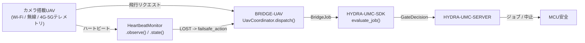

<!-- =============================================================================
HYDRA-UMC-BRIDGE-UAV - カメラ搭載ドローン双方向連携ブリッジ
Copyright (C) 2026 JuanenRac (Electro Hobby 3D) <electrohobby3d@gmail.com>
GPL-3.0-or-later - see LICENSE
============================================================================= -->

<p align="center">
  
</p>

# 🛩️ HYDRA-UMC-BRIDGE-UAV

<p align="center"><a href="README.md">🇺🇸 English</a> | <a href="README_spa.md">🇪🇸 Español</a> | <a href="README_fra.md">🇫🇷 Français</a> | <a href="README_ita.md">🇮🇹 Italiano</a> | <a href="README_deu.md">🇩🇪 Deutsch</a> | <a href="README_zho.md">🇨🇳 简体中文</a> | 🇯🇵 <b>日本語</b></p>

### 🔗 HYDRA-UMCとカメラ搭載UAVとの間の依存関係なし連携境界

<p align="left">
  
  
  
</p>

---

## 1. 🛠️ 技術概要

**HYDRA-UMC-BRIDGE-UAV** は、HYDRA-UMCとカメラ搭載ドローン(UAV)との間の双方向・高レベルの連携境界であり、Wi-Fi、無線リンク、またはセルラー(4G/5G)テレメトリ接続経由で到達可能である。小規模で命名された高レベルの飛行リクエストの語彙(`PRE_FLIGHT_CHECK`、`TAKEOFF`、`GOTO_WAYPOINT`、`HOVER_AND_CAPTURE`、`RETURN_TO_LAUNCH`)を検証・転送し、それとは別に実在する必須のリンク喪失ハートビート・ウォッチドッグを実行する。飛行制御や姿勢安定化を計算することは一切なく、HYDRA-UMC-SERVER、MCUの限界、ウォッチドッグ、E-STOPを迂回することはできない。

`HYDRA-UMC-BRIDGE-DROIDS` および `HYDRA-UMC-BRIDGE-AMR` とともに **Mobile & Autonomous Bridges** ファミリーに属し、静的な **External Automation Bridges**(CNC、LASER、OPENPNP、PRINTER3D、ROS2)と同じ `HYDRA-UMC-SDK` のジョブ・安全契約を共有している。

### 主な機能:
* ✅ **実在する依存関係なしの飛行リクエストコア:** `coordinator.py` の `UavCoordinator` はMAVLinkやベンダーSDKのインポートが一切ない —— 意図的に純粋なPythonであり、実際のUAVが接続されていないどのホストでもテスト可能である。*(実装済み、`tests/test_coordinator.py` でテスト済み)*
* ✅ **実在する命名済み飛行リクエスト語彙:** `PRE_FLIGHT_CHECK`、`TAKEOFF`、`GOTO_WAYPOINT`、`HOVER_AND_CAPTURE`、`RETURN_TO_LAUNCH` —— 生の姿勢/スロットルコマンドは決して扱わない。通常のミッション完了を表す `COMPLETE` と緊急時の `ABORT` は、どちらも同じ実在する `RETURN_TO_LAUNCH` リクエストに解決される。*(実装済み)*
* ✅ **実在する必須のリンク喪失ハートビート・ウォッチドッグ:** `HeartbeatMonitor` は、明示的な `now` によって駆動される決定論的なフェイルセーフ状態機械である —— 実際の時計を読み取ることは一切なく、一度も観測されなければ最初のチェックから `LOST` を報告し、タイムアウトちょうどの瞬間はまだ `OK` として扱う(真に超過した場合のみ、設定された `RETURN_TO_LAUNCH`/ホバーのフェイルセーフが発動する)。*(実装済み、`tests/test_heartbeat.py` で決定論的な境界値の完全なスイートによりテスト済み)*
* ✅ **実在する共有安全ゲート:** `UavCoordinator.dispatch()` を通じて送信されるすべてのジョブは、`HYDRA-UMC-SDK` の `bridge_contract` にある `evaluate_job()` によって評価される。これは他のすべての兄弟ブリッジとHYDRA-UMC-SERVERが使うのと同じゲートである。生産フェーズには外部機械が `IDLE` であり、HYDRA-UMCセルが `READY` であることが必要だが、`ABORT` は故障中でも要求可能なままである。*(実装済み)*
* ✅ **フェイルクローズのフェーズルーティングと静的エビデンス:** 未知の将来SDKフェーズは拒否される。`inspect_request_plan.py` は、独立した `LAND` リクエストを今や含む静的スキーマ `1.1` の飛行リクエストプランを、トランスポートを一切開かずに出力する。*(実装・テスト済み)*
* ✅ **実在するMAVLinkコマンドトランスポート:** `mavlink_transport.py` の `MavlinkFlightControl` は、既にゲートを通過したディスパッチを実際の `COMMAND_LONG` として送信し、実際の番号付き `MAV_CMD`(`MAV_CMD_NAV_TAKEOFF`/`MAV_CMD_DO_REPOSITION`/`MAV_CMD_NAV_LOITER_UNLIM`/`MAV_CMD_IMAGE_START_CAPTURE`/`MAV_CMD_NAV_RETURN_TO_LAUNCH`/`MAV_CMD_NAV_LAND`/`MAV_CMD_COMPONENT_ARM_DISARM`)にマッピングする —— 拒否されたディスパッチはネットワークに到達しない。*(実装済み、`tests/test_mavlink_transport.py` でテスト済み)*
* ✅ **非破壊的なビルド/テスト:** `build-test.bat`/`.sh` はソースをコンパイルし、バージョンやCHANGELOGを変更せずに決定論的なユニットテストを実行する。*(実装済み、下記「ビルドと実行」を参照)*
* 🔜 **DJI OSDKトランスポートアダプター**(非MAVLinkプラットフォーム向け)—— そのSDKが選定・テストされた後にのみ導入される。*(計画中)*

---

## 2. 🔄 UAV連携フロー



---

## 3. 🧱 アーキテクチャと設計判断

* **なぜハートビート・ウォッチドッグは、コーディネーターに組み込まず独自のモジュールなのか。** リンク喪失は「このジョブは今許可されているか」とは異なる実在する独立した故障モードである —— `HeartbeatMonitor` は、個々のジョブとは独立して「このUAVから最後に聞いたことを、まだ信頼できるか」に答えるため、ジョブがたまたま送信されたときだけでなく、継続的に(たとえば毎回のテレメトリティックごとに)チェックできる。
* **なぜ `HeartbeatMonitor` は実際の時計を読み取るのではなく、明示的な `now` を受け取るのか。** 本プロジェクトが出発点とした貼り付けられたアーキテクチャノートは、UAVブリッジがこのウォッチドッグを必須とすることを明示している —— タイムアウト境界での正確な挙動(単に「いずれタイムアウトする」ではなく)を証明する唯一の方法は、不安定で低速な実スリープベースのテストスイートに頼らず、時間を明示的でテスト可能な入力にすることである。
* **なぜ `COMPLETE` と `ABORT` はどちらも `RETURN_TO_LAUNCH` に解決されるのか。** 完了したミッションと緊急中止は、UAVにとって同じ実在する正しい結果を持つ——帰還することである。静的プランにおいてこれらを同じリクエスト名に統合すること(重複排除であり、繰り返しではない)は、2つの異なる「帰還する」という動詞を発明するのではなく、これを正直に反映している。
* **なぜこのブリッジ自身のハートビートは、フライトコントローラー自身のフェイルセーフの代替に明示的にならないのか。** Pixhawk/PX4やDJI自身のファームウェアは、無線/テレメトリレベルですでに実在する準認証済みのリンク喪失フェイルセーフを実装している —— このブリッジの `HeartbeatMonitor` はHYDRA-UMC自身の状態のための連携層のシグナルであり、両者は独立して存在しなければならない。`docs/BRIDGE_GUIDE.md` 自身のハードウェア受け入れゲートを参照。
* **なぜMAVLink/OSDKトランスポートアダプターがまだこのリポジトリにないのか。** 特定のフライトコントローラーの実際のコマンド/テレメトリプロトコルに、それが選定・テストされる前にコミットすることは、この依存関係のないローカルコアが検証できない前提を組み込むリスクを伴う。
* **エコシステムの他部分とどう関係するか。** BRIDGE-UAVは実際のUAVと `HYDRA-UMC-SDK` → `HYDRA-UMC-SERVER` → MCU安全との間に位置する —— 連携境界であり、飛行制御ノードでは決してなく、HYDRA-UMC-SERVER、MCUの限界、ウォッチドッグ、E-STOPを迂回することはできない。

---

## 📂 ディレクトリ構成

```text
HYDRA-UMC-BRIDGE-UAV/
├── src/
│   └── hydra_umc_bridge_uav/
│       ├── __init__.py
│       ├── coordinator.py       # UavCoordinator: 依存関係なしの飛行リクエストゲート
│       ├── heartbeat.py         # HeartbeatMonitor: 実在する決定論的なリンク喪失フェイルセーフ
│       └── mavlink_transport.py # 検証済みのUavDispatchを実際のMAVLink COMMAND_LONGとして送信
├── tests/
│   ├── test_coordinator.py      # 連携コアの決定論的ユニットテスト
│   ├── test_heartbeat.py        # ウォッチドッグの境界値に対する決定論的テスト
│   └── test_mavlink_transport.py # 疑似MAVLink接続に対する実MAV_CMD形状テスト
├── tools/
│   ├── build_test.py            # 非破壊的なコンパイル+テストランナー (build-test.bat/.sh)
│   ├── bump_version.py          # pyproject.toml、マニフェスト、CHANGELOG.md を同期
│   └── inspect_request_plan.py  # 静的な飛行リクエストプランを出力する(トランスポートを開かない)
├── docs/
│   └── BRIDGE_GUIDE.md          # 適用範囲、対応プラットフォーム、スクリプト、ハードウェア受け入れゲート
├── images/
│   └── HYDRA_UMC_BANNER.svg     # README バナー
├── build-test.bat / build-test.sh  # 検証のみ、リポジトリを一切変更しない
├── build.bat / build.sh            # 検証後、成功時のみバージョン + CHANGELOG を更新
├── pyproject.toml               # パッケージメタデータ。HYDRA-UMC-SDK に依存 (git)
├── hydra-umc.project.json       # エコシステムマニフェスト(バージョン、成熟度、ファミリー)
├── CHANGELOG.md
├── CODE_OF_CONDUCT.md / CONTRIBUTING.md / SECURITY.md / SUPPORT.md
├── LICENSE / LICENSE.md
└── README.md / README_*.md      # 本ファイルおよびその6言語訳
```

---

## 4. ⚙️ ビルドと実行

Python 3.11以上が必要。`tools/build_test.py` は `HYDRA-UMC-SDK` が兄弟ディレクトリ(`../HYDRA-UMC-SDK`)としてチェックアウトされているか、環境変数 `HYDRA_UMC_SDK_ROOT` で指定されていることを期待する。

```bash
# Windows
build-test.bat      # 検証のみ —— バージョン/CHANGELOGの変更なし
build.bat            # 検証後、成功時にバージョン + CHANGELOG を更新

# Linux/macOS
bash build-test.sh
bash build.sh
```

`build-test` は `src/` 配下の各モジュールを `py_compile` でコンパイルし、`unittest` の全スイート(`tests/test_coordinator.py`、`tests/test_heartbeat.py`)を実行する —— 実際のUAV接続もネットワークもなく決定論的に動作し、バージョンやCHANGELOGを変更しない。`build` はまず同じ検証を実行し、成功した場合のみ `tools/bump_version.py` を呼び出して `pyproject.toml`、`hydra-umc.project.json`、`CHANGELOG.md` の間でバージョンを同期する。実際のハードウェア向け `run` コマンドはまだ存在しない —— それには検証済みのMAVLink/OSDKトランスポートアダプターと実際のUAVが必要である。

---

## ✅ 現状と次のステップ

**現時点で実在するもの:** バージョン `0.0.4`。依存関係なしの連携コア(`UavCoordinator`)に加えて、境界値が完全にテストされた実在するリンク喪失ハートビート・ウォッチドッグ(`HeartbeatMonitor`)、フェイルクローズのフェーズルーティング、静的な `plan-only` 飛行リクエストスキーマ、各リクエストを実際の番号付き `MAV_CMD` にマッピングする実在するMAVLinkコマンドトランスポート(`MavlinkFlightControl`)、SDKチェックアウトを伴いCIに組み込まれた非破壊的なbuild-testスクリプトを備えて機能している。

**統合境界:** このブリッジは連携境界に過ぎない —— 飛行制御ノードではなく、HYDRA-UMC-SERVER、MCUの限界、ウォッチドッグ、E-STOPを迂回することはできない。送信されるすべてのジョブは、依然としてすべての兄弟ブリッジが使う同じ共有ゲートを通過する。`HeartbeatMonitor` 自身のフェイルセーフシグナルは連携層の問題であり、フライトコントローラー自身の独立したリンク喪失フェイルセーフの代替では決してない。

**今後の課題:** 実際のMAVLink(Pixhawk/PX4)もDJI OSDKトランスポートも、物理的なUAVもまだ一切検証されていない —— 実際のアダプターは、具体的なフライトコントローラー/SDKが選定・テストされた後にのみ導入される。

---

## 🔗 関連プロジェクト

本プロジェクトは、同じ作者(JuanenRac / Electro Hobby 3D)による HYDRA-UMC ロボティクスエコシステムの一部です。リクエストが実はこの中のどれかについてのものである可能性があるため、知っておく価値があります。

**親プロジェクト**
- **[HYDRA-UMC-SERVER](https://github.com/JuanenRac/HYDRA-UMC-SERVER)** — すべての制御クライアントが実際に通信する、本物のヘッドレスバックエンド(REST/WebSocket)。各コマンドがこのブリッジ自身のローカル安全ゲートを通過した後、本ブリッジが報告する認証済みエコシステム境界。

**兄弟プロジェクト** —— それぞれ独自のクライアントとして、同じく HYDRA-UMC-SERVER 自身の API と通信する
- **[HYDRA-UMC-STUDIO](https://github.com/JuanenRac/HYDRA-UMC-STUDIO)** — リアルタイムのマルチロボット 3D 可視化を備えたウェブ制御ダッシュボード。
- **[HYDRA-UMC-SUITE](https://github.com/JuanenRac/HYDRA-UMC-SUITE)** — 複数のサーバーを同時に扱えるデスクトップ(PySide6)スウォームコマンドセンター、スタンドアロン実行ファイルとしてパッケージ化。
- **[HYDRA-UMC-ANDROID-CONTROL](https://github.com/JuanenRac/HYDRA-UMC-ANDROID-CONTROL)** — 生体認証ログインとペアリングされた Wear OS コンパニオンを備えたネイティブ Android 制御アプリ。
- **[HYDRA-UMC-IOS-CONTROL](https://github.com/JuanenRac/HYDRA-UMC-IOS-CONTROL)** — リアルタイム WebSocket 同期を備えた iOS/iPadOS 制御アプリ(Flutter)。
- **[HYDRA-UMC-DSI](https://github.com/JuanenRac/HYDRA-UMC-DSI)** — 本体搭載の 7 インチ DSI タッチスクリーン向けネイティブタッチ UI、CM5 自体に組み込み。
- **[HYDRA-UMC-BRIDGE-AMR](https://github.com/JuanenRac/HYDRA-UMC-BRIDGE-AMR)** — 実際の VDA 5050 MQTT パブリッシャーによる AGV/AMR フリートの調整境界 — このエコシステムにおける 3 つのモバイルフリートブリッジのひとつ。
- **[HYDRA-UMC-BRIDGE-CNC](https://github.com/JuanenRac/HYDRA-UMC-BRIDGE-CNC)** — 実際の GRBL ステータス/制御バイトへのアクセスを持つ、CNC セルの高レベルコーディネーター。
- **[HYDRA-UMC-BRIDGE-DROIDS](https://github.com/JuanenRac/HYDRA-UMC-BRIDGE-DROIDS)** — 実際の Boston Dynamics Spot コマンド送信機能を持つ、脚型/ヒューマノイドドロイドの調整境界 — このエコシステムにおける 3 つのモバイルフリートブリッジのひとつ。
- **[HYDRA-UMC-BRIDGE-LASER](https://github.com/JuanenRac/HYDRA-UMC-BRIDGE-LASER)** — 実際のキー/筐体/インターロック GPIO セーフガード 3 系統を読み取る、レーザーセルの安全コーディネーター。
- **[HYDRA-UMC-BRIDGE-OPENPNP](https://github.com/JuanenRac/HYDRA-UMC-BRIDGE-OPENPNP)** — OpenPnP ピックアンドプレースの基板フローを安全に統括する高レベルコーディネーター。
- **[HYDRA-UMC-BRIDGE-PRINTER3D](https://github.com/JuanenRac/HYDRA-UMC-BRIDGE-PRINTER3D)** — 実際にゲート制御されたジョブコマンドを持つ、Moonraker/Klipper 3D プリンター向けの安全な調整境界。
- **[HYDRA-UMC-BRIDGE-ROS2](https://github.com/JuanenRac/HYDRA-UMC-BRIDGE-ROS2)** — 実際の遅延インポート rclpy ROS 2 トランスポートを持つ安全コーディネーター。

**直接関連**
- **[HYDRA-UMC-SDK](https://github.com/JuanenRac/HYDRA-UMC-SDK)** — すべてのブリッジが自身のコマンドを検証する共有 JSON-Schema 契約と安全ゲートの境界。

**エコシステムの他のプロジェクト**

*コアハードウェア&プラットフォーム*
- **[HYDRA-UMC](https://github.com/JuanenRac/HYDRA-UMC)** — 実際のロボットアームのマザーボード——CM5 ホスト + デュアルコア STM32H745、CAN-OTA/SPI-OTA 経由で最大 8 本のツールアームを統括。
- **[HYDRA-UMC-OS](https://github.com/JuanenRac/HYDRA-UMC-OS)** — CM5 向けの再現可能な Raspberry Pi OS プロダクト層——読み取り専用エージェント、検証済み設定/プロファイル、WiFi 初回接続プロビジョニング。

*コアバックエンド&クライアント*
- **[HYDRA-UMC-EDITOR-URDF](https://github.com/JuanenRac/HYDRA-UMC-EDITOR-URDF)** — 完成したモデルを STUDIO 自身のカタログへ送信するデスクトップ用グラフィカル URDF 作成/編集ツール。

*URTC ツールプラットフォーム*
- **[URTC](https://github.com/JuanenRac/URTC)** — 物理的な Universal Robot Tool Controller 基板向けファームウェア、CAN バス経由の 25 以上のツールプロファイル。
- **[URTC-FLASHER](https://github.com/JuanenRac/URTC-FLASHER)** — URTC 基板用のデスクトップ GUI 書き込みツール、CAN-OTA およびフルチップ SWD/JTAG。
- **[URTC-TESTER](https://github.com/JuanenRac/URTC-TESTER)** — URTC 基板向けのデスクトップ CAN バスライブ診断ツール、ツールプロファイルごとに 1 パネル。
- **[URTC-WEB-STUDIO](https://github.com/JuanenRac/URTC-WEB-STUDIO)** — Web Serial API を使ったブラウザベースの URTC-TESTER の代替、ローカルインストール不要。

*ビジョン AI ノード(Hailo-8)*
- **[HYDRA-UMC-VISION-NODE](https://github.com/JuanenRac/HYDRA-UMC-VISION-NODE)** — Hailo-8 ビジョンパイプラインの統合ハブ、段階ごとの実際のハードウェア準備状況チェック付き。
- **[HYDRA-UMC-DETECTION-HEF](https://github.com/JuanenRac/HYDRA-UMC-DETECTION-HEF)** — Hailo アーキテクチャ/チェックサムによる安全読み込み検証を備えた、実際のコンパイル済みモデルレジストリ。
- **[HYDRA-UMC-VISION-STREAMER](https://github.com/JuanenRac/HYDRA-UMC-VISION-STREAMER)** — 実際の HailoRT 統合境界を持つ、実際の GStreamer パイプライン + MediaMTX 設定生成器。
- **[HYDRA-UMC-VISUAL-SERVOING-API](https://github.com/JuanenRac/HYDRA-UMC-VISUAL-SERVOING-API)** — 上流のゾーン状態に応じて安全ゲート制御される、実際の Position-Based Visual Servoing 補正則。
- **[HYDRA-UMC-SAFETY-ZONES](https://github.com/JuanenRac/HYDRA-UMC-SAFETY-ZONES)** — キャリブレーションの鮮度を強制する、実際のゾーン侵入チェックと E-STOP 要求。

*コグニティブ AI ノード(Hailo-10)*
- **[HYDRA-UMC-COGNITIVE-NODE](https://github.com/JuanenRac/HYDRA-UMC-COGNITIVE-NODE)** — Hailo-10 コグニティブパイプライン(LLM/VLA/音声オーケストレーション)の統合ハブ。
- **[HYDRA-UMC-VLA-ENGINE](https://github.com/JuanenRac/HYDRA-UMC-VLA-ENGINE)** — Vision-Language-Action モデル向けの、実際のアクショントークンのエンコード/デコードと軌道生成。
- **[HYDRA-UMC-VOICE-UI](https://github.com/JuanenRac/HYDRA-UMC-VOICE-UI)** — 確認ゲート付きの限定的な Watch リレーを備えた、実際の音声フロントエンド(VAD + 意図解析)。
- **[HYDRA-UMC-SEMANTIC-PLANNER](https://github.com/JuanenRac/HYDRA-UMC-SEMANTIC-PLANNER)** — MCU エラーコードに対する、実際のルールベースのタスク分解と意味的エラー復旧。
- **[HYDRA-UMC-DOCS-QA](https://github.com/JuanenRac/HYDRA-UMC-DOCS-QA)** — このエコシステム自身の Markdown ドキュメントに対する、標準ライブラリのみの実際の TF-IDF 文書検索。

*オーケストレーション&スウォーム*
- **[HYDRA-UMC-ORCHESTRATOR](https://github.com/JuanenRac/HYDRA-UMC-ORCHESTRATOR)** — 実際の gRPC/Protobuf ヘルスレポート契約とミッションステートマシンを持つ統合ハブ。
- **[HYDRA-UMC-JOB-DISPATCHER](https://github.com/JuanenRac/HYDRA-UMC-JOB-DISPATCHER)** — 実際の HTTP API 上に構築された、優先度ベースの実際のジョブキュー(重複排除付き)。
- **[HYDRA-UMC-NODE-HEALING](https://github.com/JuanenRac/HYDRA-UMC-NODE-HEALING)** — リトライ/バックオフとアイデンティティ不一致検出を備えた、実際の gRPC ベースのフリートヘルスウォッチドッグ。
- **[HYDRA-UMC-PATH-PLANNER-3D](https://github.com/JuanenRac/HYDRA-UMC-PATH-PLANNER-3D)** — 実際の障害物/ワークスペース衝突検証を備えた、実際の RRT ベースの 3D 経路プランナー。
- **[HYDRA-UMC-SWARM-SYNC](https://github.com/JuanenRac/HYDRA-UMC-SWARM-SYNC)** — 複数セルの収束についてプロパティテストされた、実際の CRDT LWW-Element-Map 状態同期。

*デジタルツイン&シミュレーション*
- **[HYDRA-UMC-TWIN](https://github.com/JuanenRac/HYDRA-UMC-TWIN)** — 実際のバージョン互換性同期契約を持つ、デジタルツインエンジンの統合ハブ。
- **[HYDRA-UMC-HIL-BRIDGE](https://github.com/JuanenRac/HYDRA-UMC-HIL-BRIDGE)** — シミュレーションと実際のハードウェアの間でコマンドをルーティングする、実際のハードウェア・イン・ザ・ループ安全インターロック。
- **[HYDRA-UMC-PHYSICS-REPLICA](https://github.com/JuanenRac/HYDRA-UMC-PHYSICS-REPLICA)** — 実際の URDF サブセットに対する、実際の順運動学と関節限界検証。
- **[HYDRA-UMC-SYNTHETIC-DATA-GEN](https://github.com/JuanenRac/HYDRA-UMC-SYNTHETIC-DATA-GEN)** — YOLO/COCO アノテーションのエクスポート機能を持つ、実際のプロシージャル 2D シーンジェネレーター。

*データ&分析*
- **[HYDRA-UMC-DATALAKE](https://github.com/JuanenRac/HYDRA-UMC-DATALAKE)** — 実際の取り込み/クエリ HTTP API を備えた、実際の sqlite3 ベースの時系列ストア。
- **[HYDRA-UMC-ANOMALY-DETECTOR](https://github.com/JuanenRac/HYDRA-UMC-ANOMALY-DETECTOR)** — ドリフト監視を備えた、実際の FFT + 統計ベースラインによる異常検知器。
- **[HYDRA-UMC-PRODUCTION-REPORTS](https://github.com/JuanenRac/HYDRA-UMC-PRODUCTION-REPORTS)** — DATALAKE の履歴に対する実際の OEE/稼働率計算、再現可能な CSV エクスポート付き。
- **[HYDRA-UMC-TELEMETRY-COLLECTOR](https://github.com/JuanenRac/HYDRA-UMC-TELEMETRY-COLLECTOR)** — シーケンス重複排除機能を備えた、DATALAKE への実際の CAN/WebSocket 取り込みパイプライン。

*産業用ゲートウェイ*
- **[HYDRA-UMC-GATEWAY-INDUSTRIAL](https://github.com/JuanenRac/HYDRA-UMC-GATEWAY-INDUSTRIAL)** — 実際のコマンド許可リスト/バックプレッシャー層を持つ、産業用プロトコルへ中継する統合ハブ。
- **[HYDRA-UMC-OPCUA-SERVER](https://github.com/JuanenRac/HYDRA-UMC-OPCUA-SERVER)** — 実際のバイナリプロトコルクライアントセッションで検証された、実際の OPC-UA アドレス空間。
- **[HYDRA-UMC-MQTT-BROKER](https://github.com/JuanenRac/HYDRA-UMC-MQTT-BROKER)** — クライアント単位のオプション認証とトピック ACL を備えた、実際の MQTT ブローカー。
- **[HYDRA-UMC-MTCONNECT-ADAPTER](https://github.com/JuanenRac/HYDRA-UMC-MTCONNECT-ADAPTER)** — 縮退モード出力を備えた、実際の MTConnect `/probe` および `/current` XML エンドポイント。

*補完ツール&エコシステム運用*
- **[HYDRA-UMC-DASHBOARD-AI](https://github.com/JuanenRac/HYDRA-UMC-DASHBOARD-AI)** — 誠実な統計フォールバックを備えた、DATALAKE/ANOMALY-DETECTOR 上のスマートサマリーと異常ハイライトパネル。
- **[HYDRA-UMC-TOOL-CLI](https://github.com/JuanenRac/HYDRA-UMC-TOOL-CLI)** — 実際の安定した終了コード契約を持つフリート CLI、HYDRA-UMC-SERVER 自身の API の本物のライブクライアント。
- **[HYDRA-UMC-WATCH](https://github.com/JuanenRac/HYDRA-UMC-WATCH)** — 実際の触覚アラートとペアリングされたスマートフォンへの音声リレーを備えた WearOS コンパニオンアプリ。
- **[URTC-SMART-RACK](https://github.com/JuanenRac/URTC-SMART-RACK)** — 実際の工具 ID デコードと Smart Idle 予熱ロジックを備えた、基板搭載ラック用ファームウェア。
- **[URTC-VISION-TOOL](https://github.com/JuanenRac/URTC-VISION-TOOL)** — サーマル/RGB 検査ツールヘッド向けの、ファームウェアと実際の Python ビジョンコンパニオン。
- **[HYDRA-UMC-UPDATER](https://github.com/JuanenRac/HYDRA-UMC-UPDATER)** — このエコシステム内のすべてのリポジトリを検出・クローン・更新する、管理用デスクトップツール。

## 👤 作者
**JuanenRac** (Electro Hobby 3D)
📧 electrohobby3d@gmail.com
📺 [youtube.com/@electrohobby3d](https://youtube.com/@electrohobby3d)

## 📜 ライセンス
GPL-3.0 - 詳細はLICENSEを参照。
