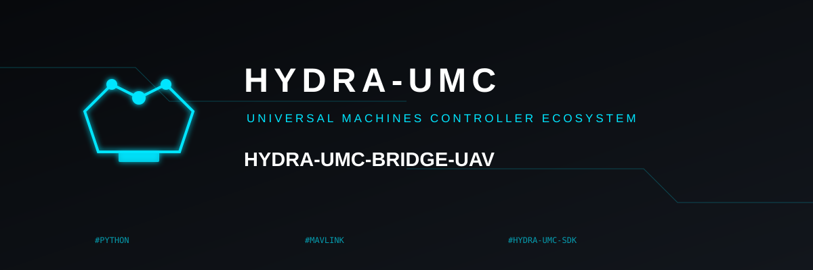
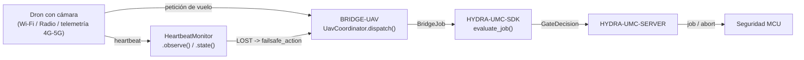

<!-- =============================================================================
HYDRA-UMC-BRIDGE-UAV - Puente de coordinación bidireccional para drones con cámara
Copyright (C) 2026 JuanenRac (Electro Hobby 3D) <electrohobby3d@gmail.com>
GPL-3.0-or-later - see LICENSE
============================================================================= -->

<p align="center">
  
</p>

# 🛩️ HYDRA-UMC-BRIDGE-UAV

<p align="center"><a href="README.md">🇺🇸 English</a> | 🇪🇸 <b>Español</b> | <a href="README_fra.md">🇫🇷 Français</a> | <a href="README_ita.md">🇮🇹 Italiano</a> | <a href="README_deu.md">🇩🇪 Deutsch</a> | <a href="README_zho.md">🇨🇳 简体中文</a> | <a href="README_jpn.md">🇯🇵 日本語</a></p>

### 🔗 Frontera de coordinación sin dependencias entre HYDRA-UMC y drones (UAV) con cámara

<p align="left">
  
  
  
</p>

---

## 1. 🛠️ VISIÓN TÉCNICA GENERAL

**HYDRA-UMC-BRIDGE-UAV** es la frontera de coordinación bidireccional de alto nivel entre HYDRA-UMC y un dron (UAV) con cámara, accesible por Wi-Fi, un enlace de radio o una conexión de telemetría celular (4G/5G). Valida y reenvía un vocabulario reducido y con nombre de peticiones de vuelo de alto nivel (`PRE_FLIGHT_CHECK`, `TAKEOFF`, `GOTO_WAYPOINT`, `HOVER_AND_CAPTURE`, `RETURN_TO_LAUNCH`), y por separado ejecuta un watchdog real y obligatorio de pérdida de enlace (heartbeat). Nunca calcula control de vuelo ni estabilización, y no puede saltarse a HYDRA-UMC-SERVER, los límites del MCU, los watchdogs ni el E-STOP.

Pertenece a la familia **Mobile & Autonomous Bridges** junto a `HYDRA-UMC-BRIDGE-DROIDS` y `HYDRA-UMC-BRIDGE-AMR`, y comparte el mismo contrato de trabajo y seguridad de `HYDRA-UMC-SDK` que los **External Automation Bridges** estacionarios (CNC, LASER, OPENPNP, PRINTER3D, ROS2).

### Características clave:
* ✅ **Núcleo real de peticiones de vuelo, sin dependencias:** `coordinator.py`'s `UavCoordinator` no importa MAVLink ni ningún SDK de fabricante - es deliberadamente Python puro, comprobable en cualquier máquina sin un UAV real conectado. *(implementado, probado en `tests/test_coordinator.py`)*
* ✅ **Vocabulario real de peticiones de vuelo con nombre:** `PRE_FLIGHT_CHECK`, `TAKEOFF`, `GOTO_WAYPOINT`, `HOVER_AND_CAPTURE`, `RETURN_TO_LAUNCH` - nunca un comando bruto de actitud/acelerador. Un `COMPLETE` de misión normal y un `ABORT` de emergencia resuelven ambos a la misma petición real `RETURN_TO_LAUNCH`. *(implementado)*
* ✅ **Watchdog real y obligatorio de pérdida de enlace:** `HeartbeatMonitor` es una máquina de estados de fallo determinista, guiada por un `now` explícito - nunca lee un reloj real, informa `LOST` desde la primera comprobación si nunca se observó nada, y trata el instante exacto del timeout como todavía `OK` (solo superarlo de verdad dispara el failsafe configurado `RETURN_TO_LAUNCH`/hover). *(implementado, probado con una suite determinista completa de casos límite en `tests/test_heartbeat.py`)*
* ✅ **Puerta de seguridad compartida real:** cada trabajo despachado mediante `UavCoordinator.dispatch()` se evalúa con `evaluate_job()` de `bridge_contract` de `HYDRA-UMC-SDK`, la misma puerta que usan todos los bridges hermanos y HYDRA-UMC-SERVER; una fase productiva exige una máquina externa `IDLE` y una celda HYDRA-UMC `READY`, mientras que `ABORT` sigue siendo solicitable durante un fallo. *(implementado)*
* ✅ **Enrutado de fase con fallo cerrado y evidencia estática:** una fase futura del SDK desconocida se rechaza. `inspect_request_plan.py` emite el plan de peticiones de vuelo estático del esquema `1.1` (que ahora incluye la petición independiente `LAND`) sin abrir ningún transporte. *(implementado, probado)*
* ✅ **Transporte real de comandos MAVLink:** `mavlink_transport.py`'s `MavlinkFlightControl` envía un despacho ya validado como un `COMMAND_LONG` real, mapeado a un `MAV_CMD` real y numerado (`MAV_CMD_NAV_TAKEOFF`/`MAV_CMD_DO_REPOSITION`/`MAV_CMD_NAV_LOITER_UNLIM`/`MAV_CMD_IMAGE_START_CAPTURE`/`MAV_CMD_NAV_RETURN_TO_LAUNCH`/`MAV_CMD_NAV_LAND`/`MAV_CMD_COMPONENT_ARM_DISARM`) - un despacho rechazado nunca llega a la red. *(implementado, probado en `tests/test_mavlink_transport.py`)*
* ✅ **Build/test sin mutación:** `build-test.bat`/`.sh` compilan el código fuente y ejecutan tests deterministas sin cambiar versión ni CHANGELOG. *(implementado, ver BUILD Y EJECUCIÓN más abajo)*
* 🔜 **Un adaptador de transporte DJI OSDK** (para una plataforma que no use MAVLink) - se introducirá solo tras seleccionar y probar ese SDK. *(planeado)*

---

## 2. 🔄 FLUJO DE COORDINACIÓN DEL UAV



---

## 3. 🧱 ARQUITECTURA Y DECISIONES DE DISEÑO

* **Por qué el watchdog de heartbeat es su propio módulo, no parte del coordinador.** La pérdida de enlace es un modo de fallo real y distinto de "¿está permitido este trabajo ahora mismo" - `HeartbeatMonitor` responde a "¿puedo seguir confiando en lo último que supe de este UAV" independientemente de cualquier trabajo concreto, así que se puede comprobar de forma continua (p. ej. en cada paquete de telemetría) y no solo cuando un trabajo se despacha.
* **Por qué `HeartbeatMonitor` recibe un `now` explícito en vez de leer un reloj real.** La nota de arquitectura pegada de la que partió este proyecto es explícita en que un bridge de UAV REQUIERE este watchdog - la única forma de demostrar su comportamiento exacto en el límite del timeout (no solo "acaba expirando en algún momento") sin una suite de tests lenta y basada en sleeps reales es hacer que el tiempo sea una entrada explícita y comprobable.
* **Por qué `COMPLETE` y `ABORT` resuelven ambos a `RETURN_TO_LAUNCH`.** Una misión terminada y un aborto de emergencia tienen el mismo resultado real correcto para un UAV: volver a casa. Colapsarlos en el mismo nombre de petición en el plan estático (deduplicado, no repetido) refleja eso con honestidad en vez de inventar dos verbos distintos de "volver".
* **Por qué el heartbeat propio de este bridge explícitamente NO sustituye al failsafe del controlador de vuelo.** El firmware de Pixhawk/PX4 y de DJI ya implementa un failsafe real de pérdida de enlace a nivel de radio/telemetría - el `HeartbeatMonitor` de este bridge es una señal de la propia capa de coordinación para el estado de HYDRA-UMC, y ambos deben existir de forma independiente; ver la propia puerta de aceptación de hardware en `docs/BRIDGE_GUIDE.md`.
* **Por qué el adaptador de transporte MAVLink/OSDK aún no está en este repositorio.** Comprometerse con el protocolo real de comandos/telemetría de un controlador de vuelo concreto antes de seleccionarlo y probarlo arriesgaría a dar por sentadas suposiciones que este núcleo local y sin dependencias no puede verificar.
* **Cómo encaja esto en el resto del ecosistema.** BRIDGE-UAV se sitúa entre un UAV real y `HYDRA-UMC-SDK` → `HYDRA-UMC-SERVER` → seguridad MCU - es una frontera de coordinación, nunca un nodo de control de vuelo, y no puede saltarse HYDRA-UMC-SERVER, los límites del MCU, los watchdogs ni el E-STOP.

---

## 📂 ESTRUCTURA DE DIRECTORIOS

```text
HYDRA-UMC-BRIDGE-UAV/
├── src/
│   └── hydra_umc_bridge_uav/
│       ├── __init__.py
│       ├── coordinator.py       # UavCoordinator: puerta de peticiones de vuelo sin dependencias
│       ├── heartbeat.py         # HeartbeatMonitor: failsafe determinista real de pérdida de enlace
│       └── mavlink_transport.py # Envía un UavDispatch ya validado como un COMMAND_LONG MAVLink real
├── tests/
│   ├── test_coordinator.py      # Tests unitarios deterministas del núcleo de coordinación
│   ├── test_heartbeat.py        # Tests deterministas de los casos límite del watchdog
│   └── test_mavlink_transport.py # Tests de forma MAV_CMD reales contra una conexión MAVLink simulada
├── tools/
│   ├── build_test.py            # Compilación + tests sin mutación (build-test.bat/.sh)
│   ├── bump_version.py          # Sincroniza pyproject.toml, manifiesto y CHANGELOG.md
│   └── inspect_request_plan.py  # Imprime el plan de peticiones de vuelo estático (sin abrir transporte)
├── docs/
│   └── BRIDGE_GUIDE.md          # Alcance, plataformas compatibles, scripts, puerta de aceptación de hardware
├── images/
│   └── HYDRA_UMC_BANNER.svg     # Banner del README
├── build-test.bat / build-test.sh  # Solo valida, nunca modifica el repositorio
├── build.bat / build.sh            # Valida y luego sube versión + CHANGELOG si tiene éxito
├── pyproject.toml               # Metadatos del paquete; depende de HYDRA-UMC-SDK (git)
├── hydra-umc.project.json       # Manifiesto del ecosistema (versión, madurez, familia)
├── CHANGELOG.md
├── CODE_OF_CONDUCT.md / CONTRIBUTING.md / SECURITY.md / SUPPORT.md
├── LICENSE / LICENSE.md
└── README.md / README_*.md      # Este archivo y sus 6 traducciones
```

---

## 4. ⚙️ BUILD Y EJECUCIÓN

Requiere Python 3.11+. `tools/build_test.py` espera `HYDRA-UMC-SDK` clonado como directorio hermano (`../HYDRA-UMC-SDK`) o indicado mediante la variable de entorno `HYDRA_UMC_SDK_ROOT`.

```bash
# Windows
build-test.bat      # solo valida — sin cambio de versión/CHANGELOG
build.bat            # valida y luego sube versión + CHANGELOG si tiene éxito

# Linux/macOS
bash build-test.sh
bash build.sh
```

`build-test` compila cada módulo bajo `src/` con `py_compile` y ejecuta la suite completa de `unittest` (`tests/test_coordinator.py`, `tests/test_heartbeat.py`) - de forma determinista, sin conexión real a ningún UAV, sin red y sin cambio de versión/CHANGELOG. `build` ejecuta esa misma validación primero y, solo si tiene éxito, llama a `tools/bump_version.py` para sincronizar la versión entre `pyproject.toml`, `hydra-umc.project.json` y `CHANGELOG.md`. Todavía no existe un comando `run` con hardware real - eso requiere un adaptador de transporte MAVLink/OSDK validado y un UAV real.

---

## ✅ Estado actual y próximos pasos

**Real hoy:** versión `0.0.4`, funcional como núcleo de coordinación sin dependencias (`UavCoordinator`) más un watchdog real de pérdida de enlace totalmente probado en sus casos límite (`HeartbeatMonitor`), enrutado de fase con fallo cerrado, un esquema de peticiones de vuelo estático `plan-only`, un transporte real de comandos MAVLink (`MavlinkFlightControl`) que mapea cada petición a su `MAV_CMD` real y numerado, y scripts de build-test sin mutación integrados en CI con un checkout del SDK.

**Frontera de integración:** este bridge es solo una frontera de coordinación - no es un nodo de control de vuelo, y no puede saltarse HYDRA-UMC-SERVER, los límites del MCU, los watchdogs ni el E-STOP; cada trabajo despachado sigue pasando por la misma puerta compartida que usan todos los bridges hermanos. La señal de failsafe propia de `HeartbeatMonitor` es un asunto de la capa de coordinación, nunca un sustituto del failsafe independiente del propio controlador de vuelo.

**Todavía pendiente:** aún no se ha validado ningún transporte real MAVLink (Pixhawk/PX4) ni DJI OSDK, ni un UAV físico - un adaptador real se introducirá solo después de seleccionar y probar un controlador de vuelo/SDK concreto.

---

## 🔗 Proyectos relacionados

Este proyecto forma parte de un ecosistema de robótica más amplio del mismo autor (JuanenRac / Electro Hobby 3D), que abarca firmware, software de control, nodos de IA y herramientas de flota.

### Directamente relacionados

- **[HYDRA-UMC-SDK](https://github.com/JuanenRac/HYDRA-UMC-SDK)** — el contrato compartido de trabajo y seguridad por el que pasa cada bridge (incluido este).
- **[HYDRA-UMC-SERVER](https://github.com/JuanenRac/HYDRA-UMC-SERVER)** — la frontera autenticada del ecosistema a la que reporta este bridge.
- **[HYDRA-UMC-BRIDGE-DROIDS](https://github.com/JuanenRac/HYDRA-UMC-BRIDGE-DROIDS)** — bridge móvil hermano para droides con patas/humanoides.
- **[HYDRA-UMC-BRIDGE-AMR](https://github.com/JuanenRac/HYDRA-UMC-BRIDGE-AMR)** — bridge móvil hermano para flotas AGV/AMR.

### Resto del ecosistema

**Plataforma HYDRA-UMC** — la microfábrica multi-robot para la que este bridge coordina auxiliares
- **[HYDRA-UMC](https://github.com/JuanenRac/HYDRA-UMC)** — la placa base CM5 + STM32H745 que orquesta hasta 8 brazos robóticos.
- **[HYDRA-UMC-SERVER](https://github.com/JuanenRac/HYDRA-UMC-SERVER)** — el backend Express/WebSocket con el que habla cada cliente de control y cada bridge.
- **[HYDRA-UMC-STUDIO](https://github.com/JuanenRac/HYDRA-UMC-STUDIO)** — panel de control web, visualización 3D multi-robot.

**External Automation Bridges** — repos hermanos que comparten la misma puerta `HYDRA-UMC-SDK`
- **[HYDRA-UMC-BRIDGE-CNC](https://github.com/JuanenRac/HYDRA-UMC-BRIDGE-CNC)** — bridge de coordinación de celda CNC.
- **[HYDRA-UMC-BRIDGE-LASER](https://github.com/JuanenRac/HYDRA-UMC-BRIDGE-LASER)** — bridge de coordinación de celda láser.
- **[HYDRA-UMC-BRIDGE-OPENPNP](https://github.com/JuanenRac/HYDRA-UMC-BRIDGE-OPENPNP)** — bridge de flujo de placas para OpenPnP.
- **[HYDRA-UMC-BRIDGE-PRINTER3D](https://github.com/JuanenRac/HYDRA-UMC-BRIDGE-PRINTER3D)** — bridge de coordinación para software de impresión 3D abierto.
- **[HYDRA-UMC-BRIDGE-ROS2](https://github.com/JuanenRac/HYDRA-UMC-BRIDGE-ROS2)** — bridge de coordinación genérico para cualquier plataforma ROS 2.

**Evidencia de seguridad e integración**
- **[HYDRA-UMC-SAFETY-ZONES](https://github.com/JuanenRac/HYDRA-UMC-SAFETY-ZONES)** — evidencia de seguridad por zonas de celda usada en toda la familia de bridges.
- **[HYDRA-UMC-HIL-BRIDGE](https://github.com/JuanenRac/HYDRA-UMC-HIL-BRIDGE)** — evidencia de pruebas hardware-in-the-loop.

## 👤 AUTOR
**JuanenRac** (Electro Hobby 3D)
📧 electrohobby3d@gmail.com
📺 [youtube.com/@electrohobby3d](https://youtube.com/@electrohobby3d)

## 📜 LICENCIA
GPL-3.0 - Ver LICENSE para más detalles.
