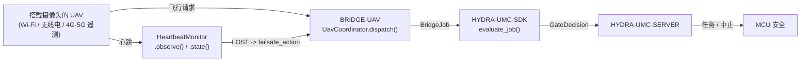

<!-- =============================================================================
HYDRA-UMC-BRIDGE-UAV - 搭载摄像头的无人机双向协调桥接
Copyright (C) 2026 JuanenRac (Electro Hobby 3D) <electrohobby3d@gmail.com>
GPL-3.0-or-later - see LICENSE
============================================================================= -->

<p align="center">
  
</p>

# 🛩️ HYDRA-UMC-BRIDGE-UAV

<p align="center"><a href="README.md">🇺🇸 English</a> | <a href="README_spa.md">🇪🇸 Español</a> | <a href="README_fra.md">🇫🇷 Français</a> | <a href="README_ita.md">🇮🇹 Italiano</a> | <a href="README_deu.md">🇩🇪 Deutsch</a> | 🇨🇳 <b>简体中文</b> | <a href="README_jpn.md">🇯🇵 日本語</a></p>

### 🔗 HYDRA-UMC 与搭载摄像头的无人机(UAV)之间无依赖的协调边界

<p align="left">
  
  
  
</p>

---

## 1. 🛠️ 技术概览

**HYDRA-UMC-BRIDGE-UAV** 是 HYDRA-UMC 与搭载摄像头的无人机(UAV)之间双向的高层协调边界,可通过 Wi-Fi、无线电链路或蜂窝(4G/5G)遥测连接访问。它校验并转发一套小型的、具名的高层飞行请求词汇(`PRE_FLIGHT_CHECK`、`TAKEOFF`、`GOTO_WAYPOINT`、`HOVER_AND_CAPTURE`、`RETURN_TO_LAUNCH`),并单独运行一个真实的、强制性的链路丢失心跳(heartbeat)看门狗。它从不计算飞行控制或姿态稳定,也不能绕过 HYDRA-UMC-SERVER、MCU 限位、看门狗或急停(E-STOP)。

它与 `HYDRA-UMC-BRIDGE-DROIDS` 和 `HYDRA-UMC-BRIDGE-AMR` 同属 **Mobile & Autonomous Bridges** 家族,并与固定式的 **External Automation Bridges**(CNC、LASER、OPENPNP、PRINTER3D、ROS2)共享同一个 `HYDRA-UMC-SDK` 任务与安全契约。

### 核心特性:
* ✅ **真实的无依赖飞行请求核心:** `coordinator.py` 中的 `UavCoordinator` 完全没有导入 MAVLink 或任何厂商 SDK——它刻意保持为纯 Python,可以在任何主机上测试,无需连接真实的 UAV。*(已实现,并在 `tests/test_coordinator.py` 中测试)*
* ✅ **真实的具名飞行请求词汇:** `PRE_FLIGHT_CHECK`、`TAKEOFF`、`GOTO_WAYPOINT`、`HOVER_AND_CAPTURE`、`RETURN_TO_LAUNCH`——绝不是原始的姿态/油门指令。正常任务完成的 `COMPLETE` 和紧急情况下的 `ABORT` 都会解析为同一个真实的 `RETURN_TO_LAUNCH` 请求。*(已实现)*
* ✅ **一个真实的、强制性的链路丢失心跳看门狗:** `HeartbeatMonitor` 是一个确定性的、由显式 `now` 驱动的故障保护状态机——它从不读取真实时钟,如果从未收到过观测就会从第一次检查开始就报告 `LOST`,并把恰好等于超时时刻的情况仍视为 `OK`(只有真正超出超时才会触发配置好的 `RETURN_TO_LAUNCH`/悬停故障保护)。*(已实现,并在 `tests/test_heartbeat.py` 中通过一整套确定性边界测试进行了测试)*
* ✅ **真实的共享安全门控:** 每个通过 `UavCoordinator.dispatch()` 派发的任务都会由 `HYDRA-UMC-SDK` 的 `bridge_contract` 中的 `evaluate_job()` 评估,这与所有兄弟桥接以及 HYDRA-UMC-SERVER 使用的是同一个门控;生产性阶段需要外部机器处于 `IDLE` 且 HYDRA-UMC 单元处于 `READY`,而 `ABORT` 在故障期间仍可请求。*(已实现)*
* ✅ **安全拒绝的阶段路由与静态证据:** 未知的未来 SDK 阶段会被拒绝。`inspect_request_plan.py` 会输出静态模式 `1.1` 的飞行请求计划(现已包含独立的 `LAND` 请求),且不会打开任何传输通道。*(已实现,已测试)*
* ✅ **真实的 MAVLink 命令传输:** `mavlink_transport.py` 的 `MavlinkFlightControl` 将一个已通过门控的派发发送为真实的 `COMMAND_LONG`,映射到真实的、编号的 `MAV_CMD`(`MAV_CMD_NAV_TAKEOFF`/`MAV_CMD_DO_REPOSITION`/`MAV_CMD_NAV_LOITER_UNLIM`/`MAV_CMD_IMAGE_START_CAPTURE`/`MAV_CMD_NAV_RETURN_TO_LAUNCH`/`MAV_CMD_NAV_LAND`/`MAV_CMD_COMPONENT_ARM_DISARM`)——被拒绝的派发永远不会到达网络。*(已实现,并在 `tests/test_mavlink_transport.py` 中测试)*
* ✅ **非变更式构建/测试:** `build-test.bat`/`.sh` 编译源码并运行确定性单元测试,不改变版本或 CHANGELOG。*(已实现,见下方"构建与运行")*
* 🔜 **一个 DJI OSDK 传输适配器**(面向非 MAVLink 平台)——只有在选定并测试了该 SDK 之后才会引入。*(计划中)*

---

## 2. 🔄 UAV 协调流程



---

## 3. 🧱 架构与设计决策

* **为什么心跳看门狗是独立的模块,而不是被并入协调器。** 链路丢失是一种真实的、与"这个任务现在是否被允许"完全不同的故障模式——`HeartbeatMonitor` 独立于任何具体任务,回答的是"我是否还能信任上一次从这台 UAV 收到的信息",因此它可以被持续检查(例如在每个遥测周期检查一次),而不仅仅是在恰好派发任务时才检查。
* **为什么 `HeartbeatMonitor` 接收显式的 `now`,而不是读取真实时钟。** 本项目起步时所依据的架构笔记明确指出,一个 UAV 桥接必须(REQUIRES)具备这个看门狗——要证明它在超时边界上的精确行为(而不只是"它最终会超时"),唯一的办法就是不依赖一个基于真实 sleep、缓慢且不稳定的测试套件,而是把时间变成一个显式的、可测试的输入。
* **为什么 `COMPLETE` 和 `ABORT` 都会解析为 `RETURN_TO_LAUNCH`。** 对一台 UAV 而言,完成任务和紧急中止有着相同的真实正确结果:回家。在静态计划中把它们收敛为同一个请求名称(去重,而不是重复列出),诚实地反映了这一点,而不是发明两个不同的"回家"动词。
* **为什么本桥接自身的心跳明确地不能替代飞控自身的故障保护。** Pixhawk/PX4 和 DJI 自身的固件已经在无线电/遥测层面实现了真实的、近乎经过认证的链路丢失故障保护——本桥接的 `HeartbeatMonitor` 是面向 HYDRA-UMC 自身状态的协调层信号,两者必须独立并存;参见 `docs/BRIDGE_GUIDE.md` 自身的硬件验收门控。
* **为什么 MAVLink/OSDK 传输适配器尚未加入本仓库。** 在选定并测试某个具体飞控真实的命令/遥测协议之前就对其做出承诺,会有引入这个本地无依赖核心无法验证的假设的风险。
* **它如何融入整个生态系统。** BRIDGE-UAV 位于真实的 UAV 与 `HYDRA-UMC-SDK` → `HYDRA-UMC-SERVER` → MCU 安全之间——它是一个协调边界,绝不是飞行控制节点,也不能绕过 HYDRA-UMC-SERVER、MCU 限位、看门狗或急停。

---

## 📂 目录结构

```text
HYDRA-UMC-BRIDGE-UAV/
├── src/
│   └── hydra_umc_bridge_uav/
│       ├── __init__.py
│       ├── coordinator.py       # UavCoordinator:无依赖的飞行请求门控
│       ├── heartbeat.py         # HeartbeatMonitor:真实的、确定性的链路丢失故障保护
│       └── mavlink_transport.py # 将已验证的 UavDispatch 作为真实的 MAVLink COMMAND_LONG 发送
├── tests/
│   ├── test_coordinator.py      # 协调核心的确定性单元测试
│   ├── test_heartbeat.py        # 心跳看门狗的确定性边界测试
│   └── test_mavlink_transport.py # 针对模拟 MAVLink 连接的真实 MAV_CMD 格式测试
├── tools/
│   ├── build_test.py            # 非变更式编译 + 测试运行器 (build-test.bat/.sh)
│   ├── bump_version.py          # 同步 pyproject.toml、清单和 CHANGELOG.md
│   └── inspect_request_plan.py  # 打印静态飞行请求计划(不打开传输通道)
├── docs/
│   └── BRIDGE_GUIDE.md          # 范围、兼容平台、脚本、硬件验收门控
├── images/
│   └── HYDRA_UMC_BANNER.svg     # README 横幅图
├── build-test.bat / build-test.sh  # 仅验证,绝不修改仓库
├── build.bat / build.sh            # 先验证,成功后才更新版本 + CHANGELOG
├── pyproject.toml               # 包元数据;依赖 HYDRA-UMC-SDK (git)
├── hydra-umc.project.json       # 生态系统清单(版本、成熟度、家族)
├── CHANGELOG.md
├── CODE_OF_CONDUCT.md / CONTRIBUTING.md / SECURITY.md / SUPPORT.md
├── LICENSE / LICENSE.md
└── README.md / README_*.md      # 本文件及其 6 种译文
```

---

## 4. ⚙️ 构建与运行

需要 Python 3.11+。`tools/build_test.py` 期望 `HYDRA-UMC-SDK` 作为兄弟目录被检出(`../HYDRA-UMC-SDK`),或通过环境变量 `HYDRA_UMC_SDK_ROOT` 指定。

```bash
# Windows
build-test.bat      # 仅验证 —— 不改变版本/CHANGELOG
build.bat            # 先验证,成功后更新版本 + CHANGELOG

# Linux/macOS
bash build-test.sh
bash build.sh
```

`build-test` 使用 `py_compile` 编译 `src/` 下的每个模块,并运行完整的 `unittest` 套件(`tests/test_coordinator.py`、`tests/test_heartbeat.py`)——以确定性的方式进行,没有真实 UAV 连接,没有网络,也不会改变版本/CHANGELOG。`build` 会先运行同样的验证,只有成功后才调用 `tools/bump_version.py`,在 `pyproject.toml`、`hydra-umc.project.json` 和 `CHANGELOG.md` 之间同步版本号。目前尚无真正的硬件 `run` 命令——这需要经过验证的 MAVLink/OSDK 传输适配器和真实的 UAV。

---

## ✅ 当前状态与后续步骤

**目前真实的部分:** 版本 `0.0.4`,作为一个无依赖协调核心(`UavCoordinator`)是功能齐备的,并配有一个真实的、经过完整边界测试的链路丢失心跳看门狗(`HeartbeatMonitor`)、安全拒绝的阶段路由、静态 `plan-only` 飞行请求模式、一个将每个请求映射到其真实编号 `MAV_CMD` 的真实 MAVLink 命令传输(`MavlinkFlightControl`),以及已接入 CI 并带 SDK 检出的非变更式 build-test 脚本。

**集成边界:** 本桥接只是一个协调边界——它不是飞行控制节点,也不能绕过 HYDRA-UMC-SERVER、MCU 限位、看门狗或急停;每个被派发的任务仍然要经过所有兄弟桥接使用的同一个共享门控。`HeartbeatMonitor` 自身的故障保护信号是协调层的事务,绝不能替代飞控自身独立的链路丢失故障保护。

**仍待完成:** 尚未验证任何真实的 MAVLink(Pixhawk/PX4)或 DJI OSDK 传输方式,也没有物理 UAV——真实的适配器只会在选定并测试了具体的飞控/SDK 之后才会引入。

---

## 🔗 相关项目

本项目是同一作者(JuanenRac / Electro Hobby 3D)打造的 HYDRA-UMC 机器人生态系统的一部分。值得了解,因为某个请求实际上可能是关于这些项目之一,而非本仓库本身。

**父项目**
- **[HYDRA-UMC-SERVER](https://github.com/JuanenRac/HYDRA-UMC-SERVER)** — 每个控制客户端真正通信的真实无头后端(REST/WebSocket);每条指令通过本桥接自身的本地安全门限后,本桥接向其汇报的经过认证的生态系统边界。

**兄弟项目** —— 同样与 HYDRA-UMC-SERVER 自身 API 通信,各自作为独立客户端
- **[HYDRA-UMC-STUDIO](https://github.com/JuanenRac/HYDRA-UMC-STUDIO)** — 具有实时多机器人 3D 可视化的网页控制面板。
- **[HYDRA-UMC-SUITE](https://github.com/JuanenRac/HYDRA-UMC-SUITE)** — 面向多台服务器的桌面(PySide6)集群指挥中心，打包为独立可执行文件。
- **[HYDRA-UMC-ANDROID-CONTROL](https://github.com/JuanenRac/HYDRA-UMC-ANDROID-CONTROL)** — 具有生物识别登录和配对 Wear OS 伴侣应用的原生 Android 控制应用。
- **[HYDRA-UMC-IOS-CONTROL](https://github.com/JuanenRac/HYDRA-UMC-IOS-CONTROL)** — 具有实时 WebSocket 同步的 iOS/iPadOS 控制应用(Flutter)。
- **[HYDRA-UMC-DSI](https://github.com/JuanenRac/HYDRA-UMC-DSI)** — 面向机载 7 英寸 DSI 触摸屏的原生触控界面，直接嵌入 CM5 本体。
- **[HYDRA-UMC-BRIDGE-AMR](https://github.com/JuanenRac/HYDRA-UMC-BRIDGE-AMR)** — 通过真实的 VDA 5050 MQTT 发布者为 AGV/AMR 车队提供的协调边界 — 本生态系统 3 个移动车队桥接之一。
- **[HYDRA-UMC-BRIDGE-CNC](https://github.com/JuanenRac/HYDRA-UMC-BRIDGE-CNC)** — 具备真实 GRBL 状态/控制字节访问能力的高层 CNC 单元协调器。
- **[HYDRA-UMC-BRIDGE-DROIDS](https://github.com/JuanenRac/HYDRA-UMC-BRIDGE-DROIDS)** — 面向足式/人形机器人的协调边界，具备真实的 Boston Dynamics Spot 指令发送器 — 本生态系统 3 个移动车队桥接之一。
- **[HYDRA-UMC-BRIDGE-LASER](https://github.com/JuanenRac/HYDRA-UMC-BRIDGE-LASER)** — 读取 3 项真实钥匙/外壳/联锁 GPIO 安全信号的激光单元安全协调器。
- **[HYDRA-UMC-BRIDGE-OPENPNP](https://github.com/JuanenRac/HYDRA-UMC-BRIDGE-OPENPNP)** — 面向 OpenPnP 贴片机板级流程的安全高层协调器。
- **[HYDRA-UMC-BRIDGE-PRINTER3D](https://github.com/JuanenRac/HYDRA-UMC-BRIDGE-PRINTER3D)** — 面向 Moonraker/Klipper 3D 打印机的安全协调边界，具备真实的受控作业指令。
- **[HYDRA-UMC-BRIDGE-ROS2](https://github.com/JuanenRac/HYDRA-UMC-BRIDGE-ROS2)** — 具备真实的惰性导入 rclpy ROS 2 传输层的安全协调器。

**直接相关**
- **[HYDRA-UMC-SDK](https://github.com/JuanenRac/HYDRA-UMC-SDK)** — 每个桥接都据此校验自身指令的共享 JSON-Schema 契约与安全门限边界。

**生态系统中的其他项目**

*核心硬件与平台*
- **[HYDRA-UMC](https://github.com/JuanenRac/HYDRA-UMC)** — 机器人手臂的真实主板——CM5 主机 + 双核 STM32H745，通过 CAN-OTA/SPI-OTA 协调最多 8 条工具臂。
- **[HYDRA-UMC-OS](https://github.com/JuanenRac/HYDRA-UMC-OS)** — 面向 CM5 的可复现 Raspberry Pi OS 产品层——只读代理、经过验证的配置/配置文件、WiFi 首次配网。

*核心后端与客户端*
- **[HYDRA-UMC-EDITOR-URDF](https://github.com/JuanenRac/HYDRA-UMC-EDITOR-URDF)** — 将完成的模型推送到 STUDIO 自身目录的桌面版图形化 URDF 创建/编辑工具。

*URTC 工具平台*
- **[URTC](https://github.com/JuanenRac/URTC)** — 面向实体 Universal Robot Tool Controller 板卡的固件，通过 CAN 总线支持 25 种以上工具配置。
- **[URTC-FLASHER](https://github.com/JuanenRac/URTC-FLASHER)** — 面向 URTC 板卡的桌面图形烧录工具，支持 CAN-OTA 以及全芯片 SWD/JTAG。
- **[URTC-TESTER](https://github.com/JuanenRac/URTC-TESTER)** — 面向 URTC 板卡的桌面实时 CAN 总线诊断工具，每种工具配置对应一个面板。
- **[URTC-WEB-STUDIO](https://github.com/JuanenRac/URTC-WEB-STUDIO)** — 通过 Web Serial API 实现的浏览器版 URTC-TESTER 替代方案，无需本地安装。

*视觉 AI 节点(Hailo-8)*
- **[HYDRA-UMC-VISION-NODE](https://github.com/JuanenRac/HYDRA-UMC-VISION-NODE)** — 面向 Hailo-8 视觉流水线的集成中枢，具备逐阶段的真实硬件就绪检测。
- **[HYDRA-UMC-DETECTION-HEF](https://github.com/JuanenRac/HYDRA-UMC-DETECTION-HEF)** — 具备 Hailo 架构/校验和安全加载验证的真实编译模型注册表。
- **[HYDRA-UMC-VISION-STREAMER](https://github.com/JuanenRac/HYDRA-UMC-VISION-STREAMER)** — 具备真实 HailoRT 集成边界的真实 GStreamer 流水线 + MediaMTX 配置生成器。
- **[HYDRA-UMC-VISUAL-SERVOING-API](https://github.com/JuanenRac/HYDRA-UMC-VISUAL-SERVOING-API)** — 具备真实 Position-Based Visual Servoing 修正律，并依据上游区域状态进行安全门控。
- **[HYDRA-UMC-SAFETY-ZONES](https://github.com/JuanenRac/HYDRA-UMC-SAFETY-ZONES)** — 具备校准新鲜度强制检查的真实区域入侵检测与 E-STOP 请求。

*认知 AI 节点(Hailo-10)*
- **[HYDRA-UMC-COGNITIVE-NODE](https://github.com/JuanenRac/HYDRA-UMC-COGNITIVE-NODE)** — 面向 Hailo-10 认知流水线(LLM/VLA/语音编排)的集成中枢。
- **[HYDRA-UMC-VLA-ENGINE](https://github.com/JuanenRac/HYDRA-UMC-VLA-ENGINE)** — 面向 Vision-Language-Action 模型的真实动作 token 编解码与轨迹生成。
- **[HYDRA-UMC-VOICE-UI](https://github.com/JuanenRac/HYDRA-UMC-VOICE-UI)** — 具备受限、需确认的 Watch 中继的真实语音前端(VAD + 意图解析)。
- **[HYDRA-UMC-SEMANTIC-PLANNER](https://github.com/JuanenRac/HYDRA-UMC-SEMANTIC-PLANNER)** — 基于真实规则的任务分解，以及针对 MCU 错误码的语义化错误恢复。
- **[HYDRA-UMC-DOCS-QA](https://github.com/JuanenRac/HYDRA-UMC-DOCS-QA)** — 面向本生态系统自身 Markdown 文档的真实纯标准库 TF-IDF 文档检索。

*编排与集群*
- **[HYDRA-UMC-ORCHESTRATOR](https://github.com/JuanenRac/HYDRA-UMC-ORCHESTRATOR)** — 具备真实 gRPC/Protobuf 健康报告契约与任务状态机的集成中枢。
- **[HYDRA-UMC-JOB-DISPATCHER](https://github.com/JuanenRac/HYDRA-UMC-JOB-DISPATCHER)** — 基于真实 HTTP API 的真实优先级任务队列，支持去重。
- **[HYDRA-UMC-NODE-HEALING](https://github.com/JuanenRac/HYDRA-UMC-NODE-HEALING)** — 具备重试/退避与身份不匹配检测的真实基于 gRPC 的车队健康看门狗。
- **[HYDRA-UMC-PATH-PLANNER-3D](https://github.com/JuanenRac/HYDRA-UMC-PATH-PLANNER-3D)** — 具备真实障碍物/工作空间碰撞校验的真实基于 RRT 的三维路径规划器。
- **[HYDRA-UMC-SWARM-SYNC](https://github.com/JuanenRac/HYDRA-UMC-SWARM-SYNC)** — 经过多单元收敛属性测试的真实 CRDT LWW-Element-Map 状态同步。

*数字孪生与仿真*
- **[HYDRA-UMC-TWIN](https://github.com/JuanenRac/HYDRA-UMC-TWIN)** — 面向数字孪生引擎的集成中枢，具备真实的版本兼容性同步契约。
- **[HYDRA-UMC-HIL-BRIDGE](https://github.com/JuanenRac/HYDRA-UMC-HIL-BRIDGE)** — 在仿真与真实硬件之间路由指令的真实硬件在环安全联锁。
- **[HYDRA-UMC-PHYSICS-REPLICA](https://github.com/JuanenRac/HYDRA-UMC-PHYSICS-REPLICA)** — 面向真实 URDF 子集的真实正向运动学与关节限位校验。
- **[HYDRA-UMC-SYNTHETIC-DATA-GEN](https://github.com/JuanenRac/HYDRA-UMC-SYNTHETIC-DATA-GEN)** — 具备 YOLO/COCO 标注导出功能的真实程序化 2D 场景生成器。

*数据与分析*
- **[HYDRA-UMC-DATALAKE](https://github.com/JuanenRac/HYDRA-UMC-DATALAKE)** — 具备真实数据摄入/查询 HTTP API 的真实 sqlite3 时序数据存储。
- **[HYDRA-UMC-ANOMALY-DETECTOR](https://github.com/JuanenRac/HYDRA-UMC-ANOMALY-DETECTOR)** — 具备漂移监测能力的真实 FFT + 统计基线异常检测器。
- **[HYDRA-UMC-PRODUCTION-REPORTS](https://github.com/JuanenRac/HYDRA-UMC-PRODUCTION-REPORTS)** — 基于 DATALAKE 历史数据的真实 OEE/可用率计算，支持可复现的 CSV 导出。
- **[HYDRA-UMC-TELEMETRY-COLLECTOR](https://github.com/JuanenRac/HYDRA-UMC-TELEMETRY-COLLECTOR)** — 面向 DATALAKE 的真实 CAN/WebSocket 数据摄入管道，支持序列去重。

*工业网关*
- **[HYDRA-UMC-GATEWAY-INDUSTRIAL](https://github.com/JuanenRac/HYDRA-UMC-GATEWAY-INDUSTRIAL)** — 中继至工业协议的集成中枢，具备真实的指令白名单/背压控制层。
- **[HYDRA-UMC-OPCUA-SERVER](https://github.com/JuanenRac/HYDRA-UMC-OPCUA-SERVER)** — 经真实二进制协议客户端会话验证的真实 OPC-UA 地址空间。
- **[HYDRA-UMC-MQTT-BROKER](https://github.com/JuanenRac/HYDRA-UMC-MQTT-BROKER)** — 具备可选按客户端认证与主题 ACL 的真实 MQTT 代理。
- **[HYDRA-UMC-MTCONNECT-ADAPTER](https://github.com/JuanenRac/HYDRA-UMC-MTCONNECT-ADAPTER)** — 具备降级模式输出的真实 MTConnect `/probe` 与 `/current` XML 端点。

*辅助工具与生态系统运维*
- **[HYDRA-UMC-DASHBOARD-AI](https://github.com/JuanenRac/HYDRA-UMC-DASHBOARD-AI)** — 基于 DATALAKE/ANOMALY-DETECTOR 的智能摘要与异常高亮面板，具备诚实的统计回退机制。
- **[HYDRA-UMC-TOOL-CLI](https://github.com/JuanenRac/HYDRA-UMC-TOOL-CLI)** — 具备真实、稳定退出码契约的车队 CLI，是 HYDRA-UMC-SERVER 自身 API 的真实在线客户端。
- **[HYDRA-UMC-WATCH](https://github.com/JuanenRac/HYDRA-UMC-WATCH)** — 具备真实触觉提醒与配对手机语音中继功能的 WearOS 伴侣应用。
- **[URTC-SMART-RACK](https://github.com/JuanenRac/URTC-SMART-RACK)** — 面向板卡安装机架的固件，具备真实的工具 ID 解码与 Smart Idle 预热逻辑。
- **[URTC-VISION-TOOL](https://github.com/JuanenRac/URTC-VISION-TOOL)** — 面向热成像/RGB 检测工具头的固件及真实 Python 视觉伴侣程序。
- **[HYDRA-UMC-UPDATER](https://github.com/JuanenRac/HYDRA-UMC-UPDATER)** — 发现、克隆并更新本生态系统中每个仓库的管理类桌面工具。

## 👤 作者
**JuanenRac** (Electro Hobby 3D)
📧 electrohobby3d@gmail.com
📺 [youtube.com/@electrohobby3d](https://youtube.com/@electrohobby3d)

## 📜 许可证
GPL-3.0 - 详见 LICENSE。
